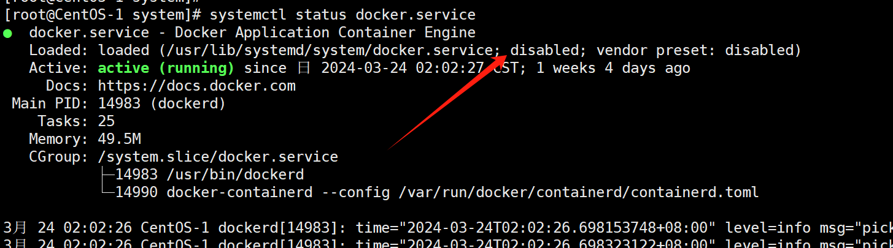

## Linux中的进程和服务
计算机中，一个正在执行的程序或命令，被叫做“进程”（process）。  
启动之后一直存在、常驻内存的进程，一般被称作“服务”（service）。

## 服务管理
上面说了服务，我们一般要经常打交道。因此服务的管理就很重要。

centos6及以前的版本使用的是service命令做服务管理，而从7开始使用systemctl来做服务管理了。

无论哪个系统版本，一般服务都是有这几个命令，只不过语法不同：
start：启动服务
stop：停止服务
restart：重启服务
status：查看服务状态

centos6中的语法：service 服务名 start|stop|restart|status
centos7中的语法：systemctl start|stop|restart|status 服务名   

systemctl：system control的意思，系统控制

service能够启动的服务名称位于/etc/init.d/目录 （centos7中也有这个文件夹）
systemctl能够操作的服务名称位于/usr/lib/systemd/system目录，可以进去看一下，已经安装的docker.service服务就在里面，防火墙服务firewalld.service也在里面；一般也可以简写成docker、firewalld；

实战：
systemctl status firewalld  查看防火墙服务的状态。

## systemctl mask 和 systemctl disable 有什么区别？
systemctl mask和systemctl disable的区别一般很难注意到，因为我大部分时候只会使用systemctl disable，并不会用到systemctl mask。在一次遇到问题的时候，需要使用systemctl mask来禁用服务，下边具体说明。

（1）systemctl enable 的作用
我们知道，在系统中安装了某个服务以后，需要将该服务设置为开机自启，那么一般会执行systemctl enable xxx ，
这个时候会发现shell中会输出两行提示，一般类似如下：
~~~shell
[root@NameNode01 system]# systemctl enable NetworkManager
Created symlink from /etc/systemd/system/multi-user.target.wants/NetworkManager.service to /usr/lib/systemd/system/NetworkManager.service.
Created symlink from /etc/systemd/system/dbus-org.freedesktop.nm-dispatcher.service to /usr/lib/systemd/system/NetworkManager-dispatcher.service.
Created symlink from /etc/systemd/system/network-online.target.wants/NetworkManager-wait-online.service to /usr/lib/systemd/system/NetworkManager-wait-online.service.
~~~
~~~shell
[root@CentOS-1 bin]# systemctl enable docker
Created symlink from /etc/systemd/system/multi-user.target.wants/docker.service to /usr/lib/systemd/system/docker.service.
[root@CentOS-1 bin]# 
~~~
这个命令会在/etc/systemd/system/目录下创建需要的符号链接，表示服务需要进行启动。通过stdout输出的信息可以看到，
软连接实际指向的文件为/usr/lib/systemd/system/目录中的文件，实际起作用的也是这个目录中的文件。

（2）systemctl disable xxx的作用
执行systemctl disable xxx后，会禁用这个服务。它实现的方法是将服务对应的软连接从/etc/systemd/system中删除。命令执行情况一般类似如下：

~~~shell
[root@NameNode01 system]# systemctl disable NetworkManager
Removed symlink /etc/systemd/system/multi-user.target.wants/NetworkManager.service.
Removed symlink /etc/systemd/system/dbus-org.freedesktop.NetworkManager.service.
Removed symlink /etc/systemd/system/dbus-org.freedesktop.nm-dispatcher.service.
Removed symlink /etc/systemd/system/network-online.target.wants/NetworkManager-wait-online.service.
~~~
在执行systemctl disable xxx的时候，实际只是删除了软连接，并不会产生其他影响。

（3）systemctl mask xxx的作用
执行 systemctl mask xxx会屏蔽这个服务。它和systemctl disable xxx的区别在于，前者只是删除了符号链接，后者会建立一个指向/dev/null的符号链接，这样，即使有其他服务要启动被mask的服务，仍然无法执行成功。执行该命令的效果一般类似如下：

~~~shell
[root@NameNode01 system]# systemctl mask NetworkManager
Created symlink from /etc/systemd/system/NetworkManager.service to /dev/null.
~~~

（4）systemctl mask xxx 和 systemctl disable xxx 的区别
在执行过mask后，如果想要启动服务，那么会报类似如下错误：
~~~shell
[root@NameNode01 system]# systemctl start NetworkManager
Failed to start NetworkManager.service: Unit is masked.
~~~
如果使用disable的话，可以正常启动服务。总体来看，disable和enable是一对操作，是用来启动、停止服务自启动的。

（5）使用systemctl unmask xxx取消屏蔽
如果使用了mask，要想重新启动服务，必须先执行unmask将服务取消屏蔽。mask和unmask是一对操作，用来屏蔽和取消屏蔽服务。

8.5、systemctl设置后台服务的自启动配置

基本语法：  

| 命令	                       | 描述           |
|---------------------------|--------------|
| systemctl is-enabled 服务名  | 查看该服务开机启动状态  |
| systemctl list-unit-files | 查看所有服务开机启动状态 |
| systemctl disable 服务名     | 关掉指定服务的自动启动  |
| systemctl enable 服务名      | 开启指定服务的自动启动  |

在用status查看服务的时候，也可以看到是否是自启动的：

## 系统运行级别

CentOS 6中：

查看默认级别：vi /etc/inittab

Linux系统有7种运行级别（runlevel）：常用的级别3和5

| 运行级别	 | 说明                               |
|-------|----------------------------------|
| 0     | 系统停机状态，系统默认运行级别不能设置为0，否则不能正常启动   |
| 1     | 单用户工作状态，root权限，用于系统维护，禁止远程登录     |
| 2     | 	多户状态（没有NFS），不支持网络               |
| 3     | 	完全的多用户状态（有NFS），登陆后进入控制台命令模式     |
| 4     | 	系统未使用，保留                        |
| 5     | 	X11控制台，登陆后进入图形GUI模式             |
| 6     | 	系统正常关闭并重启，默认运行级别不能设置为6，否则不能正常启动 |

CentOS7 运行级别简化为：  
（1）multi-user.target：多用户有网，无图形界面
等价于原运行级别3

（2）graphical.target：多用户有网，有图形界面
等价于原运行级别5

命令：
systemctl get-default：查看当前运行级别  
systemctl set-default：修改当前运行级别： systemctl set-default multi-user.target

## 关机重启命令
在 linux 领域内大多用在服务器上，很少遇到关机的操作。毕竟服务器上跑一个服务是永无止境的，除非特殊情况下，不得已才会关机。

8.8.1、基本语法
（1）sync：将数据由内存同步到硬盘中
linux中为提高效率，写磁盘的时候会先将数据写入缓冲器，缓冲区满了之后才会刷到磁盘，sync命令可以将缓冲区的数据立即写入磁盘。

（2）half：停机，关闭系统，但不断电  
（3）poweroff：关机，断电  
（4）reboot：重启，等同于shutdown -r now

（5）shutdown [选项] 时间  
-H	相当于—half，停机  
-P	相当于poweroff，停机  
-r	相当于reboot 重启  
-k "你好，我10分钟要关机"  不关机但是发送警告给用户，就是只广播消息  

时间参数：
now  立刻关机或重启  
数字  等待多久后关机（单位是分钟），也可以写关机的时间点，比如：23:55

还可以广播消息操作：  
shutdown 10 "在10分钟后关机"  ：这个命令执行后，其他人连接的客户端的屏幕上会显示你的提示消息，让别人知道要关机了  
shutdown -r 22:00 "将在22:00重启，请注意"  ：提醒其他客户端在晚上十点重启系统。

（6）shutdown -c：取消关机，并广播一个默认消息提醒其他客户端。