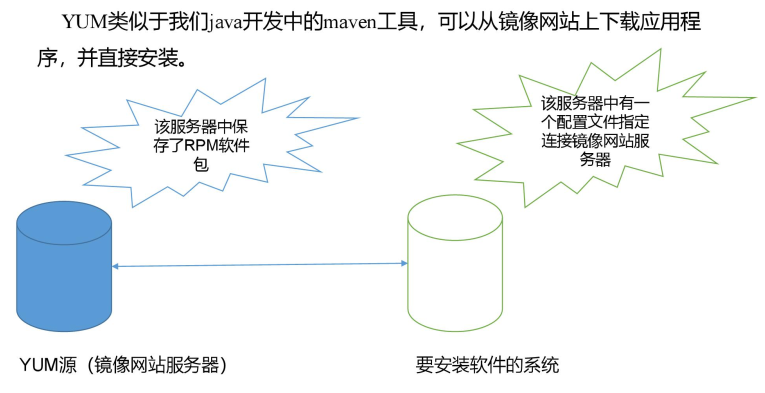
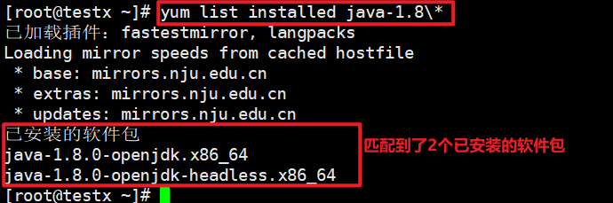

## yum的基本简介

yum全称是Yellow dog Updater, Modified，翻译过来难道是“黄狗更新”？有点不靠谱吧，
Yellow dog这个短语英语里面翻译为“卑鄙的人”,难道该翻译为“卑鄙的更新”，听起来好像是做贼似的，
谁还不让你更新了咋的！其实yum之所以叫做Yellow dog Updater, Modified，
是因为yum这个命令最初是安装在Yellow dog Linux这个linux的发行版本上的，
不知道这个发行版本怎么起了个这名字，就像不明白古时候很多人会叫“公子黑臀”“宰我”一样。
这都无关紧要，有关紧要的是不管你明不明白，它就是这么来的。

yum命令的功能：
yum的作用是自动化地进行安装、更新、移除rpm包（所以yum是基于rpm包的），并在安装、更新、移除rpm包的过程中检查依赖性并自动提示用户解决，
减少了Linux 用户一直头痛的rpm包的dependencies依赖问题。我们知道，我们使用rpm安装的时候，
经常遇到依赖的问题，需要追根溯源的一步步安装，有点顺藤摸瓜的意思，有可能最后瓜没摸到，倒被蛇咬了，
也就是说rpm的安装不仅浪费时间，而且容易出错，为了解决这个问题yum就应运而生了。

YUM（ 全称为 Yellow dog Updater, Modified） 是一个在 Fedora 和 RedHat 以及 CentOS 中的 Shell 前端软件包管理器。
基于 RPM 包管理， 能够从指定的服务器自动下载 RPM 包并且安装， 可以自动处理依赖性关系，
并且一次安装所有依赖的软件包， 无须繁琐地一次次下载、 安装， 如图所示：

## yum的使用
yum [选项] [参数]  

选项：-y	使用yum安装或者卸载软件的过程中，会有提示yes还是no，跟上-y选项后，对所有提问都回答“yes”

参数说明：

| 参数           | 作用                 |
|--------------|--------------------|
| install      | 安装 rpm 软件包         |
| update       | 更新 rpm 软件包         |
| check-update | 检查是否有可用的更新 rpm 软件包 |
| remove       | 删除指定的 rpm 软件包      |
| list         | 显示所有已经安装和可以安装的程序包  |
| clean        | 清理 yum 过期的缓存       |
| deplist      | 显示 yum 软件包的所有依赖关系  |
| info         | 显示关于软件包或组的详细信息     |

常用命令：

| 命令                 | 说明                          |
|--------------------|-----------------------------|
| yum search         | 软件包	查找某个软件包                 |
| yum list           | 列出所有可安装的软件包（含已安装、可安装的软件包列表） |
| yum list java\*    | 列出java开头的软件包                |
| yum list updates   | 列出所有可安装的软件包                 |
| yum list installed | 列出所有以安装的软件包                 |
| yum info 软件包       | 列出某个软件包的信息                  |
| yum list java\*    | 列出所有以java开头的软件包             |
| yum remove 软件包     | 卸载指定软件                      |
| yum install 软件包    | 安装指定软件包                     |
| yum update 软件包     | 升级指定软件包                     |

## 案例实操实操（java1.8 查找、安装、卸载）
1） 查找java1.8
~~~shell
[root@testx ~]# yum list | grep "^java-1.8\\|^jdk-1.8"
java-1.8.0-openjdk.i686                     1:1.8.0.332.b09-1.el7_9    updates  
java-1.8.0-openjdk.x86_64                   1:1.8.0.332.b09-1.el7_9    updates
~~~
（2）咱们就安装查找出来的第2个jdk：java-1.8.0-openjdk.x86_64
[root@testx ~]# yum -y install java-1.8.0-openjdk.x86_64
（3）卸载java-1.8
先使用yum list installed java-1.8*查询已安装的java8包列表：

然后执行下面命令，把这两个包干掉：
[root@testx ~]# yum -y remove java-1.8.0-openjdk.x86_64 java-1.8.0-openjdk-headless.x86_64

## 修改网络 YUM 源
默认的系统 YUM 源， 需要连接国外 apache 网站， 网速比较慢， 可以修改关联的网络YUM 源为国内镜像的网站， 比如网易 163,aliyun 等。

【注意：esxi安装的centos系统的镜像源显示的是：mirrors.ustc.edu.cn 中国科学技术大学开源软件镜像，还有这个好像：mirrors.163.com，是什么时候已经替换成国内的源了吗？还是默认就是这个了】
~~~shell
[root@CentOS-1 ~]# yum list installed wget
已加载插件：fastestmirror
Loading mirror speeds from cached hostfile
 * base: mirrors.ustc.edu.cn
 * epel: mirror.nju.edu.cn
 * extras: mirrors.ustc.edu.cn
 * updates: mirrors.ustc.edu.cn
错误：没有匹配的软件包可以列出
[root@CentOS-1 ~]# yum list installed | grep  wget
[root@CentOS-1 ~]# yum list installed 
已加载插件：fastestmirror
Loading mirror speeds from cached hostfile
 * base: mirrors.163.com
 * epel: mirror.nju.edu.cn
 * extras: mirrors.163.com
 * updates: mirrors.163.com
已安装的软件包
GeoIP.x86_64                                                                                               1.5.0-11.el7                                                                                         @anaconda        
GeoIP.x86_64
~~~

fastestmirror   

--enablerepo=epel
EPEL 仓库

### yum缓存命令：yum makecache fast 和 yum clean all

### yum update命令 一般起什么作用，为什么在安装软件之前要执行一下这个命令

### yum 也有卸载功能，rpm命令也有卸载功能，那使用yum安装的软件，然后使用rpm卸载和使用yum卸载有什么区别或优缺点。
