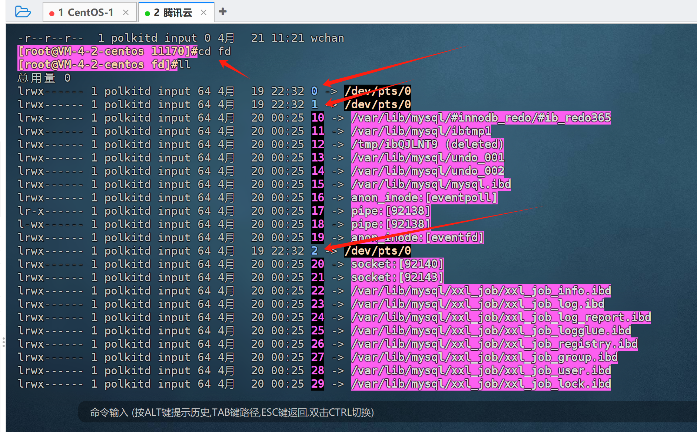

## 标准输入和输出
程序：指令+数据  
读入数据：Input  
输出数据：Output   

打开的文件都有一个fd: file descriptor (文件描述符)

Linux给程序提供三种 I/O 设备：  
标准输入（STDIN） －0 默认接受来自终端窗口的输入  
标准输出（STDOUT）－1 默认输出到终端窗口  
标准错误（STDERR） －2 默认输出到终端窗口  

上面的大概说的什么意思呢：  
在Linux系统中，每个运行的进程都会分配内存，并且说Linux系统中一切皆是文件，那运行中的进程也是有对应的文件的，进程的文件都在 /proc（进程文件夹，这个/proc文件夹就是存放正在运行的进程信息的文件夹）里，
这个文件夹下可以找到和正在运行进程PID号相同的文件夹，该文件夹中存的就是当前进程的运行信息，
其中可以看到一个exe的软连接文件，这个软连接指向的就是该进程下的命令所在地。就是进程的程序文件。
其中还有一个fd的文件夹，记录了当前程序使用到的文件。 而df文件中一定会有三个文件：0、1、2  
如图：

0：是标准输入，就是当前进程接收输入数据的地方，一般就是运行一个命令需要输入参数的话，可以再命令行输入参数信息，当然很多命令是不需要接收参数的，即便不需要输入，也是有这个0的输入入口的。

1：是标准输出，就是运行命令或进程后输出的信息，比如运行pwd命令，输出当前目录地址。

2：是标准错误输出，如果命令或程序报系统性报错或警告，就通过这个出口输出，比如输入一个aaa回车，会报错提示没有该命令。

上面的0、1、2三个文件实际上代表的是三种设备，输入设备，输出设备，错误输出设备，听老师的意思是，每个程序或命令都一定有这三个IO设备。

上图中的0、1、2后面对应的是 /dev/pts/0 这个代表的当前命令行的终端，通过tty命令可以查看当前命令行窗口对应的窗口文件，就是/dev/pts/0文件。再开一个窗口可能就是/dev/pts/1

上面三个设备的默认输入输出针对的都是窗口文件，这也就是我们输入命令回车，命令给我们回复后就能立马在窗口上显示的原因。

当然输出默认是输出到窗口文件上能立马看到，那我们可以修改默认，即输入命令后，指定结果输出的位置，比如你输入pwd命令并指定结果数据输出到另一个命令行窗口（比如：/dev/pts/1）也是可以的，
也可以指定输出到一个文件内，比如输出到一个叫 app.log 的文件内。

那怎么把默认输出改到其他地方输出呢，那就用到下面的重定向技术了。

##  I/O重定向 redirect

STDOUT（标准输出）和STDERR（标准错误输出）可以被重定向到指定文件,而非默认的当前终端。

格式：命令 操作符号 文件名

操作符号：
~~~
1> 或 >  把STDOUT重定向到文件
2> 把STDERR重定向到文件
&> 把标准输出和错误都重定向
>& 和上面功能一样，建议使用上面方式
~~~

比如你开了两个窗口，分别是 /dev/pts/0 和 /dev/pts/1 ，你就可以在0的窗口中这样写：  
pwd > /dev/pts/1  
这样，输出的结果就在两个窗口输出了。

pwd > /app/c.log  输出结果到文件。这样就自动创建一个文件，并输入信息，如果该文件已经存在，就覆盖掉旧文件。【这里要注意，是否会覆盖了已经存在的很重要的数据，因此要谨慎使用>符号】
如果命令行直接输入： > /app/c.log 回车，输出结果到文件。但是没有结果信息，其实就相当于创建了一个空文件。
相当于touch一个文件，只不过该文件如果已经存在，touch不覆盖，>则覆盖。就相当于清空一个文件，这样可以清空一个大文件的内容。
不过清空大文件内容不推荐这样做。可以使用 cat /dev/null > xxx.log 来清空一个大文件。

在 Linux 中， null 设备基本上被用来丢弃某个进程不再需要的输出流，或者作为某个输入流的空白文件，这些通常可以利用重定向机制来达到，
所以 /dev/null 设备文件是一个特殊的文件，它将清空送到它这里来的所有输入，而它的输出则可被视为一个空文件。
另外，你可以通过使用 cat或dd或cp等命令 显示 /dev/null 的内容然后重定向输出到某个文件，以此来达到清空该文件的目的。
当然使用echo是不行的，因为echo输出默认会有个换行，文件中会保留一个换行符。有时候我们写脚本的时候希望内容有个换行，不用写复制的命令去做一个换行，写一个空echo就行了。脚本中会看到有这样的用法。

追加：>> 可以在原有内容基础上，追加内容
~~~
>> 追加标准输出重定向至文件
2>> 追加标准错误重定向至文件
~~~

一个命令可能既有标准输出，又有错误输出，那可以把标准输出和错误输出各自定向至不同位置：
~~~
COMMAND > /path/to/file.out 2> /path/to/error.out
~~~

合并标准输出和错误输出为同一个数据流进行重定向：
~~~
&> 合并标准输出和错误到同一个文件，覆盖重定向
&>> 合并标准输出和错误到同一个文件，追加重定向

COMMAND &> /path/to/file.out 
COMMAND &>> /path/to/file.out 
比如：ls /app /app/service/ &> /app/l.log  两个文件夹的输入都输出到l.log中了，模拟标准输出和错误都重定向到同一个文件。

老运维还可能这样写：  
COMMAND > /path/to/file.out 2>&1 （意思就是把标准输出（1）重定向到file.out文件中，2>&1（2重定向到1）就是又把错误重定向到标准输出中，达到标准和错误都输出到同一个文件。）
COMMAND >> /path/to/file.out 2>&1
~~~

合并多个程序
(CMD1;CMD2......) 或者{ CMD1;CMD2;....; }合并多个程序的STDOUT
~~~
[root@centos8 ~]#( cal 2019 ; cal 2020 ) > all.txt
[root@centos8 ~]#{ ls;hostname;} > /data/all.log
~~~

 上面都是输出的重定向，那输入也是有重定向的，就是一个命令的参数输入，可以指定从某个文件中读取。用 < 号做标准输入重定向。这里先不总结了。

COMMAND 0< FILE  
COMMAND < FILE

cat < file1 > file2  
cat < file1 >> file1

范例：
~~~shell
[root@centos8 ~]#echo 2^3 > bc.log
[root@centos8 ~]#cat bc.log
2^3
[root@centos8 ~]#bc < bc.log
8
[root@centos8 ~]#cat < mail.txt
hello
how old are you
[root@centos8 ~]#cat mail.txt
hello
how old are you
[root@centos8 ~]#cat < mail.txt > mail2.txt
[root@centos8 ~]#cat mail2.txt
hello
how old are you
[root@centos8 ~]#cat mail.txt 
hello
how old are you
[root@centos8 ~]#mail -s test2 wang < mail.txt
[root@centos8 ~]#cat > cat.log
line1
line2
line3
~~~

把多行重定向：  
使用 "<<终止词" 命令从键盘把多行重导向给STDIN，直到终止词位置之前的所有文本都发送给
STDIN，有时被称为就地文本（here documents）
其中终止词可以是任何一个或多个符号，比如：!，@，$，EOF（End Of File），magedu等，其中EOF
比较常用

范例：
~~~shell
mail -s "Please Call" admin@magedu.com <<EOF 
> Hi Wang
>        
> Please give me a call when you get in. We may need 
> to do some maintenance on server1. 
>         
> Details when you're on-site
> Zhang
> EOF
~~~

## 管道： |符号  tee命令  -符号
待总结