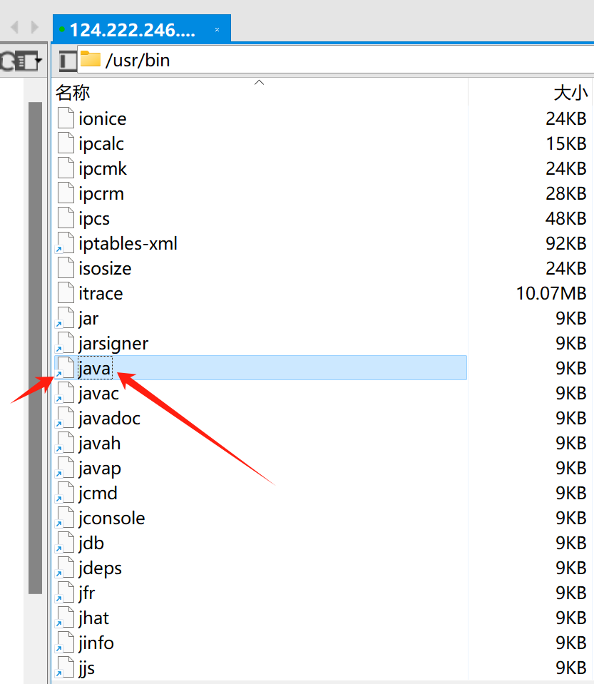

## Linux的命令，一个命令就是一个Linux的程序
在B站视频上看到说“Linux的命令，一个命令就是一个Linux的程序”，那ls和pwd是不是就是已经写好的一段程序，
那我自己也可以写一段程序，配置成一个命令随时使用吗？

linux系统命令通常存放在/bin、/usr/bin、/usr/local/bin等目录中，具体路径可以通过查看环境变量PATH来获取。

### 网络文章：
``在Linux系统中，命令通常位于系统的可执行文件路径中。这些可执行文件路径是系统环境变量PATH中定义的。当我们在终端上输入命令时，系统会搜索这些路径来找到对应的命令并执行。
在大多数Linux系统中，默认的可执行文件路径包含了一些常用的命令目录，如/bin、/usr/bin、/usr/local/bin等。这些目录下存放了系统自带的命令和一些额外安装的命令。
/bin目录是存放一些重要的二进制文件的系统命令的地方，例如ls、cp、rm等。这些命令是用户常用的基本命令，无需额外安装。
/usr/bin目录是存放一些用户可执行的命令的地方，例如gcc编译器、python解释器等。这些命令通常是通过软件包管理器安装的。
/usr/local/bin目录则是存放一些用户自己编译安装的命令的地方。用户可以在此目录下安装一些不在系统默认库中的额外软件。
除了上述目录外，还有一些其他的命令目录也会被添加到PATH中，例如/sbin、/usr/sbin、/usr/local/sbin等，这些目录存放的是系统管理员使用的一些高级命令。
要查看系统环境变量PATH的值，可以在终端上运行命令echo $PATH。系统会输出所有的可执行文件路径，以冒号分隔。
总结起来，linux系统命令通常存放在/bin、/usr/bin、/usr/local/bin等目录中，具体路径可以通过查看环境变量PATH来获取。``

## 简单总结： 命令、环境变量、PATH、profile文件
在Linux系统中，命令行中我们输入一串字母回车，默认就是把这串字符当作命令去执行，而一个命令其实就是对应一个可执行的二进制文件的程序（在Linux系统中，一切皆文件），
那输入一个命令回车后，Linux到底是去执行那个程序文件了呢？ 比如输入pwd查看当前目录，Linux去执行哪个对应pwd的文件程序了呢？还是说是底层本来就有这个程序，我们看不见这个程序在哪里呢？

其实每个命令都是对应一个可执行文件的，当我们输入命令的时候，Linux是去叫 PATH 的环境变量对应的文件夹下找你输入的命令对应的文件，
输入echo $PATH 或 env 可以查看到PATH环境变量对应的文件夹，这些文件夹下存放了很多命令对应的程序文件，文件的名字就是命令名字。
~~~shell
[root@VM-4-2-centos ~]# 
[root@VM-4-2-centos ~]# env
XDG_SESSION_ID=401565
HOSTNAME=VM-4-2-centos
TERM=xterm
SHELL=/bin/bash
HISTSIZE=3000
SSH_CLIENT=101.68.35.179 21363 22
SSH_TTY=/dev/pts/0
USER=root
LS_COLORS=rs=0:di=01;34:ln=01;36:mh=00:pi=40;33:so=01;35:do=01;35:bd=40;33;01:cd=40;33;01:or=40;31;01:mi=01;05;37;41:su=37;41:sg=30;43:ca=30;41:tw=30;42:ow=34;42:st=37;44:ex=01;32:*.tar=01;31:*.tgz=01;31:*.arc=01;31:*.arj=01;
31:*.taz=01;31:*.lha=01;31:*.lz4=01;31:*.lzh=01;31:*.lzma=01;31:*.tlz=01;31:*.txz=01;31:*.tzo=01;31:*.t7z=01;31:*.zip=01;31:*.z=01;31:*.Z=01;31:*.dz=01;31:*.gz=01;31:*.lrz=01;31:*.lz=01;31:*.lzo=01;31:*.xz=01;31:*.bz2=01;31:*.bz=01;31:*.tbz=01;31:*.tbz2=01;31:*.tz=01;31:*.deb=01;31:*.rpm=01;31:*.jar=01;31:*.war=01;31:*.ear=01;31:*.sar=01;31:*.rar=01;31:*.alz=01;31:*.ace=01;31:*.zoo=01;31:*.cpio=01;31:*.7z=01;31:*.rz=01;31:*.cab=01;31:*.jpg=01;35:*.jpeg=01;35:*.gif=01;35:*.bmp=01;35:*.pbm=01;35:*.pgm=01;35:*.ppm=01;35:*.tga=01;35:*.xbm=01;35:*.xpm=01;35:*.tif=01;35:*.tiff=01;35:*.png=01;35:*.svg=01;35:*.svgz=01;35:*.mng=01;35:*.pcx=01;35:*.mov=01;35:*.mpg=01;35:*.mpeg=01;35:*.m2v=01;35:*.mkv=01;35:*.webm=01;35:*.ogm=01;35:*.mp4=01;35:*.m4v=01;35:*.mp4v=01;35:*.vob=01;35:*.qt=01;35:*.nuv=01;35:*.wmv=01;35:*.asf=01;35:*.rm=01;35:*.rmvb=01;35:*.flc=01;35:*.avi=01;35:*.fli=01;35:*.flv=01;35:*.gl=01;35:*.dl=01;35:*.xcf=01;35:*.xwd=01;35:*.yuv=01;35:*.cgm=01;35:*.emf=01;35:*.axv=01;35:*.anx=01;35:*.ogv=01;35:*.ogx=01;35:*.aac=01;36:*.au=01;36:*.flac=01;36:*.mid=01;36:*.midi=01;36:*.mka=01;36:*.mp3=01;36:*.mpc=01;36:*.ogg=01;36:*.ra=01;36:*.wav=01;36:*.axa=01;36:*.oga=01;36:*.spx=01;36:*.xspf=01;36:MAIL=/var/spool/mail/root
PATH=/usr/local/sbin:/usr/local/bin:/usr/sbin:/usr/bin:/root/bin
PWD=/root
LANG=en_US.utf8
SHLVL=1
HOME=/root
LOGNAME=root
SSH_CONNECTION=101.68.35.179 21363 10.0.4.2 22
LESSOPEN=||/usr/bin/lesspipe.sh %s
PROMPT_COMMAND=history -jvm启动参数.md; history -jvm启动参数.md; printf "\033]0;%s@%s:%s\007" "${USER}" "${HOSTNAME%%.*}" "${PWD/#$HOME/~}"
XDG_RUNTIME_DIR=/run/user/0
HISTTIMEFORMAT=%F %T 
_=/usr/bin/env
[root@VM-4-2-centos ~]# 
~~~
上面可以看到，默认的PATH下配置的文件夹是：PATH=/usr/local/sbin:/usr/local/bin:/usr/sbin:/usr/bin:/root/bin

所以一般的命令都是在这几个文件夹下，特别是/usr/bin下，很多默认自带的命令。

一般我们通过yum或rpm安装的软件（比如yum安装jdk）不需要配置环境变量就能直接使用软件的命令，就是因为这种方式安装的软件，其软件的命令直接放进了/usr/bin下或其他PATH对应的文件下，
准确来说，命令应该没有直接在这些文件夹下，而是命令的快捷方式连接在这个文件夹下，比如：

java命令文件有个小箭头，应该只是快捷方式。

那如果是我们手动解压压缩包方式安装的jdk，因为java命令文件没有放进上面的文件夹内，所以只能在jdk的bin目录下使用java命令，要想在任何地方使用java命令，就要配置环境变量。

## 命令的类型 
shell命令是分：内部命令，外部命令 的，内部命令大概就是bash自带的命令吧，内部命令是默认就加载到内存中的，当你使用内部命令是，系统是不用去文件夹里找命令去执行的，直接就拿来用了，
但是外部命令是需要去文件夹中找命令去执行的，系统默认先找是不是内部命令，如果是就直接使用内部命令去执行了，比如echo是一个内部命令，但同时也可能是一个外部命令，当你执行 echo "nihao" 时，
默认使用内部命令的echo执行，假设内部没有echo这个命令，就去上面说的PATH指定的路径中找外部命令echo去执行，如果外部也没有该命令，就提示找不到命令。

怎么查看一个命令是不是内部命令呢：  
type命令可以查看一个命令的类型：type -a 可以查看echo同时时一个外部命令
~~~shell
[root@VM-4-2-centos ~]#type echo
echo 是 shell 内嵌  #【这个提示说明是内部命令】
[root@VM-4-2-centos ~]#
[root@VM-4-2-centos ~]#type reboot
reboot 是 /usr/sbin/reboot  #【这个提示说明是外部命令】
[root@VM-4-2-centos ~]#type -jvm启动参数.md echo
echo 是 shell 内嵌
echo 是 /usr/bin/echo  #【这个提示说明同时有内外部两个同名的echo命令，默认使用内部的echo执行】
~~~

使用 help 或 enable 命令可以列出所有内部命令

使用 enable -n xxx  可以禁用一个内部命令，禁用后就去外名找命令执行了。外部没有的话就提示找不到命令。 使用 enable  xxx 启用内部命令。

which xxx  查看命令的位置。

~~~ 
这里学习的过程中使用enable看到一个有趣的内部命令，就是”.“这个命令，这个”点“命令和 source 命令一样，可以使一个文件的环境变量生效，比如你修改了一个环境变量，可以使用 . 或 source 命令，加上对应的环境变量的文件， 使其生效。
~~~

外部命令执行一遍之后也会把路径缓存到内存中，下次执行直接使用，可以使用 hash 命令查看已经缓存的命令。

### 别名
使用 alias 可以定义一个别名的命令：  
alias cdzk="cd /app/zookeeper/apache-zookeeper-3.6.2-bin/bin"

这样就可以定义好一个一键切换到zk的bin文件夹的命令。

~~~shell
[root@CentOS-1 profile.d]#alias cdzk="cd /app/zookeeper/apache-zookeeper-3.6.2-bin/bin"
[root@CentOS-1 profile.d]#cdzk
[root@CentOS-1 bin]#ll
总用量 64
-rwxr-xr-x. 1 mdl mdl   232 9月   4 2020 README.txt
-rwxr-xr-x. 1 mdl mdl  2066 9月   4 2020 zkCleanup.sh
-rwxr-xr-x. 1 mdl mdl  1158 9月   4 2020 zkCli.cmd
-rwxr-xr-x. 1 mdl mdl  1620 9月   4 2020 zkCli.sh
-rwxr-xr-x. 1 mdl mdl  1843 9月   4 2020 zkEnv.cmd
-rwxr-xr-x. 1 mdl mdl  3690 9月   4 2020 zkEnv.sh
-rwxr-xr-x. 1 mdl mdl  1286 9月   4 2020 zkServer.cmd
-rwxr-xr-x. 1 mdl mdl  4559 9月   4 2020 zkServer-initialize.sh
-rwxr-xr-x. 1 mdl mdl 11116 9月   4 2020 zkServer.sh
-rwxr-xr-x. 1 mdl mdl   988 9月   4 2020 zkSnapShotToolkit.cmd
-rwxr-xr-x. 1 mdl mdl  1377 9月   4 2020 zkSnapShotToolkit.sh
-rwxr-xr-x. 1 mdl mdl   996 9月   4 2020 zkTxnLogToolkit.cmd
-rwxr-xr-x. 1 mdl mdl  1385 9月   4 2020 zkTxnLogToolkit.sh
[root@CentOS-1 bin]#
[root@CentOS-1 bin]#type cdzk
cdzk 是 `cd /app/zookeeper/apache-zookeeper-3.6.2-bin/bin' 的别名
~~~

并且，别名命令的执行优先级最高，高于内部命令。因此定义别名的时候，最好不要和其他命令重名，定义之前可以先执行一下该命令看看是不是已经有这个命令了。

如果想要别名永久生效，可以配置到全局配置文件中，或配置到相关用户目录的配置文件中。百度一下方法吧。  
因为别名算是个人的定义，因此别名配置永久一般配置在当前用户目录的.bashrc隐藏文件中，只对当前用户生效。
比如在/root目录下的.bashrc文件中最后一行加入：alias "cd /app/zookeeper/apache-zookeeper-3.6.2-bin/bin" 保存。
执行：. /root/.bashrc 使其配置文件的配置生效。
就可以永久生效了。 

命令行直接 alias 命令回车查看所有别名。

unalias [-a] name [name ...] 取消别名
unalias -a #取消所有别名

### 总结：
命令的类型有：别名命令，内部命令，外部命令，执行优先级是：别名>内部命令>外部命令

## 基于上面， 编写自己的命令

基于上面的知识点，可以自定义编写自己常用的复制操作组合成一个命令，实现一键做到一件事的目的。

实现方式可以有两种：

一：定义别名，别名对应的命令可以是一个复杂的组合。

二：基于上面的逻辑，可以编写一个shell脚本程序，放在上面的PATH对应的文件夹下，比如放在/usr/local/bin下，
进而实现一条命令干很多定制化的动作。