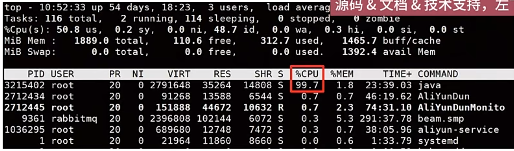
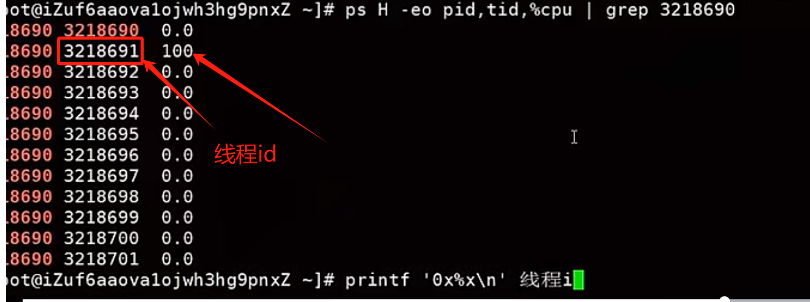
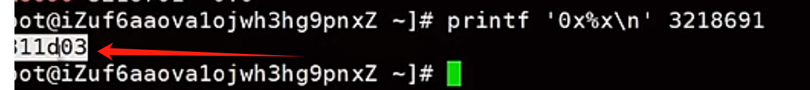
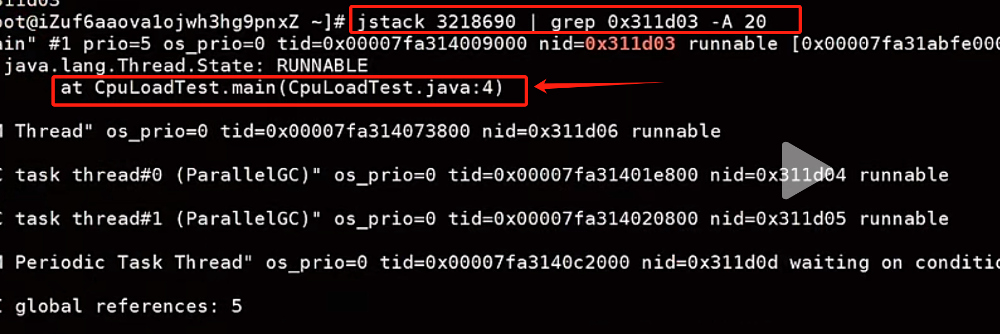
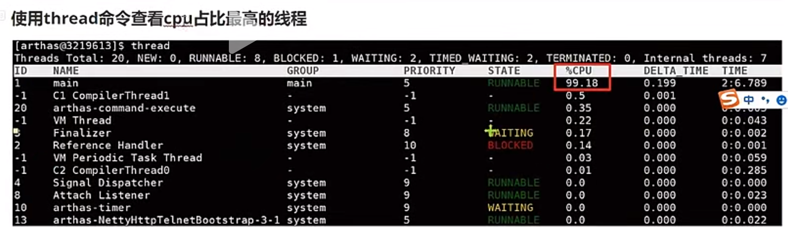
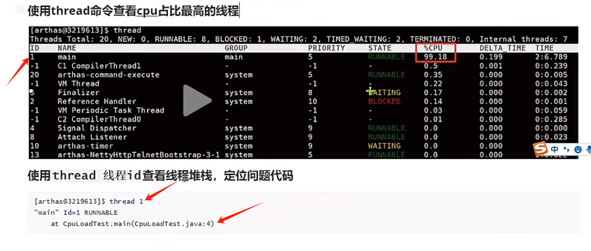

## 问题：
比如有一段代码是死循环无法推出：
while(true){

}
那运行这个程序就会导致cpu飙升，可能到达cpu占用百分之90以上。
定位这个代码的位置有4步：

## 第一步：
使用top命令，拿到cpu占用很高的进程id。

## 第二步：
根据进程，找到导致cpu很高的线程：ps H -eo pid,tid,%cpu | grep 进程id

## 第三步：
将线程id转换成16进制：printf '0x%x\n' 线程id

## 第四步：
jstack 进程id | grep 16进制线程id -A 20

jstack:jdk内置命令，用于查看某个java进程所有线程快照，里面包含了线程详细的堆信息  
grep:linux中的用于内容查找的命令，可以从大量文本中快速找到某个关键字所在的行，-A参数后面的20，表示找到内容后，取内容所在行后面20行记录

# 使用arthas定位cpu飙升的代码
使用top找到cpu飙升的java进程id，

启动arthas并挂在这个进程上

然后：

然后：
