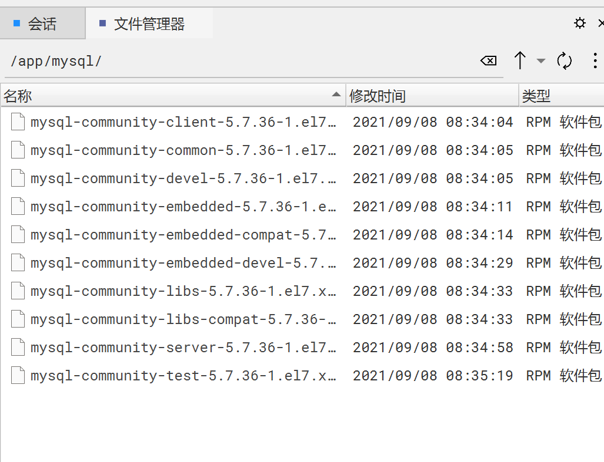

## 首先官网下载

mysql-5.7.36-1.el7.x86_64.rpm-bundle.tar

已经在阿里云盘。

## 在Linux上安装

tar -xvf mysql-5.7.36-1.el7.x86_64.rpm-bundle.tar
解压后有很多rpm包：

只安装这几个就行了（按下面顺序安装，因为有依赖关系）：
rpm -ivh mysql-community-common-5.7.36-1.el7.x86_64.rpm
rpm -ivh mysql-community-libs-5.7.36-1.el7.x86_64.rpm
rpm -ivh mysql-community-client-5.7.36-1.el7.x86_64.rpm
rpm -ivh mysql-community-server-5.7.36-1.el7.x86_64.rpm

安装之前先卸载冲突的mariadb包：
rpm -qa | grep mariadb
rpm -e mariadb-libs-5.5.68-1.el7.x86_64 --nodeps

根据提示，可能还要安装一些基础包：libaio.x86_64  "perl(Data::Dumper)" 等。

通过rpm安装,上面安装没有指定安装的目录，就是安装到了mysql默认的目录:  
配置文件：/etc/my.cnf
MySQL 程序目录：/usr/bin/，包括 mysql、mysqldump 等命令行工具。
MySQL 数据目录：/var/lib/mysql，存放所有数据库的数据文件。
服务启动脚本：/usr/lib/systemd/system/mysqld.service，用于启动、停止 MySQL 服务。
日志文件：默认在 /var/log/mysqld.log 中记录 MySQL 服务的日志。

安装完成后，可以通过查看 my.cnf 配置文件，来确认数据目录和日志目录等是否与默认一致。如有需要，也可以在配置文件中修改相关目录。

安装完之后：
systemctl status mysqld 查看服务状态.

然后修改my.cnf(先备份一下该文件), 配置文件案例在下面的"参数优化"文件夹内的"my.cnf".

注意: 好像是因为my.cnf文件中手动指定了一些文件的存放目录,比如数据文件的存放目录,日志文件的目录,虽然存放的默认的文件夹,但是安装后启动的时候还是会提示权限问题,
导致一些文件无法生成,比如日志文件,也可能是因为默认的错误日志文件名字改了(mysqld.log改成了error.log),导致生成不了文件. 
不管怎样, 反正一律先执行一下下面的命令,授权下面这些整个文件夹给msyql用户就行了,就可以随意创建文件修改文件了:
sudo mkdir /var/lib/mysql
sudo chown -R mysql:mysql /var/lib/mysql
sudo chmod -R 750 /var/lib/mysql

sudo mkdir -p /var/log/mysql
sudo chown -R mysql:mysql /var/log/mysql
sudo chmod -R 750 /var/log/mysql
sudo chown -R mysql:mysql /var/log
sudo chmod -R 750 /var/log

## 默认安装后，mysql相关文件的位置

配置文件：`/etc/my.cnf`  （其他版本的可能在/etc/mysql/my.cnf）

数据库数据文件：默认路径是 `/var/lib/mysql`，每个数据库会在此目录下有一个相应的子目录。数据文件以 `.ibd` 或 `.MYD` 为后缀。

frm文件：存放表结构，myd文件：存放表数据，myi文件：存放索引。

二进制日志文件：如果启用了二进制日志，默认位置通常也是在 `/var/lib/mysql` 目录下，文件名一般以 `mysql-bin` 开头。

日志文件：位置可以在配置文件中定义，默认情况下可能是 `/var/log/mysqld.log` 或 `/var/log/mysql/error.log`。

socket 文件：默认位置为 `/var/run/mysqld/mysqld.sock`，用于本地进程与 MySQL 服务器之间的通信。mysqld.pid文件也在这个文件夹。这个文件夹可以拿到MySQL的进程id。

启动脚本： 在 Linux 上，MySQL 的启动脚本通常位于 `/usr/lib/systemd/system/mysqld.service` 或 `/etc/init.d/mysql`。

注意：上面这些文件的位置可以通过查看 MySQL 配置文件（`my.cnf` 或 `my.ini`）来确认和修改。如果安装时使用了自定义路径，这些文件和目录的位置也会随之变化。

## 启动服务 和 修改root密码

安装完之后：
systemctl status mysqld
systemctl start mysqld

注意:如果因为各种配置文件的参数配置问题导致启动失败的,先systemctl stop mysqld, 然后修正配置参数, 每次修改参数后,
也要把数据文件夹(/var/lib/mysql)下刚刚自动初始化生成的的文件全部删除再重启, 因为这些文件可能是有问题的或不完整的.

第一次启动mysql服务后，会自动给root生成一个密码，在日志文件里(`/var/log/mysqld.log` 或 `/var/log/mysql/error.log`)，
里面有一句：
A temporary password is generated for root@localhost: gI7zDjb<)vIr
告诉了你生成的临时密码：gI7zDjb<)vIr

登录：
mysql -uroot -p 回车输入密码

登录后修改密码：alter user 'root'@'localhost' identified by '123987456Mdl';
会提示：ERROR 1819 (HY000): Your password does not satisfy the current policy requirements
因为mysql5.6之后会校验密码安全，太简单的密码不给通过。

在 /etc/my.cnf的[mysqld]下面添加一行关闭安全校验的配置：validate_password=off
重启mysql：systemctl restart mysqld

在登录MySQL后执行修改密码就可以了。

/etc/my.cnf配置文件里的配置可以看一下。

### 知识点补充

~~~text
在 MySQL 中，当你通过命令行连接到 MySQL 服务器时，即使没有选择具体的数据库，
你仍然可以执行一些特定的 SQL 语句，例如 ALTER USER、SET、CREATE DATABASE 等。
这是因为这些语句不依赖于某个具体的数据库，而是与数据库服务器本身的全局管理有关。

具体原因:
ALTER USER 语句的作用：
ALTER USER 是用于管理 MySQL 用户的命令，涉及修改用户的身份验证信息、权限等。
用户信息在 MySQL 中存储在名为 mysql 的系统数据库中，具体来说是 mysql.user 表。
但是，执行 ALTER USER 命令时，你并不需要显式选择 mysql 数据库，因为 MySQL 自动知道这个操作是针对全局用户管理的。

不需要指定数据库的 SQL 语句：
一些 SQL 语句本质上是全局性的，不依赖于某个特定的数据库。例如：
ALTER USER、CREATE USER、DROP USER 等用户管理命令。
CREATE DATABASE 和 DROP DATABASE 等与数据库本身相关的命令。
SET 命令，用于设置会话或全局级别的系统变量。
这些命令在 MySQL 内部是直接针对系统层面的数据进行操作，而不是用户自定义的数据库。

MySQL 的命令行客户端行为：
当你刚连接 MySQL 服务器时，如果不指定数据库，MySQL 允许你执行不依赖于数据库上下文的命令。
如果你尝试执行需要特定数据库上下文的命令（例如 SELECT * FROM some_table;），MySQL 会提示你没有选择数据库。

举例
创建数据库：
CREATE DATABASE mydatabase;
这条语句不需要依赖任何已有的数据库，因为它的操作对象是数据库服务器的全局资源。

修改用户密码：
ALTER USER 'root'@'localhost' IDENTIFIED BY '123987456Mdl';
这条语句直接作用于 MySQL 的用户管理系统表（即 mysql.user），因此不需要指定数据库。

选择数据库：
USE mydatabase;
这条语句指定了数据库上下文，后续的表操作等将基于这个数据库。

查询有哪些数据库:
SHOW DATABASES;
查看当前处于哪个数据库:
select database();
查询有哪些表:
show tables;
状态:
status;
退出:
quit;

总结
MySQL 中某些命令（如 ALTER USER）是与数据库服务器的全局配置和管理相关的，而不是与特定的数据库或表直接相关。
因此，即使在没有选择数据库的情况下，也可以执行这些命令，因为它们不依赖于某个数据库上下文。
~~~

默认root用户只能本地连接, 如果其他ip连接会报这样的错误(该ip不允许连接):
1130 -Host'115.196.229.195' is not allowed to connect to this MySQL server

出于安全考虑,root用户就控制只能本地访问, 然后创建一些特定的用户,给外部访问.
创建用户的方式,以及给用户授权，看下面的管理员常用命令.

如果要配置主从复制,参考下面的"阿里云3306和3307做主从复制"笔记.
