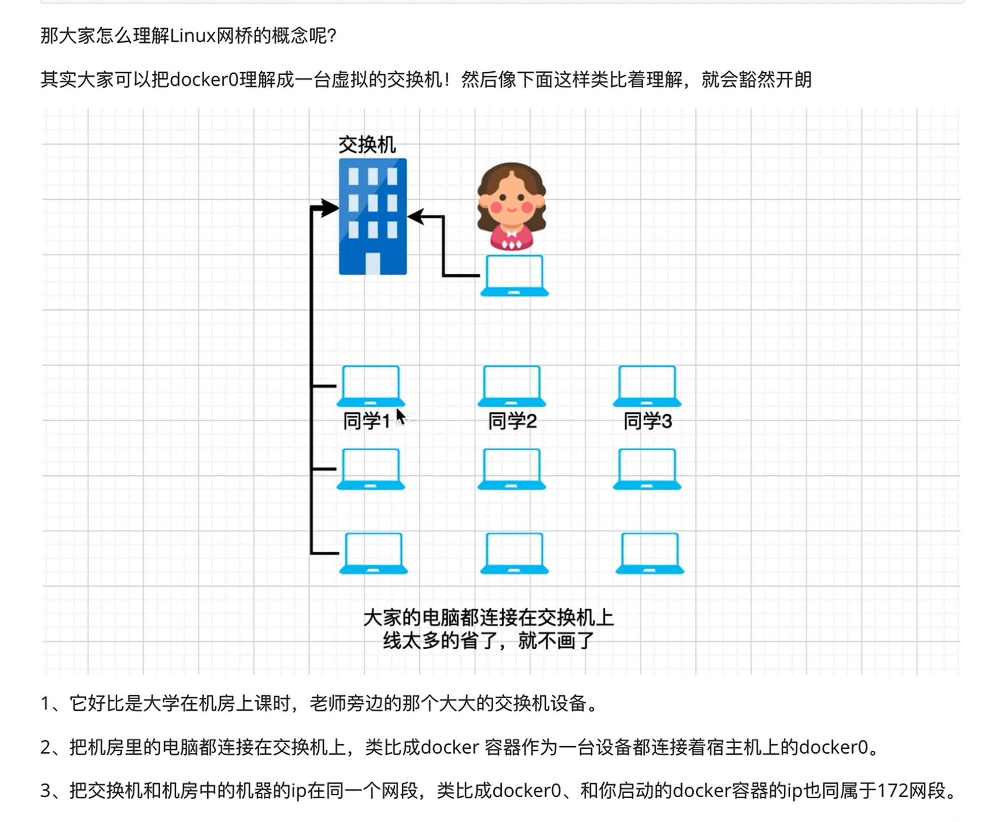
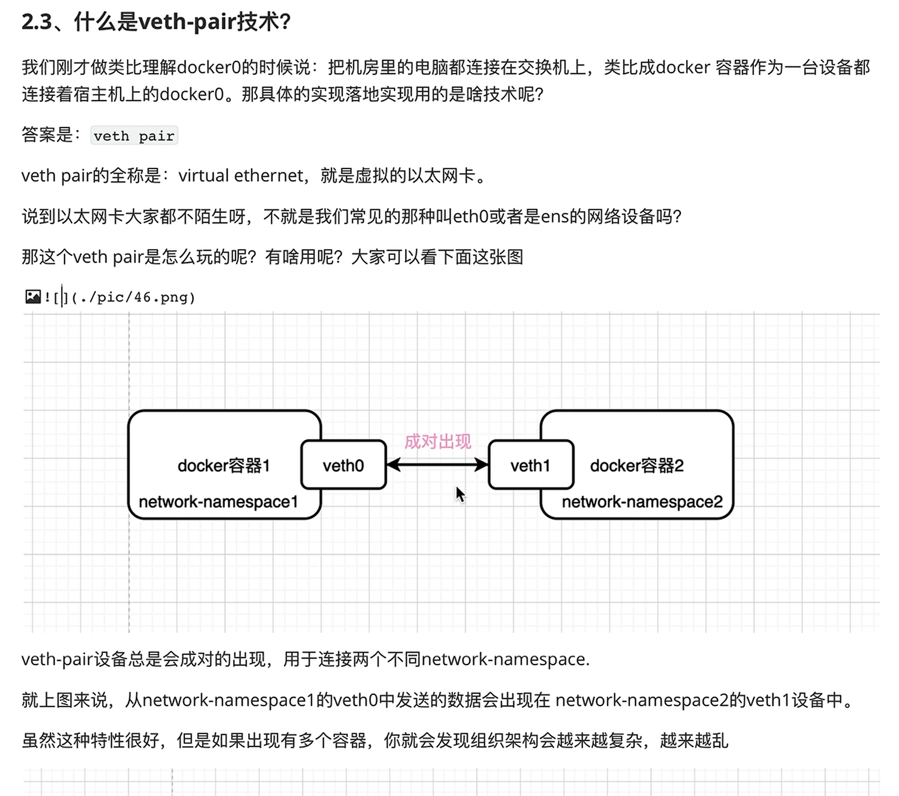
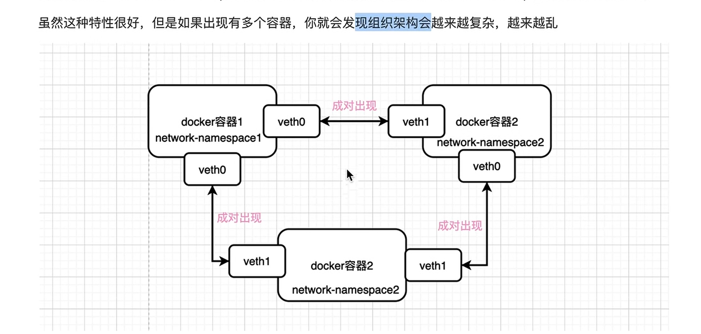

## 阿里云腾讯云ip
阿里云ip: 121.40.156.98 内网ip: 172.16.85.34
腾讯云ip: 124.222.246.77 内网ip: 10.0.4.2


=========================================================================
=================== 下面的是一些基础知识点 =================================
========================================================================

## 基础知识

### 什么是网桥:

网桥:待总结


宿主机安装docker后通过ip addr查看网络接口, 会看到已经自动增加一个网络接口:docker0,
这个docker0其实是一个网桥. 

可以通过下面的命令, 列出本机的网桥:
ip link show type bridge

理解docker0:

因此,容器中的ip和docker0的ip就是在一个网段的. 可以启动几个容器测试一下. (但是使用docker swarm的话好像不太一样.)


这里面的命名空间什么意思(docker0和宿主机是在一个命名空间), 什么事veth-pair技术,为什么是成对出现的,出现的目的是什么, 





# 几个基本技术点:

## 虚拟网卡对
`veth-pair`（Virtual Ethernet Pair）技术是一种常用于网络虚拟化和容器网络中的机制，用来在不同的网络命名空间之间传输数据。它的基本原理是创建一对虚拟网卡设备（称为 `veth` 设备），并将它们关联在一起，使得通过其中一个设备发送的数据可以从另一个设备接收。`veth` 设备通常用于连接容器、虚拟机或不同的网络命名空间。

以下是 `veth-pair` 技术的核心概念和用法：

### 1. **虚拟网卡对**：
- `veth` 是一对成对出现的虚拟网络接口，每一对接口中的一端连接到一个网络命名空间，另一端连接到另一个命名空间或宿主机。
- 例如，容器内部的网络可以通过 `veth` 对的一端连接到宿主机的网络或桥接设备上。 
- 【就理解成两台机器的两个插网线的口（一个机器上一个口），就是一个配对儿，这两个口，被系统给连接起来了（至于怎么连接的，这个是Linux系统级别的技术），就像通过一条网线连接在一起了，】

### 2. **工作原理**：
- 当在 `veth` 对的一端发送数据时，这些数据会自动出现在另一端，仿佛这两端之间有一条虚拟的网络链路(就像是一条网线,连接两头的虚拟网络接口)。
- `veth` 对不直接连接到物理网络，而是通过内核的虚拟网络机制实现数据传输。
- 例如，在容器场景中，一个 `veth` 端点可以被移入容器的网络命名空间中，而另一端留在宿主机，用于桥接到其他网络设备。

### 3. **典型应用场景**：
- **容器网络（如 Docker、Kubernetes）**：每个容器创建时，Docker 会为其创建一个 `veth` 设备对，一个放在容器内部，另一个连接到宿主机的网络设备上，例如 Linux 的 `bridge`（网桥），使容器与宿主机网络或其他容器互联。
- **虚拟机网络**：虚拟机的虚拟网络接口可以使用 `veth` 设备与宿主机或虚拟交换机连接，从而与物理网络进行交互。
- **网络命名空间的隔离**：在 Linux 内核中，不同的进程可以使用不同的网络命名空间，而通过 `veth-pair` 技术可以将这些隔离的命名空间连接起来，实现跨命名空间的通信。

### 4. **优点**：
- **高效性**：由于 `veth` 设备是完全在内核空间操作的，因此它们的性能较高，数据传输的延迟非常低。
- **灵活性**：它可以用于连接不同的网络命名空间，提供灵活的网络拓扑，适合各种虚拟化环境。
- **无物理限制**：`veth` 设备是虚拟的，完全不依赖物理网卡，因此可以随时创建和销毁。

### 5. **操作示例**：
- 创建一个 `veth-pair`：
  ```bash
  ip link add veth0 type veth peer name veth1
  ```
  这条命令将创建两个虚拟网络设备 `veth0` 和 `veth1`，数据通过这对设备进行传输。

- 将 `veth1` 移入某个网络命名空间：
  ```bash
  ip link set veth1 netns <namespace>
  ```
  这样，`veth0` 仍在当前命名空间，而 `veth1` 则移入指定的命名空间，实现跨命名空间通信。

### 总结：
`veth-pair` 技术是容器、虚拟化和网络命名空间中广泛使用的核心技术，能够灵活地连接不同网络环境，支持数据高效传输和隔离的网络环境创建。


## 网络命名空间
**网络命名空间（Network Namespace）** 是 Linux 内核提供的一种用于网络资源隔离的机制，允许不同的进程拥有各自独立的网络栈。通过网络命名空间，用户可以创建彼此隔离的网络环境，每个命名空间都有独立的网络设备、IP 地址、路由表、防火墙规则等。

### 1. **网络命名空间的基本概念**：
网络命名空间允许多个网络环境在同一个物理主机上并行运行，而这些环境互相隔离，就像是在不同的机器上。每个网络命名空间都包含以下网络资源的独立副本：
- **网络接口**（如 `eth0`）
- **IP 地址**
- **路由表**
- **防火墙规则**
- **套接字**

这些资源在命名空间之间是隔离的，一个命名空间中的进程无法直接访问另一个命名空间的网络资源。

### 2. **常见的应用场景**：
- **容器**：每个容器通常都有自己的网络命名空间，拥有独立的网络接口、IP 地址等，从而实现与其他容器和宿主机的网络隔离。
- **虚拟化环境**：通过命名空间，可以为虚拟机、进程或其他隔离的网络环境创建独立的网络堆栈。

### 3. **创建和管理网络命名空间**：
可以使用 `ip netns` 命令来创建和管理网络命名空间。例如：

```bash
ip netns add ns1       # 创建名为 ns1 的网络命名空间
ip netns list          # 列出所有命名空间
ip netns exec ns1 bash # 进入命名空间 ns1
```

在 `ns1` 网络命名空间内，你可以设置独立的网络接口、IP 地址等。

### 4. **veth-pair 与网络命名空间的关系**：
**`veth-pair`**（虚拟以太网对）通常用来连接不同的网络命名空间，或者在命名空间与宿主机网络之间建立通信桥梁。`veth` 设备成对出现，一端连接到一个命名空间，另一端可以连接到另一个命名空间或宿主机的网络设备上。

#### 具体工作方式：
- 每个 `veth` 对包含两个网络接口（类似一根虚拟的网线的两端），它们可以在不同的命名空间中各自充当网络接口。
- 数据通过 `veth` 对的一端进入，自动从另一端发送出去，类似于一个数据的虚拟管道。

**步骤示例**：
1. **创建一个 veth 对**：
   ```bash
   ip link add veth0 type veth peer name veth1
   ```
   这将创建两个虚拟网卡接口 `veth0` 和 `veth1`。

2. **将 veth1 移入另一个网络命名空间**：
   ```bash
   ip netns add ns1                # 创建名为 ns1 的网络命名空间
   ip link set veth1 netns ns1      # 将 veth1 设备移动到 ns1 中
   ```

3. **为网络接口设置 IP 地址并启用**：
   在主机的默认命名空间中：
   ```bash
   ip addr add 192.168.1.1/24 dev veth0  # 为 veth0 设置 IP 地址
   ip link set veth0 up                   # 启用 veth0
   ```

   在 `ns1` 命名空间中：
   ```bash
   ip netns exec ns1 ip addr add 192.168.1.2/24 dev veth1  # 为 veth1 设置 IP 地址
   ip netns exec ns1 ip link set veth1 up                  # 启用 veth1
   ```

4. **测试命名空间之间的通信**：
   现在，你可以通过 `ping` 测试两个网络命名空间（主机命名空间和 `ns1`）之间的通信：
   ```bash
   ping 192.168.1.2  # 在主机中，ping 命名空间 ns1 中的 veth1
   ```

通过这种方式，`veth-pair` 实现了命名空间之间的数据通信，相当于为每个命名空间提供了一个虚拟网卡连接通道。

### 5. **veth-pair 在容器中的作用**：
在容器化技术中（如 Docker、Kubernetes），`veth-pair` 是实现容器与宿主机网络通信的核心机制。每个容器启动时，Docker 会为它创建一个独立的网络命名空间，同时通过 `veth-pair` 设备将容器的网络命名空间与宿主机的网络桥接在一起。
- 容器内的 `veth` 接口通常会连接到一个虚拟交换机（如 Linux Bridge 或 Open vSwitch），这使得容器之间、容器与外部网络的通信得以实现。

### 6. **总结**：
- **网络命名空间** 提供了网络资源的隔离，每个命名空间拥有独立的网络栈。
- **veth-pair** 是连接不同网络命名空间的工具，起到桥梁作用，允许隔离的命名空间通过虚拟网络设备进行通信。
- 结合网络命名空间和 `veth-pair`，可以构建灵活的、隔离的网络拓扑，特别适用于容器化和虚拟化环境。


## 一个容器就是一个网络命名空间吗?
**一个容器不完全等同于一个网络命名空间**，但每个容器通常包含一个独立的网络命名空间，作为其隔离机制的一部分。容器技术（如 Docker 或 Kubernetes）使用多个命名空间来隔离容器的不同资源，其中网络命名空间用于隔离容器的网络环境。

### 1. **容器与网络命名空间的关系**：
当创建一个容器时，操作系统为该容器生成一个独立的网络命名空间。这个命名空间包括容器内所有的网络设备、IP 地址、路由表、防火墙规则等。容器内的进程只能访问这个命名空间中的网络资源，而无法直接访问宿主机或其他容器的网络资源。

每个容器内的网络命名空间是完全独立的，这意味着：
- 容器拥有自己的网络接口，如 `eth0`（通常是通过 `veth-pair` 连接到宿主机）。
- 容器内部有独立的 IP 地址，通常是私有网络中的 IP。
- 容器可以有自己的防火墙规则和路由表，与其他容器或宿主机隔离。

### 2. **多个命名空间的隔离**：
除了网络命名空间，容器技术还使用其他类型的命名空间来实现不同资源的隔离。例如：
- **PID命名空间**：容器拥有独立的进程ID空间，每个容器的进程ID与宿主机不同。
- **Mount命名空间**：容器拥有独立的文件系统视图。
- **IPC命名空间**：隔离容器之间的进程间通信机制。
- **UTS命名空间**：允许容器拥有独立的主机名。

### 3. **veth-pair 与网络命名空间的连接**：
容器的网络命名空间与宿主机的网络通常通过 **`veth-pair`**（虚拟以太网对）连接。具体过程如下：
- 容器启动时，Docker 或其他容器引擎会为该容器创建一个网络命名空间。
- 系统会为该命名空间创建一对虚拟以太网设备（`veth` 对），其中一端（`veth1`）在容器的网络命名空间中，作为容器的 `eth0` 网络接口。
- 另一端（`veth0`）则位于宿主机的网络命名空间中，通常连接到一个虚拟网桥（如 Docker 的 `docker0`），从而使容器与宿主机以及其他容器通信。

### 4. **容器与网络命名空间的典型工作流程**：
当容器启动时，操作系统会执行以下步骤来隔离网络：
1. **创建网络命名空间**：为容器生成独立的网络命名空间。
2. **创建虚拟网卡对（veth-pair）**：创建一对 `veth` 设备，一端在容器命名空间中，另一端在宿主机命名空间中。
3. **连接虚拟网卡到网桥**：宿主机中的 `veth` 设备连接到一个虚拟网桥（如 `docker0`），该网桥连接到宿主机的网络，使容器可以通过宿主机访问外部网络。
4. **分配IP地址**：为容器内的虚拟接口（如 `eth0`）分配一个 IP 地址，通常是通过私有网络 IP 地址空间（如 `172.17.x.x`）。
5. **路由配置**：容器内的网络路由表设置使得容器可以通过 `eth0` 接口访问外部网络。

### 5. **同一个容器中的多个网络命名空间？**
通常，**一个容器只包含一个网络命名空间**，但可以通过高级网络配置（如使用 Docker 的 `--net` 选项）让多个容器共享同一个网络命名空间（例如，多个容器使用相同的 IP 地址和网络接口）。这样做可以实现进程级别的隔离，但共享同一个网络环境。比如，某些场景下，运行在同一容器中的多个进程可能需要共享同一个网络接口，便可以使用这种方式。

### 6. **特殊网络模式**：
容器技术提供了多种网络模式，不同模式下容器和网络命名空间的关系也不同：
- **Bridge 模式（默认）**：每个容器都有自己的网络命名空间，容器的 `veth` 设备通过宿主机的网桥连接到宿主机网络。
- **Host 模式**：容器与宿主机共享同一个网络命名空间。容器使用宿主机的网络接口和 IP 地址，这样容器和宿主机之间没有网络隔离。
- **None 模式**：容器创建时不分配任何网络接口，网络命名空间是空的，通常用于完全隔离的场景。
- **Container 模式**：多个容器共享同一个网络命名空间，多个容器之间网络资源不隔离。

### 7. **总结**：
- **一个容器并不等同于一个网络命名空间**，但容器内的网络资源通常通过网络命名空间进行隔离。
- 每个容器通常有独立的网络命名空间，拥有自己的网络接口、IP 地址和路由表，通过 `veth-pair` 与宿主机或其他容器通信。
- 网络命名空间是 Linux 容器实现网络隔离的关键机制，结合其他命名空间可以实现进程、文件系统等多层次隔离。


## docker的网络模型
Docker 的网络类型及其用途是 Docker 容器管理中的一个关键部分，理解这些网络类型和网络的创建对于确保容器之间的通信和资源共享非常重要。以下是 Docker 网络类型的介绍、为什么需要创建网络以及不创建网络时会发生什么。

### 1. **Docker 的网络类型**

Docker 提供了几种不同的网络类型，每种网络都有其特定的用途，适用于不同的应用场景：

#### 1.1 **Bridge 网络**（默认网络）
- **用途**：Bridge 网络是 Docker 的默认网络类型，主要用于同一台主机上的容器之间的通信。每个容器都会连接到一个虚拟的网桥（例如 `docker0`），并且每个容器都有独立的 IP 地址。
- **特点**：适用于单节点 Docker 安装时的容器通信。同一台主机上的容器通过 IP 或者容器名可以互相访问。

  ```bash
  docker run -d --name container1 --network bridge nginx
  docker run -d --name container2 --network bridge nginx
  ```

#### 1.2 **Host 网络**
- **用途**：Host 网络使得容器与宿主机共享相同的网络命名空间，这意味着容器使用宿主机的 IP 地址和端口。
- **特点**：容器不再有独立的网络命名空间。容器运行时的端口会直接映射到宿主机上。适用于需要最大网络性能或避免 NAT（网络地址转换）的场景。

  ```bash
  docker run -d --network host nginx
  ```

#### 1.3 **Overlay 网络**
- **用途**：Overlay 网络用于 Docker Swarm 集群或多个 Docker 主机之间的通信，它通过在多个主机之间创建虚拟网络，使得分布在不同主机上的容器能够相互通信。
- **特点**：适用于分布式系统中的容器通信，可以跨越多个物理或虚拟主机。

  ```bash
  docker network create -d overlay my-overlay-network
  docker service create --name my-service --network my-overlay-network nginx
  ```

#### 1.4 **Macvlan 网络**
- **用途**：Macvlan 网络使容器能够直接与宿主机的物理网络连接，并为每个容器分配独立的 MAC 地址和 IP 地址。
- **特点**：适用于需要直接访问宿主机所在网络或与外部物理设备进行通信的场景。

  ```bash
  docker network create -d macvlan \
    --subnet=192.168.1.0/24 \
    --gateway=192.168.1.1 \
    -o parent=eth0 my-macvlan-network
  ```

#### 1.5 **None 网络**
- **用途**：None 网络表示容器启动时不分配网络接口。容器完全隔离，无法与外界通信。
- **特点**：适用于不需要网络的容器，通常用于测试或特定安全需求的场景。

  ```bash
  docker run -d --network none nginx
  ```

### 2. **为什么要创建网络？**

创建 Docker 网络有以下几个作用：

#### 2.1 **容器通信和隔离**
- **容器之间的通信**：Docker 网络允许多个容器相互通信。不同的网络类型决定了容器是否可以在同一主机上通信（如 `bridge` 网络）或跨多主机通信（如 `overlay` 网络）。
- **隔离**：通过 Docker 网络，你可以将不同的容器放在不同的网络中，实现逻辑上的隔离。例如，将前端容器与数据库容器放在不同的网络中，以确保安全性。

#### 2.2 **服务发现和负载均衡**
- **服务发现**：Docker 网络为同一网络中的容器提供内置的 DNS 服务，容器可以通过容器名称互相发现和通信，而无需使用 IP 地址。
- **负载均衡**：在 Docker Swarm 中，Docker 网络支持基于 VIP（虚拟 IP）的负载均衡，自动将请求分配到多个容器实例中。

#### 2.3 **跨主机通信**
在使用 Docker Swarm 或 Kubernetes 等编排工具时，Docker 网络可以跨越多个主机，允许分布在不同物理机器上的容器相互通信。例如，`overlay` 网络可以将不同主机上的容器连接在一起。

#### 2.4 **IP 地址和网络管理**
创建网络可以为容器分配特定的 IP 地址或定义子网，以便更好地管理容器的网络配置。例如，使用 `macvlan` 网络可以确保容器与宿主机所在的物理网络进行无缝通信。

### 3. **不创建网络就不能使用 Docker 吗？**

#### 3.1 默认的 Docker 网络
即使你不手动创建网络，Docker 在启动时已经为你创建了几个默认网络：
- **Bridge 网络**：即使你不显式创建，Docker 会默认将容器放在 `bridge` 网络中。同一台主机上的容器可以通过 IP 地址或名称相互访问。
- **Host 网络**：与宿主机共享网络的容器默认使用 `host` 网络，不需要手动创建。
- **None 网络**：没有网络连接的容器会使用 `none` 网络。

因此，**即使不创建网络，你仍然可以使用 Docker 的默认网络**，但这些网络有其局限性。例如，`bridge` 网络只能在同一主机上的容器之间通信，不能跨主机通信。如果需要跨主机的容器通信或更加灵活的网络管理，就必须手动创建网络。

#### 3.2 创建网络的必要性
虽然 Docker 提供了默认网络，但在以下情况下创建自定义网络是必要的：
- **跨主机通信**：在使用 Docker Swarm 集群时，需要创建 `overlay` 网络来支持跨主机通信。
- **网络隔离**：如果你希望将不同的应用（如前端和后端）放在不同的网络中以确保安全隔离，需要手动创建网络。
- **自定义配置**：你可能需要控制网络的子网、网关或 IP 地址范围，这时就需要创建自定义网络。

### 4. **总结**

- **Docker 的网络类型**包括 bridge、host、overlay、macvlan 和 none，每种类型适用于不同的场景。
- **创建网络的作用**在于管理容器之间的通信、实现服务发现和负载均衡、进行网络隔离以及支持跨主机通信。
- **默认网络**允许基本的容器通信，但**手动创建网络**对于复杂的应用场景、跨主机通信、网络隔离和安全控制是必要的。


## docker Swarm创建服务为什么需要先创建网络
在 Docker Swarm 中创建服务时，**先创建网络**是为了确保服务之间能够进行高效、安全、灵活的通信。Docker Swarm 是一种容器编排工具，支持分布式环境下的容器管理，因此网络在 Swarm 集群中扮演了重要角色。以下是创建网络的重要性和原因。

### 1. **容器之间的通信**
Docker Swarm 集群通常由多个节点组成，容器可能会分布在不同的主机上。为了让这些容器之间能够相互通信，需要使用跨主机的虚拟网络。在 Swarm 中，通常使用 `overlay` 网络来实现跨节点的容器通信。

- **跨主机通信**：`overlay` 网络允许在不同节点上的容器通过虚拟网络互相通信，而无需关心容器实际所在的物理主机。这样，你可以在不同的主机上运行服务，并确保它们可以相互访问。

例如，创建一个 `overlay` 网络并将服务连接到该网络：

```bash
docker network create -d overlay my-overlay-net
docker service create --name my-service --network my-overlay-net nginx
```

通过这样的设置，`my-service` 中的容器可以通过该网络与其他服务的容器进行通信。

### 2. **服务发现与负载均衡**
Docker Swarm 内置了服务发现和负载均衡功能，而这些功能依赖于 Docker 网络进行工作。

- **服务发现**：当你在 Swarm 中启动多个容器时，Docker 网络会为它们提供一个内置的 DNS 解析服务。容器可以通过服务名称（而不是 IP 地址）进行相互访问。这种自动的服务发现使得容器间的通信更加动态和灵活，避免了手动配置 IP 地址。

  例如，你可以通过 `my-service` 的名称直接访问这个服务，而不需要知道其 IP 地址：

  ```bash
  curl http://my-service
  ```

- **负载均衡**：当服务中有多个副本时，Swarm 通过虚拟 IP (VIP) 的方式实现负载均衡。请求会通过 `overlay` 网络发送到同一个虚拟 IP 地址，Docker Swarm 会自动将流量分发给多个副本。

### 3. **网络隔离和安全**
网络隔离是容器化技术的重要安全机制之一。通过创建网络，可以将不同的服务隔离在不同的网络中，从而避免不相关的服务之间相互访问，提升安全性。

- **安全隔离**：你可以将前端和后端服务分别置于不同的网络中，确保只有相关服务能够通信，防止数据泄露。例如，你可以为数据库服务创建一个专属的网络，确保只有需要访问数据库的服务能够加入该网络。

  例如：

  ```bash
  docker network create -d overlay frontend-net
  docker network create -d overlay backend-net

  docker service create --name frontend --network frontend-net nginx
  docker service create --name backend --network backend-net mysql
  ```

在这种场景下，前端服务和后端服务位于不同的网络，确保了隔离性，提升了安全性。

### 4. **跨主机容器的持久通信**
在 Swarm 集群中，容器可能会因为故障或扩展而在不同的节点之间迁移。为了确保容器能够在迁移之后继续通信，使用 `overlay` 网络是必需的，因为它提供了一个虚拟的网络抽象，使得容器无论在哪个节点上，都可以继续通过相同的网络进行通信。

例如，当一个容器从一个节点迁移到另一个节点时，如果没有一个全局的 `overlay` 网络，迁移后的容器将无法与其他节点的容器通信。

### 5. **简化管理**
通过创建网络，Docker Swarm 中的服务和容器管理更加灵活。你可以在网络中动态添加或删除服务，而不需要手动进行复杂的网络配置。网络的动态性使得 Swarm 集群中的容器编排变得更简单高效。

- **动态配置**：当你需要扩展或缩减服务时，可以直接通过 Docker Swarm 自动管理容器的网络连接。新的容器会自动加入已定义的网络，并通过内置的服务发现机制与现有容器通信。

### 6. **避免使用默认网络的局限性**
虽然 Docker 提供了默认的 `bridge` 网络和 `host` 网络，但它们有如下局限性：
- **`bridge` 网络**：仅限于单一主机上的容器通信，不能跨主机通信，因此不适合用于 Swarm 集群。
- **`host` 网络**：容器和宿主机共享相同的网络命名空间，缺乏隔离性，也不适合大规模的分布式应用场景。

Swarm 集群需要能够跨主机通信的网络，如 `overlay` 网络，这样才能在集群中实现容器的高效通信和管理。

### 7. **总结**
在 Docker Swarm 中创建服务时先创建网络是为了实现以下目标：
- **跨主机的容器通信**，使得分布式环境下的容器能够无缝互联。
- **服务发现和负载均衡**，容器可以通过服务名称相互通信，并实现流量的自动分发。
- **网络隔离与安全**，通过将不同服务置于不同的网络中，提升安全性和隔离性。
- **跨节点持久通信**，确保容器在迁移时仍然保持可访问性。
- **动态网络管理**，简化了集群中服务和容器的管理。

因此，创建合适的网络是部署和管理 Swarm 集群中服务的一个必要步骤。


## Docker Swarm必须使用 overlay网络吗
虽然不是必须的，但是一般我们使用Swarm就是使用Swarm的特性， 比如：跨主机的容器通信、服务发现和负载均衡、
服务的自动扩容与缩容等，这些特性是必须使用overlay网络类型的。


## swarm启动的容器指定了自己的网络,为什么还有ingress网络
在 Docker Swarm 中，即使你为服务指定了自己的网络（例如 `overlay` 网络），Swarm 仍然会创建并使用一个 **ingress 网络**。这是 Swarm 模式的设计特点，主要是为了实现 **负载均衡和路由功能**。下面是详细的原因和工作原理：

### 1. **什么是 Ingress 网络？**
Ingress 网络是 Docker Swarm 内置的一个特殊的 **`overlay` 网络**，用于处理 **服务的入口流量**，尤其是当你在 `docker service create` 命令中使用了 `-p` 参数暴露服务端口时，Swarm 会通过 ingress 网络来分发流量。它的主要作用是：
- **提供服务的入口负载均衡**：当你通过 Swarm 暴露某个服务端口（例如 `-p 8084:8084`），不论你连接到集群的哪个节点，Swarm 都会通过 ingress 网络将请求路由到合适的节点上的某个服务副本，进行负载均衡。
- **跨节点的服务发现和流量转发**：即使服务副本不在你连接的那个节点上，Swarm 也会通过 ingress 网络将流量转发到实际运行服务副本的节点。

### 2. **为什么有 Ingress 网络？**
即使你为服务创建了自定义的网络，Swarm 仍然需要 Ingress 网络来处理通过端口暴露到集群的外部流量。这是因为自定义网络通常用于服务之间的内部通信，而 ingress 网络则是专门处理来自集群外部的请求。

例如，当你启动服务时，命令如下：
```bash
docker service create --name docker-demo -p 8084:8084 --replicas 2 --network my-overlay-net registry.cn-hangzhou.aliyuncs.com/mdl_study/docker-demo:1.2
```

这个命令做了以下几件事：
- **`--network my-overlay-net`**：为服务创建了一个自定义 `overlay` 网络，服务副本之间的内部通信会通过这个网络进行。
- **`-p 8084:8084`**：暴露了服务的 8084 端口，Swarm 会通过 ingress 网络将外部请求（例如从客户端发往集群的请求）路由到实际运行该服务的节点。

因此，**ingress 网络** 在这里的作用是：
- 当外部请求到达某个 Swarm 节点时，Swarm 需要通过 ingress 网络将请求负载均衡到任意一个运行服务副本的节点上，而不局限于请求最初到达的节点。

### 3. **Ingress 网络的工作原理**
- 当你通过 `docker service create` 暴露了端口，Swarm 会自动在每个集群节点上监听该端口。
- 不论客户端连接到哪个节点，Swarm 都会通过 ingress 网络决定将请求路由到哪个节点上运行的服务副本。
- 如果服务副本不在请求到达的节点上，Swarm 使用 **ingress 网络** 来把流量转发到真正运行服务副本的节点上。

### 4. **能否不使用 Ingress 网络？**
- 如果你不使用 `-p` 来暴露服务的端口，Swarm 就不会使用 ingress 网络进行流量负载均衡。
- 如果你想避免 Swarm 自行处理的负载均衡，可以通过不使用 `-p`，并仅使用自定义的 `overlay` 网络来实现服务之间的内部通信。但这意味着外部用户需要通过特定节点的 IP 和服务副本内部的网络端口进行访问，而不是通过集群级别的统一入口端口。

### 5. **总结**
- **Ingress 网络** 是 Swarm 的一种负载均衡和路由机制，默认情况下用于处理外部请求，并将请求分发给集群中的服务副本。
- 即使你为服务指定了自定义网络，Swarm 仍然需要 ingress 网络来处理从集群外部进入的流量。
- 如果不需要外部访问和负载均衡，你可以不使用 `-p` 参数，避免创建 ingress 网络，不过这通常会降低服务的灵活性。

因此，`ingress 网络` 是 Swarm 集群设计中的一个关键组件，用于保证高效、透明的服务路由和负载均衡。