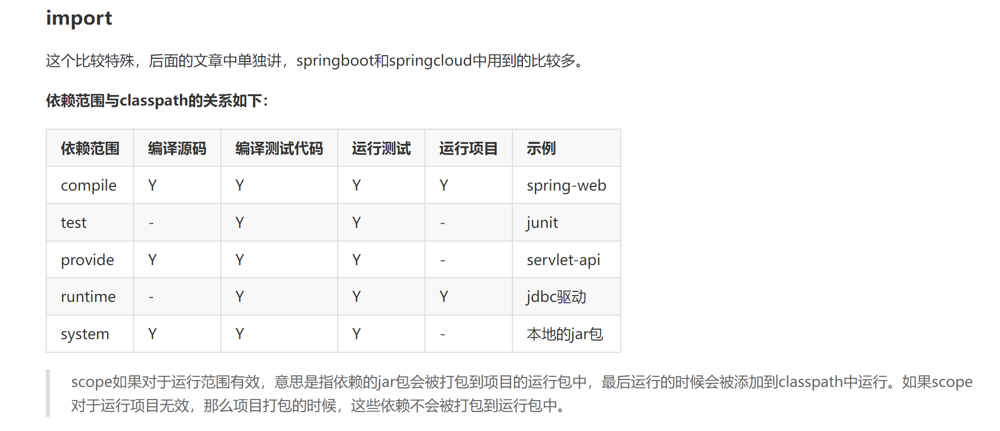
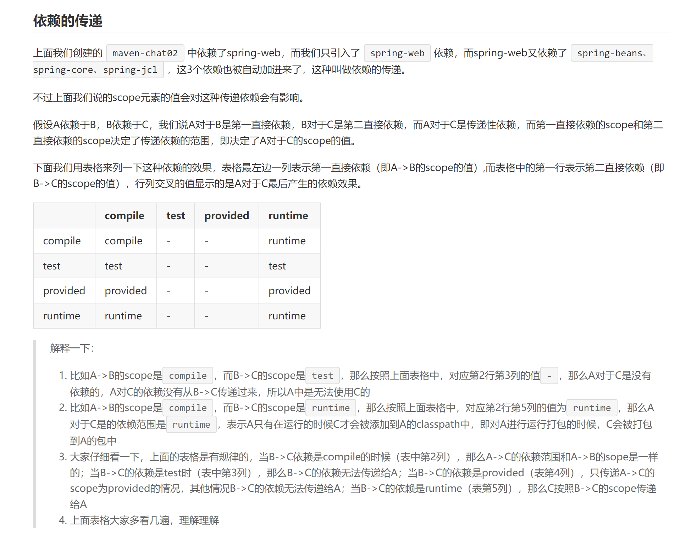
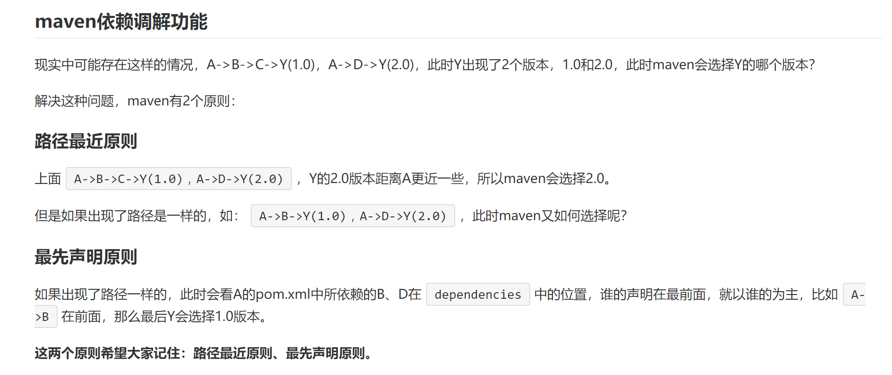
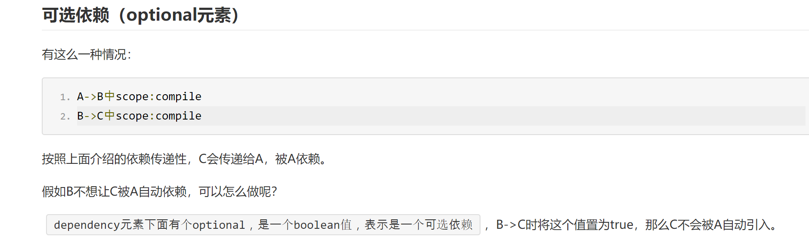
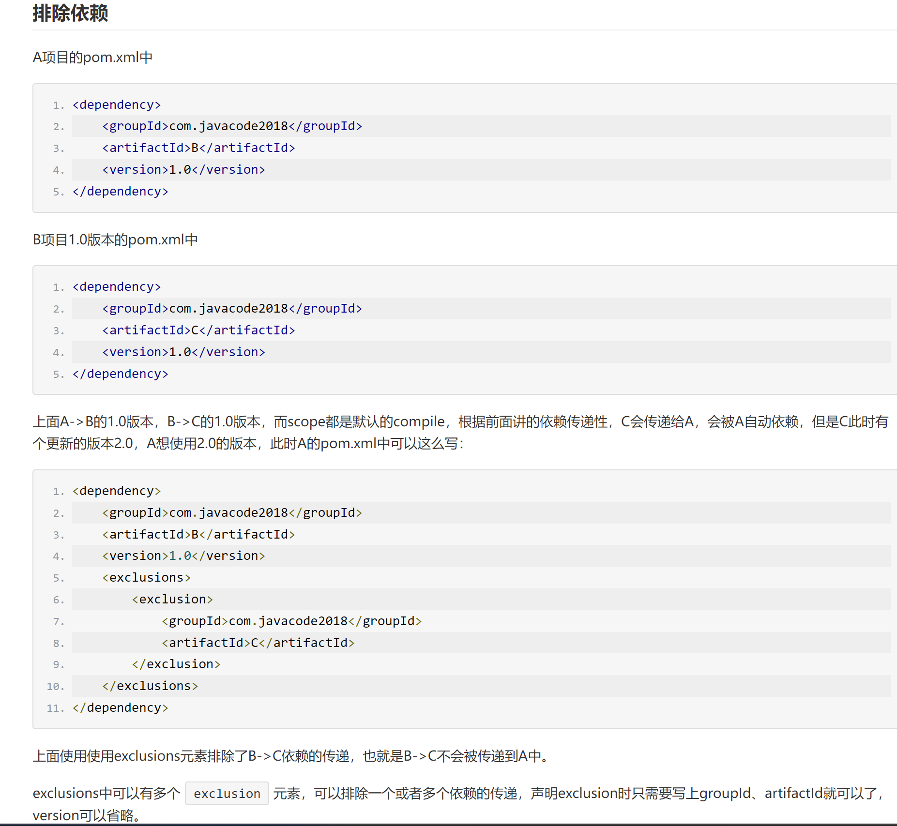

## 约定配置

Maven 提倡使用一个共同的标准目录结构，Maven 使用约定优于配置的原则，大家尽可能的遵守这样的目录结构，如下所示：

| 目录	                                | 目的                                           |
|------------------------------------|----------------------------------------------|
| ${basedir}                         | 存放pom.xml和所有的子目录                             |
| ${basedir}/src/main/java           | 	项目的java源代码                                  |
| ${basedir}/src/main/resources	     | 项目的资源，比如说property文件，springmvc.xml            |
| ${basedir}/src/test/java           | 	项目的测试类，比如说Junit代码                           |
| ${basedir}/src/test/resources	     | 测试用的资源                                       |
| ${basedir}/src/main/webapp/WEB-INF | 	web应用文件目录，web项目的信息，比如存放web.xml、本地图片、jsp视图页面 |
| ${basedir}/target                  | 打包输出目录                                       |
| ${basedir}/target/classes	         | 编译输出目录                                       |
| ${basedir}/target/test-classes     | 	测试编译输出目录                                    |
| Test.java	                         | Maven只会自动运行符合该命名规则的测试类                       |
| ~/.m2/repository	                  | Maven默认的本地仓库目录位置                             |

大家结合上面表格中的信息，再去看看springboot-chat01项目的结构，这是maven项目标准的结构，大家都按照这个约定来，然后maven中打包、运行、部署时候就非常方便了，maven他自己就知道你项目的源码、资源、测试代码、打包输出的位置，这些都是maven规定好的，就不是你随意搞的一个结构，所以不需要我们再去配置了，所以使用maven去打包、部署、运行都是非常方便的。

这块现实中也有很多案例，比如USB接口，电压，这些都是规定好的，如果USB接口所有厂商制造的大小都不一致，那我们使用电子设备的时候是相当难受的。

## maven导入依赖的构件

~~~xml

<project>
    <dependencies>
        <!-- 在这里添加你的依赖 -->
        <dependency>
            <groupId></groupId>
            <artifactId></artifactId>
            <version></version>
            <type></type>
            <scope></scope>
            <optional></optional>
            <exclusions>
                <exclusion></exclusion>
                <exclusion></exclusion>
            </exclusions>
        </dependency>
    </dependencies>
</project>
~~~

- dependencies元素中可以包含多个dependency，每个dependency就表示当前项目需要依赖的一个构件的信息
- dependency中groupId、artifactId、version是定位一个构件必须要提供的信息，所以这几个是必须的
- type：依赖的类型，表示所要依赖的构件的类型，对应于被依赖的构件的packaging。大部分情况下，该元素不被声明，默认值为jar，表示被依赖的构件是一个jar包。
- scope：依赖的范围，后面详解
- option：标记依赖是否可选，后面详解
- exclusions：用来排除传递性的依赖

## maven依赖范围（scope）
我们都知道，java中编译代码、运行代码都需要用到classpath变量，classpath用来列出当前项目需要依赖的jar包，这块不清楚的可以去看一下classpath和jar。

maven用到classpath的地方有：编译源码、编译测试代码、运行测试代码、运行项目，这几个步骤都需要用到classpath。

如上面的需求，编译、测试、运行需要的classpath对应的值可能是不一样的，这个maven中的scope为我们提供了支持，可以帮我们解决这方面的问题，scope是用来控制被依赖的构件与classpath的关系（编译、打包、运行所用到的classpath），scope有以下几种值：

compile
编译依赖范围，如果没有指定，默认使用该依赖范围，对于编译源码、编译测试代码、测试、运行4种classpath都有效，比如上面的spring-web。

test
测试依赖范围，使用此依赖范围的maven依赖，只对编译测试、运行测试的classpath有效，在编译主代码、运行项目时无法使用此类依赖。比如junit，它只有在编译测试代码及运行测试的时候才需要。

provide
已提供依赖范围。表示项目的运行环境中已经提供了所需要的构件，对于此依赖范围的maven依赖，对于编译源码、编译测试、运行测试中classpath有效，但在运行时无效。比如上面说到的servlet-api，这个在编译和测试的时候需要用到，但是在运行的时候，web容器已经提供了，就不需要maven帮忙引入了。

runtime
运行时依赖范围，使用此依赖范围的maven依赖，对于编译测试、运行测试和运行项目的classpath有效，但在编译主代码时无效，比如jdbc驱动实现，运行的时候才需要具体的jdbc驱动实现。

system
系统依赖范围，该依赖与3中classpath的关系，和provided依赖范围完全一致。但是，使用system范围的依赖时必须通过systemPath元素显示第指定依赖文件的路径。这种依赖直接依赖于本地路径中的构件，可能每个开发者机器中构件的路径不一致，所以如果使用这种写法，你的机器中可能没有问题，别人的机器中就会有问题，所以建议谨慎使用。

~~~
scope如果对于运行范围有效，意思是指依赖的jar包会被打包到项目的运行包中，
最后运行的时候会被添加到classpath中运行。如果scope对于运行项目无效，
那么项目打包的时候，这些依赖不会被打包到运行包中。
~~~
上面这句话是不是就是我打包只有几十kb的原因。

