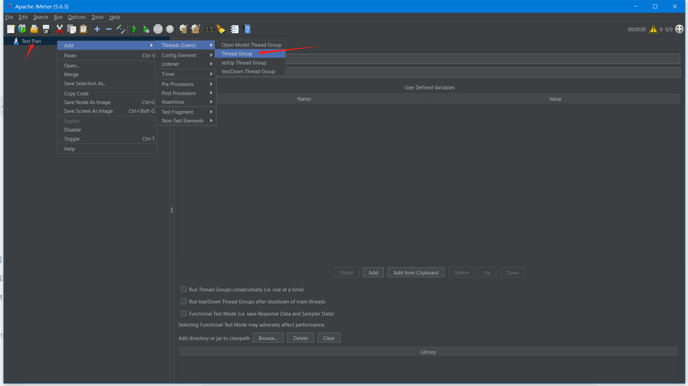
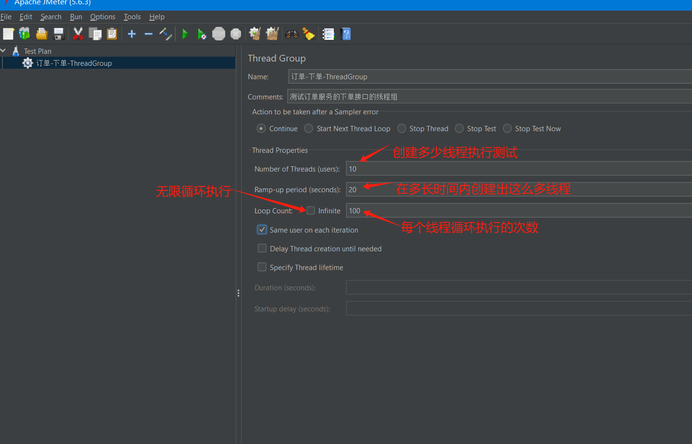

## 官网下载
下载二进制文件:Apache-jmeter-5.6.3.zip  
https://jmeter.apache.org/download_jmeter.cgi

解压到D盘, 不要解压到C盘, 因为在C盘启动的话,可能是因为目录有空格的问题,启动之后会报错,保存文档也报错:   
main ERROR FileManager (jmeter.log) java.io.FileNotFoundException: jmeter.log (拒绝访问。) java.io.FileNotFoundException: jmeter.log (拒绝访问。)

进到bin目录, 双击打开jmeter.bat文件. 然后会启动命令行窗口和Jmeter界面化窗口.

## 简单使用

### 创建测试计划
#### 添加线程组：
1.右键点击测试计划（Test Plan）> 添加（Add）> Threads (Users) > Thread Group。

2.配置线程组，例如设置线程数（Number of Threads）、Ramp-Up Period 和循环次数（Loop Count）。

#### 添加取样器（Sampler）：
1.右键点击线程组（Thread Group）> 添加（Add）> Sampler > HTTP Request。
2.配置 HTTP 请求的参数，如服务器名称或 IP、端口号、请求路径等。

#### 添加监听器（Listener）：
1.右键点击线程组或 HTTP 请求（HTTP Request）> 添加（Add）> Listener > View Results Tree。
2.监听器用于查看和分析测试结果。