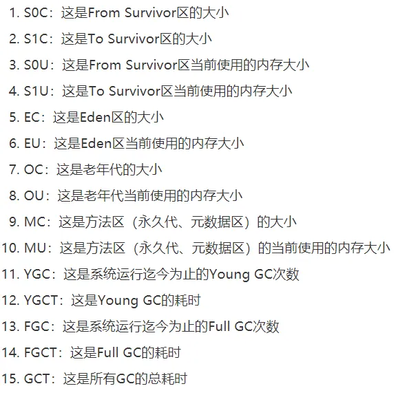

## jstat（JVM Statistics Monitorning Tool）

用于监控虚拟机各种运行状态信息的命令行工具，分析运行中的jvm进程整体情况。

它可以显示本地或远程虚拟机进程中的类装载、内存、垃圾收集、JIT编译等运行数据，它是运行期定位虚拟机性能问题的首选工具。

## 使用方法

先通过jps -l 命令找到自己Java程序的进程pid，
然后再使用jstat命令：  
jstat -gc 程序的pid

就可以看到该jvm进程的内存和垃圾回收情况。

| 列名	  | 说明                                  |
|------|-------------------------------------|
| S0C	 | 年轻代中第一个survior（From幸存区）的容量（kb）      |
| S1C	 | 年轻代中第二个survior（To幸存区）的容量（kb）        |
| S0U	 | 年轻代中第一个survior（From幸存区）目前已使用的容量（kb） |
| S1U	 | 年轻代中第二个survior（To幸存区）目前已使用的容量（kb）   |
| EC	  | eden区的容量（kb）                        |
| EU	  | eden区目前已使用的容量（kb）                   |
| OC	  | 老年代的容量（kb）                          |
| OU	  | 老年代目前已使用的容量（kb）                     |
| MC	  | 方法区（perm永久代，元数据）的容量（kb）             |
| MU	  | 方法区（perm永久代，元数据）目前已使用的容量（kb）                 |
| YGC  | 	从应用程序启动到采集时年轻代中gc次数                |
| YGCT | 	从应用程序启动到采集时年轻代中gc所用时间（秒）           |
| FGC  | 	从应用程序启动到采集时老年代中gc次数                |
| FGCT | 	从应用程序启动到采集时老年代gc所用的时间（秒）           |
| GCT  | 	从应用程序启动到采集时gc所用的总时间（秒）             |

另外：
jstat -gc PID 1000 10 这个命令可以每1000毫秒刷新一下，共刷新10次。

## 如何实用jstat命令，那就先想一下我们分析jvm运行情况需要哪些信息：

包括如下:
新生代对象增长的速率，
Young gc的触发频率，
Young Gc的耗时，
每次 Young GC后有多少对象是存活下来的，
每次 Young GC过后有多少对象进入了老年代，
老年代对象增长的速率，
Full GC的触发频率，
Full GC的耗时。

只要知道了这些信息，其实我们就可以结合之前几周的文章分析过的JVM GC优化的方法，合理分配内存空间，
尽可能让对象留在年轻代不进入老年代，避免发生频繁的FuGC。
这就是对jvM最好的性能优化了.因此我们一点点分析，通过jsta工具如何得到上述信息.

## 查看新生代增长的速率：jstat -gc PID 1000 10

这行命令，他的意思就是每隔1秒钟更新出来最新的一行jstat统计信息，一共执行10次jstat统计，
通过这个命令，你可以非常灵活的对线上机器通过固定频率输出统计信息，观察每隔一段时间的jvm中的Eden区对象占用变化。
如果系统压力比较低，每秒几乎不增长对象，那就改成一分钟。
高峰期和平时峰期都看一看。

Young GC的触发频率和每次耗时：
根据你的Eden区大小，除以上面的增长速率就知道多久一次yong gc了。根据jstat给出的yong gc次数和总耗时，知道每个耗时。

每次 Young GC后有多少对象是存活和进入老年代：
yong gc后有 多少对象是存活下来的，不太好直观的看出来，但是可以观察推测：
我们知道，活下来的对象是进入survivor区和老年代的，此时我们就可以用jstat -gc命令，看每次yong gc后的survivor区和老年代的变化，注意：yong
gc后survivor区肯定有对象进入占用一部分空间，但是老年代是可能有对象进入占一部分空间，所以重点是观察老年代的变化。因为一般能进入老年代或应该进入老年代的是需要长期存活的对象，需要长期存活的对象不可能一直在增长，如果你的老年代每次yong
gc都进入几十M的对象，是不正常的。每次进入几十K或几M还算情有可原。所以，基于上面的理论可以用老年代和survivor区的增长速率推测每次yong
gc后有多少对象活了下来。
比如用上面的方法知道了三分钟一次yong gc，就可以用jstat -gc 18000 10 去观察每次yong gc后的对象存活情况。
从一个正常的角度来看，老年代的对象是不太可能不停的快速增长的，因为普通的系统其实没那么多长期存活的对象。如果你发现比如每次
Young GC过后，老年代对象都要增长几十MB，那很有可能就是你一次 Young GC过后存活对象太多了存活对象太多，可能导致放入
Survivor区域之后触发了动态年龄判定规则进入老年代，也可能是 Survivor区域放不下了，所以大部分存活对象进入老年代。
所以通过上述观察策略，你就可以知道每次 Young GC过后多少对象是存活的，实际上
Survivor区域里的和进入老年代的对象，都是存活的，你也可以知道老年代对象的增长速率，比如每隔3分钟一次 Young
GC，每次会有50MB对象进入老年代，这就是老年代对象的增长速率，每隔3分钟增长50MB。进而决定怎么优化。

FuGC的触发时机和耗时：
只要知道了老年代对象的增长速率，那么Full GC的触发时机就很清晰了，比如老年代总共有800MB的内存，每隔3分钟新增50MB对象，那么大概每小时就会触发一次Fu‖GC然后可以看到
stat打印出来的系统运行起劲为止的FuGC次数以及总耗时，比如一共执行了10次FullGC，共耗时30s，每次FullGC大概就是需要耗费3s左右。

