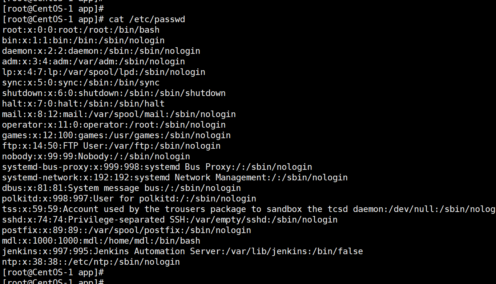

## useradd：添加新用户
管理员权限才能添加或修改用户。

useradd 用户名	添加新用户  
useradd -g 组名 用户名	添加新用户到某个组

添加用户时，默认会在/home目录生成一个和用户名同名的用户的家目录

## passwd：设置用户密码
passwd 用户名	为指定的用户设置密码

passwd tom  会提示输入密码，输入过程屏幕上不会显示。

## id：查看用户是否存在
id 用户名

查看tom、jack是否存在：

[root@testx ~]# id tom  
uid=1001(tom) gid=1001(tom) 组=1001(tom)  
[root@testx ~]# id jack  
id: jack: no such user  

## cat /etc/passwd：查看创建了哪些用户
所有创建的用户在/etc/passwd文件中都会有记录

## su：切换用户
su：swith user的意思，表示切换用户

su 用户名	切换到目标用户，只能获得目标用户的执行权限，不能获得其环境变量  
su - 用户名	切换到目标用户并获得目标用户的环境变量及执行权限

root切换到其他用户不需要密码，否则要输入对应用户的密码才能切换。
当一个新创建的用户没有密码时，非管理员的其他用户是无法su到该用户的，因为验证密码的时候通不过。

案例：
当前是root用户，这root用户下，去执行su和su -的切换用户的效果，
echo $PATH用来输出环境变量PATH的信息，注意看环境变量的值有什么不同

~~~shell
[root@testx ~]# su tom
[tom@testx root]$ echo $PATH
/usr/local/sbin:/usr/local/bin:/usr/sbin:/usr/bin:/root/bin
[tom@testx root]$ exit
exit
[root@testx ~]# su - tom
上一次登录：二 5月  3 16:43:17 CST 2022pts/0 上
[tom@testx ~]$ echo $PATH
/usr/local/bin:/bin:/usr/bin:/usr/local/sbin:/usr/sbin:/home/tom/.local/bin:/home/tom/bin
~~~

## userdel：删除用户
userdel 用户名	删除用户，但会保留用户的主目录（即家目录）  
userdel -r 用户名	删除用户及其主目录（即家目录）；  -r	删除用户的同时，删除与用户相关的所有文件

## who：查看登录用户信息
whoami	显示当前用户名称  
who am i	显示登录用户的用户名以及登录时间， 注意登录用户并不是当前用户

显示登录用户的用户名以及登录时间
~~~shell
[root@testx ~]# who am i
root     pts/0        2022-05-03 12:53 (192.168.200.1)
[root@testx ~]# su user1
[user1@testx root]$ who am i
root     pts/0        2022-05-03 12:53 (192.168.200.1)
[user1@testx root]$ whoami
user1
~~~

## sudo：（superuser do）设置普通用户具有root或其他用户的权限
sudo是linux系统管理指令，是允许系统管理员让普通用户执行一些或者全部的root命令的一个工具，用法：sudo 管理员命令。

比如mdl用户直接使用sudo执行相关命令会被禁止并上报操作记录：
~~~shell
[mdl@CentOS-1 ~]$ mkdir /app/y
mkdir: 无法创建目录"/app/y": 权限不够
[mdl@CentOS-1 ~]$ sudo mkdir /app/y

我们信任您已经从系统管理员那里了解了日常注意事项。
总结起来无外乎这三点：

    #1) 尊重别人的隐私。
    #2) 输入前要先考虑(后果和风险)。
    #3) 权力越大，责任越大。

[sudo] mdl 的密码：
mdl 不在 sudoers 文件中。此事将被报告。
[mdl@CentOS-1 ~]$ 

~~~

用root用户修改配置：
vi /etc/sudoers

修改/etc/sudoers文件，找到下面一行，在root下面添加一行，如下图所示：

\## Allow root to run any commands anywhere  
root    ALL=(ALL)     ALL  
mdl    ALL=(ALL)     ALL

这样mdl用户就能执行root权限的命令了，使用sudo时，输入mdl自己的密码就行了（因为时管理员把mdl添加到/etc/sudoers文件的，说明管理员信任mdl）：
~~~shell
[mdl@CentOS-1 ~]$ mkdir /app/y
mkdir: 无法创建目录"/app/y": 权限不够
[mdl@CentOS-1 ~]$ sudo mkdir /app/y
[sudo] mdl 的密码：
[mdl@CentOS-1 ~]$ 
[mdl@CentOS-1 ~]$ 
[mdl@CentOS-1 ~]$ cd /app
[mdl@CentOS-1 app]$ ll
总用量 0
-rw-r--r--. 1 root root   0 4月   5 13:16 1.txt
drwxr-xr-x. 2 root root  32 4月   5 13:37 a
drwxr-xr-x. 3 root root  28 4月   5 13:15 b
drwxr-xr-x. 2 root root  19 4月   5 13:09 c
-rw-r--r--. 1 root root   0 4月   5 13:15 d
drwxr-xr-x. 2 root root  32 4月   5 13:23 e
drwxr-xr-x. 3 root root  28 4月   5 13:24 f
-rw-r--r--. 1 root root   0 4月   5 13:23 g
drwxr-xr-x. 2 root root  42 3月  19 23:06 myJenkins
drwxr-xr-x. 2 root root   6 4月   5 14:58 y
drwxr-xr-x. 5 root root 108 3月  31 23:57 zookeeper
[mdl@CentOS-1 app]$
~~~

从上面看，创建出的文件夹好像属于root的

或者配置成使用sudo命令时，不需要输入密码：
\## Allow root to run any commands anywhere
root    ALL=(ALL)     ALL
tom    ALL=(ALL)     NOPASSWD:ALL

sudo -l  : 列出当前用户可以利用sudo执行哪些命令

sudo -u 用户名 : 以该用户的身份执行命令

sudo -b 命令 : 在后台运行命令

~~~text

visudo命令：专门用来编辑sudo配置文件。 加 -c 检查sudoers文件语法错误。
 
#第一列表示用户名(组里的用户前加%)
#第二列的ALL表示允许从任何主机登录当前的用户账户
#第三列的ALL表示第一列的用户可以切换到系统中任何一个其它用户
#第四列表示第一列的用户能以root身份执行什么命令
 
test    ALL=(ALL)       ALL
#test用户具有所有权限相当于root执行命令需要输入密码
 
test    ALL=(ALL)       NOPASSWD:ALL
#test用户具有所有权限相当于root执行命令不需要输入密码
 
test    ALL=(ALL)       /usr/bin/useradd,/usr/bin/userdel
#test用户能执行useradd、userdel命令执行命令需要输入密码
 
test    ALL=(ALL)       NOPASSWDD:/usr/bin/useradd,/usr/bin/userdel
#test用户能执行useradd、userdel命令执行命令不需要输入密码
~~~

记录sodu操作日志：  
在配置文件中加上: Defaults logfile=/var/log/sudo.log

### su sudo 区别对比
用户身份：su命令需要超级用户（root）密码，用户可以切换到其他用户的身份并获得其权限。而sudo命令允许普通用户以其自己的密码执行特权操作。
权限范围：su命令切换到其他用户后，用户将获得该用户的全部权限。而sudo命令可以通过配置文件（sudoers文件）控制特权操作的范围，可以精确指定用户可以执行哪些命令以及以哪些用户的身份执行。
安全性：由于su命令需要共享root密码，这可能存在一些安全风险。如果其他人知道root密码，他们就可以切换到root用户，并拥有完全控制系统的权限。而sudo命令通过使用自己的密码来执行特权操作，可以避免共享root密码，提高系统的安全性。
记录日志：sudo命令会记录每个特权操作的日志，包括执行的命令和执行者的身份。这可以帮助系统管理员进行安全审计和追踪。而su命令没有内置的日志功能，无法追踪用户切换和执行的命令。
使用方式：su命令可以在命令行中直接输入，然后输入目标用户的密码即可切换用户。而sudo命令需要在命令前加上sudo关键字，然后输入自己的密码确认身份。

### 适用场景
使用su命令切换用户适用于需要长时间以其他用户身份操作的情况，比如需要在其他用户的环境下执行一系列命令或长时间工作。
使用sudo命令适用于临时需要执行特权操作的情况，比如安装软件、更新系统或执行重要的系统维护任务。

## usermod：修改用户
usermod [选项] 用户名