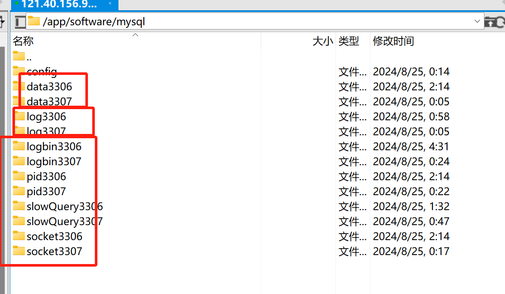

在 Linux 上安装并配置两个 MySQL 实例以实现主从复制是一个常见的任务。这种配置可以通过在同一台服务器上运行多个 MySQL
实例来实现，两个实例使用不同的端口和配置文件。

以下是实现主从复制的详细步骤，假设已经安装了 MySQL 5.7，并且要配置两个实例分别运行在端口 `3306`（主库）和 `3307`（从库）。

### 一、准备工作

1. **安装 MySQL**：
   确保 MySQL 已安装并正常运行。可以使用以下命令检查 MySQL 版本：

   ```bash
   mysql --version
   ```

2. **创建目录结构**：
   在配置多个实例之前，需要为每个实例创建单独的目录结构，包括数据目录、日志目录等。

   ```bash
   sudo mkdir -p /var/lib/mysql3306 /var/log/mysql3306
   sudo mkdir -p /var/lib/mysql3307 /var/log/mysql3307
   ```

实际在阿里云上的实战，各种文件都建的独有的文件夹，本文中的只是举例，和阿里云上的不一致。


将数据目录和日志目录的权限设置为 MySQL 用户：（因为mysql默认不允许其他用户运行mysql，所以，自己自定义的文件夹一定要给“mysql”用户授权，
启动mysql的时候，使用切换到“mysql”执行启动命令，如果没有mysql用户，就创建一个。授权成功后，后面的初始化新的数据目录的操作，才不会出现问题（出问题可以查看指定的错误日志）。
一定要注意，应该把所有新指定的目录（数据目录，日志目录，pid目录，binlog目录等）都授权，
如果是使用默认的方式启动mysql服务（systemctl start mysqld的方式），这些应该都是在mysql的脚本中都写好了，我们不用管）

   ```bash
   sudo chown -R mysql:mysql /var/lib/mysql3306 /var/log/mysql3306
   sudo chown -R mysql:mysql /var/lib/mysql3307 /var/log/mysql3307
   ```

   ```bash
   chown -R mysql:mysql /app/software/mysql/data3306
   chown -R mysql:mysql /app/software/mysql/log3306
   chown -R mysql:mysql /app/software/mysql/logbin3306
   chown -R mysql:mysql /app/software/mysql/pid3306
   chown -R mysql:mysql /app/software/mysql/slowQuery3306
   chown -R mysql:mysql /app/software/mysql/socket3306
   ```

### 二、配置主实例（3306）

1. **创建配置文件**：
   为主实例创建一个新的配置文件 `/etc/mysql/my3306.cnf`。

   ```bash
   sudo cp /etc/mysql/my.cnf /etc/mysql/my3306.cnf
   ```

   编辑配置文件 `/etc/mysql/my3306.cnf`：

   ```ini
   [mysqld]
   port = 3306
   datadir = /var/lib/mysql3306
   socket = /var/run/mysqld/mysqld3306.sock
   log-error = /var/log/mysql3306/error.log
   pid-file = /var/run/mysqld/mysqld3306.pid
   server-id = 1
   log-bin = /var/lib/mysql3306/mysql-bin
   ```

2. **初始化数据目录**：

   初始化新的数据目录，因为自己指定了新的数据目录，并且启动方式是自己通过命令执行特定配置文件的方式启动mysql，
   所以那些必须的数据还不存在，比如默认就应该有的mysql数据库和里面的user表等，就要在启动mysql服务之前先初始化这些必须的数据，
   只需在首次配置时执行初始化：（初始化之后，查看错误日志看看有没有什么问题，看看数据目录里是否有数据文件了）

   ```bash
   sudo mysqld --defaults-file=/etc/mysql/my3306.cnf --initialize-insecure --user=mysql --datadir=/var/lib/mysql3306
   阿里云的：sudo mysqld --defaults-file=/app/software/mysql/config/my3306.cnf --initialize-insecure --user=mysql--datadir=/app/software/mysql/data3306
   # 注意：--initialize-insecure 这个参数初始化的数据，初始化的root用户没有密码（--initialize参数好像有密码），下面启动mysql服务后，可以先给root设置一个密码。
   ```
   

3. **启动主实例**：

   使用以下命令使用mysql用户启动 MySQL 主实例：

   ```bash
   sudo -u mysql mysqld --defaults-file=/etc/mysql/my3306.cnf &
   阿里云的：sudo -u mysql mysqld --defaults-file=/app/software/mysql/config/my3306.cnf &
   ```

4. **配置主库用户和权限**：

   登录到主实例并创建一个用于复制的用户：

   ```bash
   # 注意：这个mysqld3306.sock的名字是文件夹，并不是文件，好像是一个打不开的文件夹，存储里mysql连接信息。
   # 因为启动mysql服务实例的时候，配置文件中指定了socket文件夹是/var/run/mysqld/mysqld3306.sock, 
   # 因此该mysql服务实例的连接控制数据就记录在/var/run/mysqld/mysqld3306.sock里，那以后登录mysql都要指定这个socket文件夹。
   # 否则mysql使用默认的socket文件夹信息，就登录不上这个mysql服务实例。
   mysql -u root --socket=/var/run/mysqld/mysqld3306.sock 
   阿里云的：mysql -u root --socket=/app/software/mysql/socket3306/mysqld.sock
   可以先给root用户设置一下密码。

   CREATE USER 'replica_user'@'%' IDENTIFIED BY 'replica_password';
   GRANT REPLICATION SLAVE ON *.* TO 'replica_user'@'%';
   FLUSH PRIVILEGES;
   ```

5. **获取二进制日志信息**：

   获取二进制日志信息，这些信息将在配置从库时使用：

   ```sql
   FLUSH TABLES WITH READ LOCK;
   SHOW MASTER STATUS;
   ```

   记下输出中的 `File` 和 `Position`，例如 `mysql-bin.000001` 和 `154`。

6. **解锁表**：

   解除数据库锁定：

   ```sql
   UNLOCK TABLES;
   ```

### 三、配置从实例（3307）

1. **创建配置文件**：
   为从实例创建一个新的配置文件 `/etc/mysql/my3307.cnf`。

   ```bash
   sudo cp /etc/mysql/my.cnf /etc/mysql/my3307.cnf
   ```

   编辑配置文件 `/etc/mysql/my3307.cnf`：

   ```ini
   [mysqld]
   port = 3307
   datadir = /var/lib/mysql3307
   socket = /var/run/mysqld/mysqld3307.sock
   log-error = /var/log/mysql3307/error.log
   pid-file = /var/run/mysqld/mysqld3307.pid
   server-id = 2
   relay-log = /var/lib/mysql3307/relay-bin
   log-bin = /var/lib/mysql3307/mysql-bin  # 如果希望从库也能作为其他库的主库
   ```

2. **初始化数据目录**：

   别忘记给mysql用户授权这些文件夹：
   ```bash
   chown -R mysql:mysql /app/software/mysql/data3307
   chown -R mysql:mysql /app/software/mysql/log3307
   chown -R mysql:mysql /app/software/mysql/logbin3307
   chown -R mysql:mysql /app/software/mysql/pid3307
   chown -R mysql:mysql /app/software/mysql/slowQuery3307
   chown -R mysql:mysql /app/software/mysql/socket3307
   ```

   初始化新的数据目录：

   ```bash
   sudo mysqld --defaults-file=/etc/mysql/my3307.cnf --initialize-insecure --user=mysql --datadir=/var/lib/mysql3307
   阿里云的：sudo mysqld --defaults-file=/app/software/mysql/config/my3307.cnf --initialize-insecure --user=mysql--datadir=/app/software/mysql/data3307
   # 注意：--initialize-insecure 这个参数初始化的数据，初始化的root用户没有密码（--initialize参数好像有密码），下面启动mysql服务后，可以先给root设置一个密码。
   ```
   

3. **启动从实例**：

   使用以下命令启动 MySQL 从实例：

   ```bash
   sudo -u mysql mysqld --defaults-file=/etc/mysql/my3307.cnf &
   阿里云的：sudo -u mysql mysqld --defaults-file=/app/software/mysql/config/my3307.cnf &
   
   # 然后先登录3307的mysql服务，查看一番，给root用户设置一下密码，再创建一个管理员用户user_mdl供平时使用
   mysql -u root --socket=/app/software/mysql/socket3307/mysqld.sock
   ```

4. **导入主库数据到从库**：

   从主库导出数据并导入到从库。先在主库导出数据：

   ```bash
   mysqldump -u root --socket=/var/run/mysqld/mysqld3306.sock --all-databases --master-data > /tmp/backup.sql
   阿里云的：mysqldump -u root -p --socket=/app/software/mysql/socket3306/mysqld.sock --all-databases --master-data > /app/software/mysql/dump3306/backup.sql
   # mysqldump命令 是
   ```

   然后将备份文件复制到从库并导入：

   ```bash
   mysql -u root --socket=/var/run/mysqld/mysqld3307.sock < /tmp/backup.sql
   阿里云的：mysql -u root --socket=/app/software/mysql/socket3307/mysqld.sock < /app/software/mysql/dump3306/backup.sql
   ```

5. **配置从库复制**：

   登录从库，配置要复制的主库的信息，并启动复制：

   ```sql
   CHANGE MASTER TO
   MASTER_HOST='127.0.0.1',
   MASTER_PORT=3306,
   MASTER_USER='replica_user',
   MASTER_PASSWORD='replica_password',
   MASTER_LOG_FILE='mysql-bin.000001',  # 使用在主库上记下的文件名
   MASTER_LOG_POS=154;  # 使用在主库上记下的位置（这里一定要使用上面记录的编号吗，使用最新获取的编号行不行）

   START SLAVE;
   ```

6. **检查复制状态**：

   检查从库的复制状态：

   ```sql
   SHOW SLAVE STATUS;
   ```

   确认 `Slave_IO_Running` 和 `Slave_SQL_Running` 均为 `Yes`，并且没有错误信息。

### 四、验证主从复制

1. **在主库上创建测试数据**：

   在主库上创建一个新数据库或表：

   ```sql
   CREATE DATABASE test_db;
   ```

2. **验证从库是否同步**：

   在从库上检查新创建的数据库是否已经同步：

   ```sql
   SHOW DATABASES LIKE 'test_db';
   ```

   如果能看到 `test_db`，说明主从复制配置成功。

### 五、总结

通过上述步骤，你可以在同一台 Linux 服务器上运行两个 MySQL 实例，实现主从复制。3306 端口的实例作为主库，3307
端口的实例作为从库。这种配置方法有效地利用了服务器资源，并提供了数据库的高可用性和容灾能力。