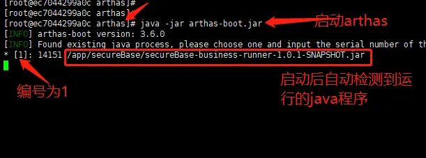
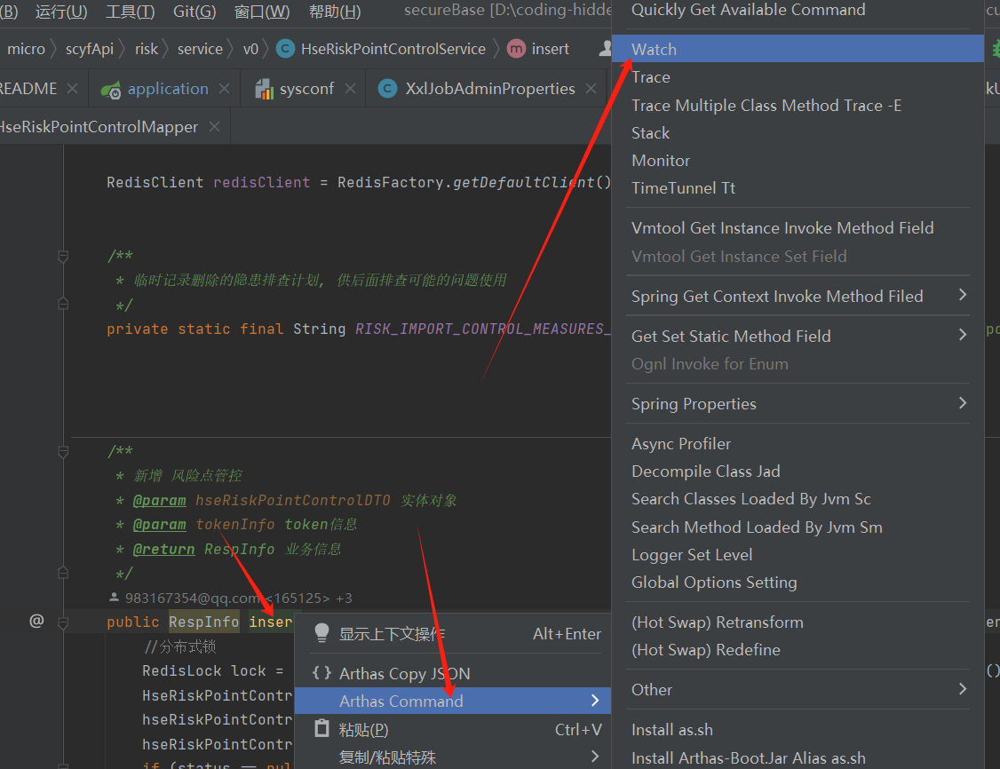

## 先在服务器上查询是否已经有arthas
find / -name  arthas-boot.jar 

或者 find / -name arthas 查到arthas相关的文件夹,进去看看有没有arthas的jar包.

## 启动arthas
java -jar arthas-boot.jar

如果端口号被占用，也可以通过以下命令换成另一个端口号执行:
java -jar arthas-boot.jar --telnet-port 9998 --http-port -1

--telnet-port 9998 该参数指定Arthas使用 9998 端口进行 Telnet 连接,Telnet 是一种协议，允许你通过命令行远程访问 Arthas 控制台.  
--http-port -1 该参数指定禁用Arthas的HTTP服务。通常，Arthas 提供一个基于 HTTP 的用户界面，用于可视化监控和操作。将端口设置为 -1 表示禁用此功能。

## 挂载arthas到进程上
如图启动后会检测到java进程, 然后输入进程编号回车就挂载上去了:  

日志记录的信息，记录在c:\Users\用户目录\logs目录下的日志中。Linux也在对应的用户目录下

## 常用命令
### watch (监测方法的入参,出参,返回值,异常 等.)

如图,在类中的insert方法上右键拿到针对该insert方法 watch 命令:
watch com.xxx.HseRiskPointControlService insert '{params,returnObj,throwExp}'  -n 5  -x 3 

{params,returnObj,throwExp} 表示 方法的参数,返回值,异常信息 都监测

-x 3 参数表示展示对象的深度, 可以改成 5 或 6, 这样比较深的对象的属性值都能展示出来.

-n 5 参数表示监测到几次调用后自动退出watch的监测.

-b  参数表示在方法执行前监测,这样监测到的参数的值就是"入参",-b 的参数下,监测到方法的返回值就是null,因为是在方法执行前监测的, 
    默认是 -f 在方法执行结束后(无论是正常结束还是异常结束)监测, -f的情况下监测到的方法参数的值是"出参(在方法中可能被修改后的参数的值)"

注意:如果方法返回值使用的JSONObject,那arthas是没法没法打印展示具体JSONObject对象里面的值的,即便 -x 10 都没法打印出JSONObject对象里面的值(可能是因为JSONObject对象没有固定的属性),
可以使用下面的方法,把返回值转成json字符串打印(注意docker容器里打印中文可能乱码):
watch com.xxx.HseRiskPointControlService insert '{params,@com.alibaba.fastjson.JSON@toJSONString(returnObj),throwExp}'  -n 5  -x 3

### trace (对方法内部调用路径追踪, 输出方法内每行代码节点的耗时)
同上使用arthas IDEA插件在方法上拿到命令.

trace com.xxx.HseRiskPointControlService insert  -n 5 --skipJDKMethod false 

--skipJDKMethod false 表示不跳过jdk的方法监测

#### 根据调用耗时过滤，耗时大于25ms的调用路径才打印
trace com.xxx.HseRiskPointControlService insert '#cost > 25' -n 5 --skipJDKMethod false

### stack (输出当前方法被调用的调用路径,查询哪里调用的该方法)
获取insert方法的调用路径
stack com.xxx.HseRiskPointControlService insert  -n 5
条件表达式来过滤，第 0 个参数的值小于 0 
stack com.xxx.HseRiskPointControlService insert 'params[0]<0'  -n 5
据执行时间来过滤，耗时大于 5 毫秒
stack com.xxx.HseRiskPointControlService insert '#cost > 5'  -n 5 

### monitor (监控指定类中方法的执行情况)
用来监测该方法在指定时间段内的执行次数,成功次数,失败次数,每次平均耗时,失败率:  
monitor com.xxx.HseRiskPointControlService insert  -n 5  --cycle 10
上面命令表示 每10秒监测并打印一次,一共打印5次.

### tt (time-tunnel 时间隧道)
记录下指定方法每次调用的入参和返回信息，并能对这些不同时间下调用的信息进行观测.  

watch 虽然很方便和灵活，但需要提前想清楚观察表达式的拼写，这对排查问题而言要求太高，因为很多时候我们并不清楚问题出自于何方，只能靠蛛丝马迹进行猜测。 
这个时候如果能记录下当时方法调用的所有入参和返回值、抛出的异常会对整个问题的思考与判断非常有帮助。
于是乎，TimeTunnel 命令就诞生了。

