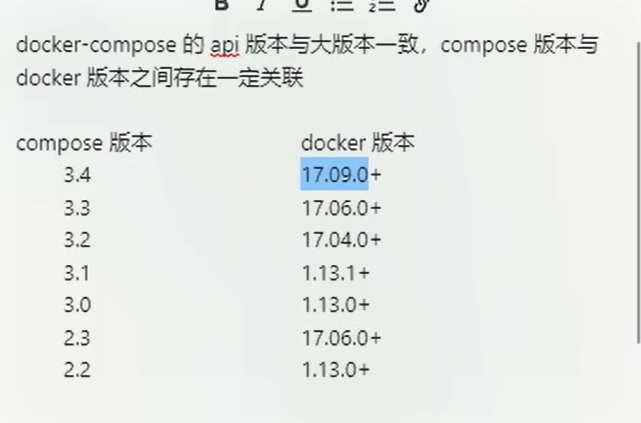
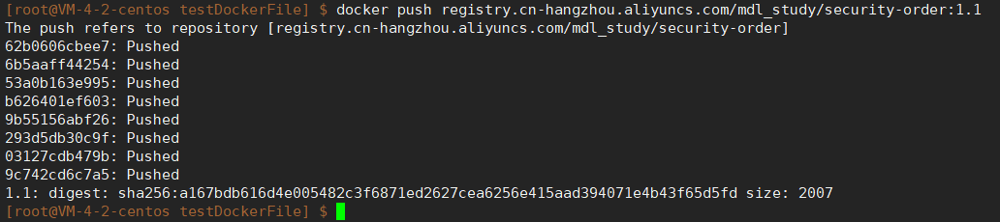
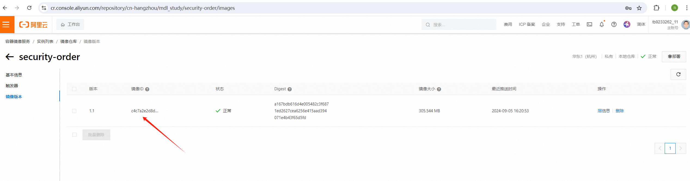

## Dockerfile的文件名称
只要文件名是“Dockerfile”（无论大小写，没有文件格式后缀）的文件， 
就是Dockerfile文件.

在某个文件夹里使用docker build 构建镜像的时候， docker会默认使用当前文件夹下面的Dockerfile文件
进行构建，如果当前文件夹下有多个Dockerfile文件，就需要明确指定使用哪个。

docker build 的用法看下面的讲解.


## 什么是Dockerfile
Dockerfile 是用于构建 Docker 镜像的脚本，定义了镜像内的文件系统结构、依赖项、 环境变量以及启动命令等。
Dockerfile 使用一种特定的语法，包含一系列指令，每一条指令都会生成镜像的一层。
下面是 Dockerfile 语法的概述：


## Dockerfiel 的语法
编写 Dockerfile 时，每一条指令的顺序和内容对于最终生成的 Docker 镜像性能、可维护性和功能性至关重要。
下面我将按照编写 Dockerfile 文件时常用的顺序详细讲解每一条指令，并通过案例进行说明。

------------------------------------------------------------------------------------------------
### 1. FROM 指令
FROM 指令用于指定基础镜像。Dockerfile 的第一条指令通常就是 `FROM`，它告诉 Docker 要从哪个现有的镜像开始构建。
from基于的镜像一般是官方提供的，比较精简的镜像，比如精简的centos镜像，很精简的，里面可能很多命令都没有。

FROM ubuntu:20.04

详细说明：
这表示我们将使用 ubuntu:20.04 作为构建镜像的基础。这是一个官方的 Ubuntu 20.04 的镜像，接下来所有的操作都会基于这个镜像。

------------------------------------------------------------------------------------------------
### 2. LABEL 和 MAINTAINER 指令
LABEL 用于添加元数据，例如作者信息、版本号等。这些标签可以用于镜像管理和自动化工具中。
可替代MAINTAINER指令，比MAINTAINER更灵活，可以写多行。  

LABEL maintainer="yourname@example.com"  
LABEL name="yourname"  

这个标签指定了镜像维护者的联系信息。在复杂的项目中，LABEL 还可以添加其他元数据，如镜像版本、描述等。

------------------------------------------------------------------------------------------------
### 3. ARG 指令
ARG 用于定义在构建过程中可以使用的变量。与 ENV 不同，ARG 的作用范围仅限于构建时，容器运行时无法访问。

ARG jdkVersion=8

这个指令定义了一个名为 VERSION 的变量，默认值为 1.0。你可以在 Dockerfile 中通过 ${VERSION} 使用这个变量。
ARG的值还可以再build镜像的时候通过传入参数（docker build -t --build-arg jdkVersion=11）替换掉文件中的值，所以文件中的指定的（jdkVersion=8）这个8的值可以认为是默认值, 
或者文件中不指定值, 在命令参数中必须输入值。
因此，同一个Dockerfile文件，可以通过指定参数的方式构建出不同内涵的镜像。

------------------------------------------------------------------------------------------------
### 4. ENV 指令
ENV 用于在容器运行时设置环境变量，这些变量可以被容器内的程序访问。

示例（一行多个）：
ENV APP_HOME=/usr/src/app  appId=10001

示例（一行一个）：
ENV APP_HOME /usr/src/app  
ENV appId 10001

设置一个名为 APP_HOME 的环境变量，其值为 /usr/src/app。后续的 RUN、CMD 等指令可以使用这个环境变量。

------------------------------------------------------------------------------------------------
### 5. WORKDIR 指令
WORKDIR 用于设置工作目录（制作的这个镜像运行起来的容器的工作目录）。这个指令的作用是改变当前的工作目录，
相当于 cd 到这个目录里，如果没有就先创建这个目录，
所有后续的 RUN、CMD、ENTRYPOINT 等指令都会在这个目录下执行。
【疑问：如果在这个指令之前使用RUN或CMD命令，那是在哪个目录下执行的】

WORKDIR $APP_HOME

此指令将工作目录切换到之前通过 ENV 设置的 APP_HOME 路径 /usr/src/app。如果目录不存在，Docker 会自动创建。

------------------------------------------------------------------------------------------------
### 6. COPY 和 ADD 指令
这两个指令用于将文件或目录从主机复制到镜像中。COPY 仅支持本地文件系统，而 ADD 还支持 URL 和自动解压 tar 文件。

COPY . .

这行代码将当前上下文目录下的所有文件复制到镜像的工作目录（在上面的例子中是 /usr/src/app）。

#### 另一种 ADD 的用法：
ADD app.tar.gz /app

这行代码会解压 app.tar.gz 并将内容复制到 /app 目录中。

------------------------------------------------------------------------------------------------
### 7. RUN 指令
RUN 指令用于在镜像内执行命令。常见用途是安装依赖、配置环境等。每个 `RUN` 指令会创建镜像的新层。
比较像Linux的shell执行命令，但是run本身是docker的命令，不是shell命令。
比如 我们基于精简的镜像centos做自己的镜像，无可避免的要在这个centos上安装一些插件或命令，
就可以用run去指示出要Linux执行的安装安装命令，例如：
安装软件有两种方式：
第一种：数组的方式，docker官方推荐的方式，运行之后就自动退出了，用的是Linux的exec模式。例如：run ["yum", "install", "httpd"]，这句话的意思是：用yum去安装httpd软件。
第二种：直接运行一个shell命令，就是run后面直接跟着一个shell命令即可。如：run yum install httpd。

RUN apt-get update && apt-get install -y python3

这行代码首先更新包管理器的索引，然后安装 Python 3。`RUN` 指令后的命令通常会连接成一行，以减少镜像层数。

------------------------------------------------------------------------------------------------
### 8. EXPOSE 指令
EXPOSE 指令声明容器运行时要暴露的端口，供外部访问。需要注意的是，这仅是文档性质的声明，实际端口映射需要在运行容器时指定。

EXPOSE 8080

这行代码声明容器将监听 8080 端口，通常用在 Web 应用中。

------------------------------------------------------------------------------------------------
### 9. VOLUME 指令
`VOLUME` 指令用于定义数据卷，持久化数据或在多个容器间共享数据。

VOLUME /data

此指令创建一个挂载点 `/data`，可以将主机的目录或其他容器的目录挂载到这个路径。
这个挂载点是不是必须容器内的程序往这个挂载点写数据，这个内容内的挂载点下才有数据，
并且是不是启动容器的时候，必须指定这个挂载点到宿主机的某个文件夹下，好像说如果不指定对应的宿主机的文件夹，
就会在宿主机的某个位置创建一个随机的文件夹与这个挂载点映射。

------------------------------------------------------------------------------------------------
### 10. ENTRYPOINT 和 CMD 指令
这两条指令用于指定容器启动时执行的命令。
说是Dockerfile中只能有一条CMD或ENTRYPOINT指令，如果多条就只执行最后一条，
它们有类似的功能，但有不同的使用场景：

- CMD 是为容器提供默认命令，它可以被 `docker run` 提供的命令覆盖。
- ENTRYPOINT 更加不可变，适用于明确的启动任务。

CMD ["python3", "app.py"]   
或  
CMD ping 127.0.0.1

CMD的各种语法可以再查询总结一下。


此指令指定了容器启动时默认执行 `python3 app.py`。如果在 `docker run` 命令后指定了其他命令，则会覆盖此指令。

ENTRYPOINT ["python3", "app.py"]
此指令将 `python3 app.py` 作为容器的入口点，后续命令行参数会作为 `app.py` 的参数传递。

------------------------------------------------------------------------------------------------
### 11. HEALTHCHECK 指令
HEALTHCHECK 指令定义了容器的健康检查，它定期执行以确保容器运行正常。并在异常时采取相应的操作，如重启容器。

HEALTHCHECK --interval=5m --timeout=3s --retries=5 CMD curl -f http://localhost/ || exit 1
或
HEALTHCHECK --interval=5m --timeout=3s --retries=5 CMD ps -ef | grep aaa.jar || exit 1

exit的值：0是健康的，1是不健康的（unhealthy），2是保留值，不确定健不健康。

此指令每 5 分钟运行一次 `curl` 命令检查本地服务器是否正常运行，如果检查失败则退出码为 1，表明容器状态不健康。
执行检查动作的超时时间是3s，如果失败重试5次（默认3次），
--retries 指定了 Docker 在宣布容器不健康（unhealthy）之前，尝试健康检查的次数。
每次健康检查失败时，Docker 会等待一段时间（由 --interval 参数指定），然后再次进行健康检查。这个过程会持续到达到最大重试次数为止。
如果在所有重试机会中，健康检查仍然失败，则容器状态会被标记为“不健康”（unhealthy）。
健康检查失败的影响：

当容器被标记为不健康时，容器编排工具（如 Docker Swarm 或 Kubernetes）可能会采取相应的措施，如重启容器、停止服务或触发告警。
对于独立运行的容器，虽然容器不会自动重启，但可以通过 docker inspect 或其他监控工具查看容器的健康状态。

------------------------------------------------------------------------------------------------
### 12. USER 指令
USER 指令指定接下来执行命令的用户。

USER nobody

此指令将执行命令的用户切换为 `nobody`，通常用于提高安全性，避免以 root 用户执行命令。
当然如果指定的话，需要先保证有这样一个用户，并且有相关的用户权限。用的不多。

------------------------------------------------------------------------------------------------
### 13. STOPSIGNAL 指令
STOPSIGNAL 指令定义了容器终止时发送给主进程的信号。

STOPSIGNAL SIGTERM

此指令指定当停止容器时发送 SIGTERM 信号给主进程，以确保容器优雅退出。

------------------------------------------------------------------------------------------------
### 14. ONBUILD 指令
ONBUILD 指令用于为派生镜像定义触发动作。通常在基于当前镜像构建新镜像时使用。

ONBUILD RUN echo "This image has been built!"

此指令定义了一个在继承此镜像的 Dockerfile 中触发的命令，当构建基于此镜像的新镜像时会运行这条命令。

------------------------------------------------------------------------------------------------
### 15. SHELL 指令
SHELL 指令用于指定默认的 shell 程序，通常用于 Windows 容器。

SHELL ["powershell", "-Command"]

此指令更改了 `RUN` 指令使用的 shell，从默认的 `/bin/sh` 切换到 PowerShell。

------------------------------------------------------------------------------------------------

通过以上指令，你可以编写一个功能全面的 Dockerfile。


## 案例：（注意：一般工作中就使用下面案例中的指令就够了）

以下是一个完整的示例 Dockerfile：

```Dockerfile
# 使用基础镜像
FROM openjdk:8

# 设置标签（工作中一般不写写个，或不写自己的信息，写开源镜像的时候可以写上自己的信息）
LABEL maintainer="madongliang"
LABEL email="mdl6699@163.com"

# 设置构建时变量
ARG VERSION=1.0

# 添加文件当前文件夹下的jar包到镜像中，改名字为app.jar
ADD aaa.jar /app.jar

# 设置环境变量, jvm参数等
ENV JVM_OPTS="-Duser.timezone=Asia/Shanghai -Xms128m -Xmx128m"  
ENV appId=10001 

# 设置工作目录
WORKDIR /app/service

# 暴露端口
EXPOSE 8080/tcp

# 创建数据卷
VOLUME /data

# 设置启动命令
ENTRYPOINT ["sh", "-c", "java ${JVM_OPTS} -jar /app.jar $APP_OPTS"]
或
ENTRYPOINT ["java","-Xms128m","-Xmx256m","-Xmn128m","-Dfile.encoding=UTF-8","-jar","/app/service/app.jar"]

# 健康检查
HEALTHCHECK --interval=5m --timeout=3s \
  CMD curl -f http://localhost/ || exit 1
```

这个 Dockerfile 定义了一个基于 Ubuntu 20.04 的镜像，它会安装 Python 3，并将项目文件复制到 `/usr/src/app` 目录下。容器启动时会运行 `python3 app.py`，并监听 8080 端口。


## docker build 构建镜像
docker build [OPTIONS] PATH | URL | -

OPTIONS:是构建时的参数,比如-t指定镜像名称和标签(-t 镜像名:tag).  
PATH或URL或-: 是制定需要构建的上下文路径,可以是本地的路径,可以是git仓库地址的url,也可以是标准输入的方式.

一般使用:`docker  build  -t 镜像名:tag  . `的方式构建镜像. 

上面命令解析:
docker build: 这是构建 Docker 镜像的基本命令。它会根据给定的上下文（即构建所依赖的文件和目录），默认在上下文目录中找Dockerfile文件, 并按照Dockerfile文件中的指令构建镜像。

-t 镜像名:tag: 这个选项用来为构建的镜像命名并打标签。 镜像名：你想给镜像起的名字。比如，my-app。 tag：镜像的版本号或标签。比如，1.0。如果不指定，默认会使用 latest 作为标签。
例如，-t my-app:1.0 会将构建的镜像命名为 my-app，并给它分配一个 1.0 的标签。

. :这个点表示 构建上下文 的路径。上下文包含Dockerfile文件及其构建镜像要使用的文件和目录。在这个命令中的 . 代表当前目录，也就是告诉Docker在当前目录中查找 Dockerfile 和相关资源来构建镜像。


注意: 如果你的Dockerfile文件不是默认的名称,或者可能不在上下文目录中, 可以使用-f指定Dockerfile路径和名称, 但是上下文还是可以使用.来使用当前目录构建:
docker  build  -t 镜像名:tag -f /app/myDockerfile .

当然也可以指定上下文的路径:
docker  build  -t 镜像名:tag -f /app/myDockerfile /app/aaa


#### 其他参数
--build-arg:  给Dockerfile文件中的ARG的参数赋值,可以做到通过命令动态修改文件内的参数:
docker build --build-arg VERSION=1.0 -t my-image .


–target：指定阶段构建，对应多阶段构建的场景,使用 --target 指定多阶段构建中的某个构建阶段，通常用于优化和缩小最终镜像大小。
docker build --target builder -t my-builder-image .

--no-cache:禁用缓存，强制 Docker 每一层都重新构建，而不使用之前构建时的缓存。适用于需要完全干净构建的场景。
docker build --no-cache -t my-image .


## 镜像推送仓库
新构建的镜像,如果想用于Docker swarm, 那必须把镜像推送到远程仓库, 因为刚构建的镜像只在本地, 其他节点的docker里是没有这个镜像的, 因此,如果想让swarm集群中的所有节点都使用相同版本的镜像,
swarm集群对某个镜像启动容器的时候, 各个节点都是从远程仓库拉取镜像并启动容器的. 所以,构建的镜像必须先推送的远程仓库.

自己已经申请了阿里云仓库:
https://cr.console.aliyun.com/cn-hangzhou/instance/repositories

先把本地docker登录阿里云仓库:  
docker login --username=tb9233262_11 registry.cn-hangzhou.aliyuncs.com   
回车输入密码:  
123987456Mdl  
这个密码应该是给镜像仓库设置的密码,不是阿里云的密码.

cat ~/.docker/config.json 命令可以查看一下登录后保存的登录信息.


登录成功后，需要将本地的镜像打上符合阿里云仓库格式的标签：
docker tag 要打tag的本地镜像  阿里云的地址/命名空间/镜像名(镜像名应该是要和仓库名字相同):1.1 
即:
docker tag  security-order:1.1  registry.cn-hangzhou.aliyuncs.com/mdl_study/security-order:1.1

docker images 就能看到刚打过标签的镜像. 


完成打标签后，使用以下命令将新标签的镜像推送到阿里云：
docker push 阿里云的地址/命名空间/镜像名(镜像名应该是要和仓库名字相同):1.1
即:
docker push registry.cn-hangzhou.aliyuncs.com/mdl_study/security-order:1.1   







