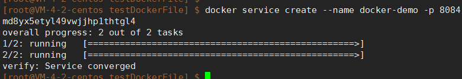
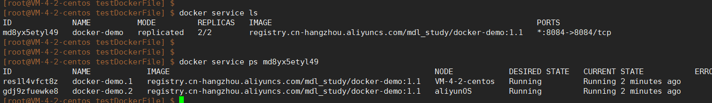

## Docker swarm
Docker swarm 是docker自带的,不需要安装,可以直接使用.

====================================================================================================================

## 搭建docker swarm集群要求
Docker Swarm 集群在生产环境中的最佳实践建议是使用至少 3 台机器 来确保高可用性（HA）。
然而，从技术上讲，Swarm 集群可以在两台机器上运行，尽管这种配置会有一些限制和风险。

为什么建议至少 3 台机器？
高可用性 (High Availability)：
Docker Swarm 使用 Raft 协议来管理集群的状态和数据一致性。Raft 协议要求至少过半数节点可用，才能达成共识（即更新集群状态）。
当 Swarm 集群只有 2 个节点时，如果其中一个管理节点发生故障，剩下的节点将无法继续管理集群，因为无法达到多数派投票（quorum）。
这会导致集群无法正常工作。

故障恢复能力：
在有 3 个或更多管理节点的 Swarm 集群中，即使一个节点出现故障，剩下的节点仍然能够维持多数投票，从而保持集群的正常运行。
在生产环境中，通常会配置奇数个管理节点（例如 3、5、7 个），以避免因网络分区或单节点故障导致整个集群失效。

为什么在两台机器上也能搭建 Swarm？
虽然最佳实践是 3 台或更多机器，但 Docker Swarm 的设计允许你在只有 2 台机器的情况下初始化和运行集群。这种配置在小规模开发环境或测试环境中是可行的，并且能够提供基本的 Swarm 功能。
但是，使用 2 台机器意味着你必须承受没有高可用性保障的风险。如果其中一台机器（尤其是管理节点）不可用，整个集群将失效，无法继续进行服务调度和管理。

====================================================================================================================

## 搭建docker swarm集群
首先每台机器必须先安装docker

选择一台机器作为 Swarm 管理节点（manager），在该机器上执行以下命令初始化swarm集群,即创建一个集群,执行初始化命令的节点会成为manager节点：

sudo docker swarm init --advertise-addr 124.222.246.77

--advertise-addr参数后面的ip地址就是本机的ip,供work节点连接使用.(下面有详细讲解--advertise-addr参数)

执行该命令后，你将看到类似以下的输出：

~~~shell
Swarm initialized: current node (xxxxxx) is now a manager.

To add a worker to this swarm, run the following command:

    docker swarm join --token SWMTKN-1-xxxxxxxxx 124.222.246.77:2377

To add a manager to this swarm, run 'docker swarm join-token manager' and follow the instructions.

~~~
这里的 docker swarm join --token SWMTKN-1-xxxxxxxxx 124.222.246.77:2377 是将其他节点（worker）加入 Swarm 所需的命令。

在第二台机器上，执行在上一步中生成的 docker swarm join 命令。例如：
docker swarm join --token SWMTKN-1-2mifyeylwlpqhkm61f49wngjsk1sxrpa7kag6g7eiu43915csq-8zvjf1y1on8vv08ev7yiwe37r 124.222.246.77:2377

注意1: 如果找不到了上面的这个命令,也可以使用:docker swarm join-token worker 命令再次查看加入worker节点的命令.
或者使用:docker swarm join-token manager 命令查看加入manager节点的命令.

执行完该命令后，你应该会看到类似以下的确认消息：This node joined a swarm as a worker.

注意2: 如果第一次执行上面的命令因为网络或防火墙的问题没能把当前节点成功添加到swarm的主节点下的话, 调整完网络问题后, 再次执行添加work节点的命令会发现报错:
"Error response from daemon: This node is already part of a swarm. Use "docker swarm leave" to leave this swarm and join another one."
意思是当前节点已经是一个work节点(就是刚才第一次执行出问题导致的,虽然出问题了,但是当前机器docker已经把自己标记为worker节点了),只不过这个节点没有成功添加到主节点下,
因此需要先执行""docker swarm leave"命令,把当前节点从集群移除, 然后重新添加.)

注意3: 上面的命令(docker swarm join --token SWMTKN-1-2mifyeylwlpqhkm61f49wngjsk1sxrpa7kag6g7eiu43915csq
-8zvjf1y1on8vv08ev7yiwe37r 124.222.246.77:2377)一般情况下是没问题的, 
但是如果你当前的机器有两个ip(比如我的阿里云的服务器,有公网ip和私网ip),那这个命令就存在问题了, 这个命令虽然吧当前阿里云的服务器作为worker节点加入了swarm集群,
但是它可能使用了阿里云服务器的私网ip作为广告出去的ip,即它默认拿到了服务器的私网ip给其他节点,让其他节点给自己通信的时候使用这个广告的ip, 如果其他节点也是私网中的阿里云节点应该也没问题,
但是我的其他节点是腾讯云的服务器, 这就导致其他节点(我的腾讯云主节点)与阿里云节点通信的时候使用的是阿里云服务器的私网ip,导致无法通信(好像导致的是容器与容器直接的访问服务有问题,
而主节点还是可以控制worker节点做副本的创建和删除操作的,应该是docker集群中的通信分多种,一种是集群管理的通信,一种是容器服务之前的访问通信等,
这里导致的通信问题是服务访问通信问题,比如影响负载均衡,容器与容器互调等).   
因此:这个命令应该加一个参数:   
--advertise-addr  需要广告出去的自己的ip

这个参数指定把自己哪个ip广告出去,得到下面的完整命令:   
docker swarm join --token SWMTKN-1-2mifyeylwlpqhkm61f49wngjsk1sxrpa7kag6g7eiu43915csq-8zvjf1y1on8vv08ev7yiwe37r 124.222.246.77:2377 --advertise-addr 121.40.156.98

指定广告出去的是公网ip, 这样其他节点,或者说相关的docker网络里记录的就是你广告的公网ip, 就使用这个ip与你通信. 

~~~
--advertise-addr 参数用于指定当前节点在 Swarm 集群中向外广播的 IP 地址，确保其他节点通过这个地址能够加入到 Swarm 集群中并进行通信。

指定通信 IP：如果你的服务器有多个网络接口（如有内网 IP 和公网 IP），通过这个参数你可以明确告诉 Swarm 集群应该通过哪个 IP 地址与其他节点通信。
多网络接口的情况：有些服务器有多个 IP 地址，可能是因为它们同时接入了不同的网络（如内网和公网）。在这种情况下，Docker Swarm 需要知道哪个 IP 应该被用来和集群中的其他节点通信，而不是默认使用一个不适合的网络接口。
NAT/防火墙环境：如果节点在 NAT 或防火墙之后，也可以使用 --advertise-addr 来指定一个可以被外部访问的地址。
如果不加 --advertise-addr 参数：
自动选择 IP：如果你不加这个参数，Docker 会自动选择一个 IP 地址来作为广告地址（Advertise Address）。通常，Docker 会根据网络接口的优先级自动选择第一个可用的 IP 地址。
不加的情况下可能的问题：在有多个网络接口的机器上，比如有公网和内网 IP，Docker 可能会选择错误的网络接口（比如内网 IP），导致外部节点无法通过正确的 IP 地址连接到管理节点。因此，在多网卡、多 IP 环境下，建议明确指定 --advertise-addr 参数。
~~~

加入worker节点完成之后, 验证 Swarm 状态:
回到管理节点，执行以下命令查看 Swarm 的状态：
sudo docker node ls

你应该能看到两台机器的列表，其中一台为管理节点，另一台为工作节点。

现在你已经成功搭建了一个包含两台机器的 Swarm 集群，可以通过下面讲解的 docker service create 命令创建服务.

====================================================================================================================

## swarm中的几个概念
### swarm:  
就是集群,可以理解成一个docker集群的整体,管理整个swarm集群的引擎. 其包含了使用swarm的命令.

### node:  
就是加入swarm集群的一台机器,服务器.  分为管理者节点(manager)和工作节点(worker).
管理者节点是用来管理和维护集群的,swarm的命令只能在管理者节点使用.
(节点退出集群的命令docker swarm leave是在worker节点使用的,表示当前节点退出该集群),
两种节点都可以有多台机器,管理节点可以有多个,但是leader只有一个.

### service(服务):  
服务(Services)是指一组任务的集合，服务定义了任务的属性。
服务有两种模式:
replicated services 按照一定规则在各个工作节点上运行指定个数的任务。

global services 每个工作节点上运行一个任务.

两种模式通过 docker service create 的--mode 参数指定.

服务就可以理解为我们的一个java服务,比如订单服务,或者一个Redis服务.
但是这个服务是可以部署多个实例的,每个实例用一个容器去运行,每个实例就是一个task任务.
所有service服务就像是一个项目模板, task任务是这个项目部署出的多个服务实例.
即:一个服务对应一个或多个任务.

### task(任务):  
任务就是要去做的一个事, swarm中最小的调度单位, 任务当然需要一个容器去执行的, 所有一个任务一般就是一个容器, 理解成一个容器就行了. 

====================================================================================================================

## 管理 Swarm
1. 离开 Swarm ,如果你想让某个节点离开 Swarm，可以在该节点上运行：
   docker swarm leave
   如果这是最后一个管理节点，使用 --force 选项强制离开：
   docker swarm leave --force

2. 删除节点
   要从 Swarm 中删除某个节点（不在该节点上运行命令），可以在管理节点上执行：
   docker node rm <NODE-ID>

3. 节点可用性管理
   可以管理节点的可用性状态，例如将某个节点设置为不可用：
   docker node update --availability drain <NODE-ID>  
   这将停止在该节点上运行的新任务，并将现有任务移到其他节点。

====================================================================================================================

## 集群监控
你可以通过 Docker 提供的命令监控集群的状态，如：

docker node ls：列出所有节点及其状态。
docker service ls：列出所有服务及其状态。
docker service ps 服务名称 ：查看服务任务的状态。

docker network ls
docker network inspect 网络名或id: 查看Docker网络的详情

docker inspect 容器id或名称: 查看容器的详情

====================================================================================================================

## 创建docker网络和使用网络
说明，通过docker网络的很多知识点的综合决定, 使用docker swarm一般必须先创建一个overlay驱动类型的docker网络,
这个类型的网络可以实现容器的跨节点访问,也就是: swarm使用overlay驱动类型的网络, 可以保证不同节点的容器在一个网络里(说的应该就是不同节点的副本容器ip在一个网段里).
可以实现容器通过swarm集群做到跨节点访问,并且,有服务自动发现的功能, 当你在 Swarm 中启动多个容器时，Docker 网络会为它们提供一个内置的DNS解析服务。
容器可以通过服务名称（而不是 IP 地址）进行相互访问。这种自动的服务发现使得容器间的通信更加动态和灵活，避免了手动配置 IP 地址。
例如，你可以通过 my-service 的名称直接访问这个服务，而不需要知道其IP地址(因为ip地址是随着容器的扩容缩容动态变化的,不固定)：
curl http://my-service.  
并且可以负载均衡：当服务中有多个副本时，Swarm 通过虚拟 IP (VIP) 的方式实现负载均衡。
请求会通过 overlay 网络发送到同一个虚拟 IP 地址，Docker Swarm 会自动将流量分发给多个副本。

以上等原因,所以一般创建swarm集群之前先给集群创建一个overlay的网络,集群启动的时候,指定使用这个网络.

创建overlay网络:
docker network create -d overlay my-overlay-net

创建swarm集群的时候指定该网络:
docker service create --name my-nginx -p 80:80 --replicas 3 --network my-overlay-net --with-registry-auth 镜像名称

创建网络之后,可以使用下面的命令管理网络:  
docker network ls  列出所有网络
docker network inspect 网络名称或id  查看该网络的详情,这个很有用,在其"Containers"选项里可以查看该网络里有哪些容器,
"Peers"里查看有哪些节点ip加入了这个网络(下面创建服务的时候指定使用这个网络,这个网络里就能显示出相关的容器信息和相关的节点ip信息等)

====================================================================================================================

## 部署服务 和 维护服务
Docker Swarm 的一个核心功能是服务部署。你可以在 Swarm 集群上部署分布式服务。

### 创建服务:
使用以下命令创建一个服务，例如部署一个 Nginx 服务：
docker service create --name my-nginx -p 80:80 --replicas 3 --net nginx

--name my-nginx：指定服务的名称。  
-p 80:80：将 Swarm 节点的端口 80 映射到容器的端口 80。如果不指定, 应该是使用节点机器的随机端口映射到容器内暴露的端口.   
--replicas 3：指定在集群中运行 3 个 Nginx 实例。    
nginx：指定使用的镜像。  

注意: 下面的例子:  

docker service create --name my-order --replicas 2 --with-registry-auth registry.cn-hangzhou.aliyuncs.com/mdl_study/security-order:1.1

是从自己的阿里云仓库拉取镜像创建swarm服务(节点已经登录了阿里云仓库, 仓库已经有registry.cn-hangzhou.aliyuncs.com/mdl_study/security-order:1.1镜像了), 
刚开始是使用这样的命令创建的:  
docker service create --name my-order --replicas 2 registry.cn-hangzhou.aliyuncs.com/mdl_study/security-order:1.1
不带--with-registry-auth参数,就总是报错:
image registry.cn-hangzhou.aliyuncs.com/mdl_study/security-order:1.1 could not be accessed on a registry to record
its digest. Each node will access registry.cn-hangzhou.aliyuncs.com/mdl_study/security-order:1.1 independently,
possibly leading to different nodes running different
versions of the image.
大概的意思就是某个节点无法访问阿里云仓库,但是各个节点单独通过docker pull 下载阿里云仓库的这个镜像是没问题的, 说明每个阶段确实都登录上阿里云仓库了. 
但是就是通过docker service create --name my-order --replicas 2 registry.cn-hangzhou.aliyuncs.
com/mdl_study/security-order:1.1集群拉取镜像创建服务就报访问错误. 不知道是不是因为两个节点上的docker的版本不一致导致manager节点操控worker节点的时候,存在传递信息的问题.
反正命令加上--with-registry-auth后就不报错了:
~~~
GPT给的答案:
如果各个节点都能使用 docker pull 命令成功拉取镜像，但在 docker service create 时仍然报 "image could not be accessed on a registry to record its digest" 错误，那么问题可能出现在Docker Swarm的镜像管理机制或者注册认证传递上。

根据错误信息，Swarm在拉取镜像时无法记录镜像的 digest，这可能是由于以下几个原因导致的。接下来我会针对这种场景提供几个更具体的解决方案：

1. 使用 --with-registry-auth 传递认证信息
在Swarm服务中，虽然各个节点可以手动拉取镜像，但在 docker service create 时，Swarm集群的各个节点需要知道如何从镜像仓库拉取镜像的凭据。
因此，需要通过 --with-registry-auth 参数将登录信息传递给Swarm集群的其他节点。

解决方案： 使用 --with-registry-auth 创建服务，它会将你当前登录的阿里云仓库的凭证传递给每一个节点.  你只需要在Swarm管理节点上登录镜像仓库，Docker会自动将认证信息传播到其他节点，而不需要手动在每个节点上登录。

2.如果问题持续存在，你也可以尝试手动指定镜像的 digest 而不是标签。使用 Digest 让 Swarm 服务直接拉取镜像的特定版本。

3.检查Docker版本一致性：确保Swarm集群中的所有节点Docker版本一致
~~~

上面的命令创建服务并启动正常的返回消息是:  

查看:

如果有问题, 会一直卡在进度条那里. 如果一直卡着, 那就Ctrl+Z退出命令, 通过

端口映射特别说明:
根据大概的测试和查资料发现, 使用swarm创建的某个服务的副本容器, 比如指定的端口映射是 -p 8084:8084 (docker service create --name docker-demo -p 8084:8084 
--replicas 2 --network my-overlay-net registry.cn-hangzhou.aliyuncs.com/mdl_study/docker-demo:1.2), 
启动后,即便多个副本都运行在同一个节点上(比如其他节点出现问题,导致多个副本都转移到了同一个节点上),
那也不会因为多个副本容器都映射宿主机的8084端口而出现错误,因为swarm里的负载均衡器和调度器的工作原理是:
Swarm 的负载均衡机制确保所有请求都经过一个虚拟 IP (VIP) 地址，而不是直接访问各个副本的 IP 地址和端口。负载均衡器会将请求分发到各个副本，并处理副本之间的流量。
宿主机的端口映射是针对整个服务的而不是针对服务下面的副本(一个容器就是服务的一个副本)，Swarm 确保每个服务(而不是副本容器)的端口映射到宿主机的唯一端口，因此不会出现冲突。
当然,如果你再启动一个服务,宿主机的端口映射还是8084,那就会报错端口已经占用.

创建服务的完整命令:  
docker service create --name docker-demo -p 8084:8084 --replicas 2 --network my-overlay-net --with-registry-auth registry.cn-hangzhou.aliyuncs.com/mdl_study/docker-demo:1.2

### 查看服务状态
要查看服务的状态，可以运行：
docker service ls
这将显示集群中所有服务的状态。

这个命令会列出服务的所有任务，显示每个任务的状态。可以通过任务状态来判断当前服务的大概状态：
docker service ps my-nginx

使用 inspect 可以获取详细的服务状态信息,其中包括当前的更新进度、失败的任务和更新的策略等:
docker service inspect <service-name>

通过查看服务的日志，可以了解任务容器的启动和终止状态，从而评估更新的进展情况。
docker service logs <service-name>

### 更新服务

docker service update 命令用于更新服务的配置，其功能更为广泛。它可以对服务的各种参数进行修改，
更新后会触发服务的滚动更新, 即逐步停止旧版本的任务容器并启动新版本的任务容器，确保服务平稳更新。

主要功能：
更新镜像：可以更改服务的容器镜像，例如从 v1 更新到 v2。
更新环境变量：修改或增加容器启动时的环境变量。
更新资源限制：修改 CPU 和内存的资源限制。
更新端口映射：更改服务公开的端口。
更新副本数：虽然下面的 scale 也可以修改副本数，但update功能范围更广，不仅限于副本数的调整。

使用场景：
当需要更新服务的镜像版本、配置、资源限制等参数时，使用 update 命令。例如，发布新版本的应用，或调整服务的资源分配策略。

示例：  

更新镜像：将 my-service 服务的镜像更新为 my-image:v2, 通常用于发布新版本的应用：
docker service update --image my-image:v2 my-service

增加环境变量,你可以添加、修改或删除服务的环境变量。：
docker service update --env-add "NEW_ENV=prod" my-service  添加环境变量,如果环境变量已存在,那就是修改其值
docker service update --env-rm "OLD_ENV" my-service  删除环境变量

增加或减少副本数(任务数)：
docker service update --replicas 5 my-service
注意:当你想停止一个服务,而又不想删除这个服务的时候, 可以修改副本数为0

更新资源限制:
你可以调整服务的资源限制，如 CPU 和内存。通过 --limit-cpu 和 --limit-memory 选项可以设置容器运行时的资源上限。  
docker service update --limit-cpu 0.5 --limit-memory 512M my-service   将 my-service 服务的 CPU 限制为 50%（0.5 核）和内存限制为 512MB

更新端口映射:  
使用 --publish-add 和 --publish-rm 选项可以添加或删除服务的端口映射。  
docker service update --publish-add <host-port>:<container-port> <service-name>  
docker service update --publish-rm <host-port> <service-name>

滚动更新策略:  
滚动更新策略决定了更新过程中，Swarm 如何逐步替换旧的容器实例。你可以使用 --update-parallelism 和 --update-delay 来控制更新速度。

--update-parallelism：指定一次最多同时更新多少个任务容器。
--update-delay：在更新每批任务之间添加的延迟时间。

docker service update --update-parallelism 2 --update-delay 10s my-service  一次更新 2 个任务容器，批次间等待 10 秒

重启策略:  
使用 --restart-condition 选项可以设置容器的重启策略，包括 none、on-failure 和 any。你还可以指定最大重启次数和延迟。  
docker service update --restart-condition <none|on-failure|any> <service-name>  
docker service update --restart-condition on-failure my-service  将服务配置为在失败时自动重启容器  

认证信息传递:
在使用私有镜像仓库时，你可以通过 --with-registry-auth 选项将镜像仓库的认证信息传递给 Swarm 集群的所有节点。
docker service update --with-registry-auth <service-name>

查看服务更新进度和状态:

docker service ls  

使用 inspect 可以获取详细的服务状态信息，其中包括当前的更新进度、失败的任务和更新的策略等。
docker service inspect <service-name>

这个命令会列出服务的所有任务，显示每个任务的状态。可以通过任务状态来判断更新是否正在进行或已经完成。
docker service ps <service-name>

通过查看服务的日志，可以了解任务容器的启动和终止状态，从而评估更新的进展情况。
docker service logs <service-name>

### 回滚服务更新(针对上面的更新) 待总结
如果上面的更新操作出问题了,那就需要回滚.

docker service update --rollback

docker service update --image my-image:v2 --rollback my-service
    

docker service rollback

### 扩展或缩减
可以使用以下命令更新服务的副本数量,例如增加或减少副本数, 即增加该服务要启动的容器实例的个数:
docker service scale my-nginx=5
这会将 my-nginx 服务的副本数增加到 5。

docker service scale 命令的主要功能是调整服务的副本数，也就是决定服务有多少个任务实例在运行。它主要用于快速横向扩展或收缩服务的任务数量。
Swarm 会自动在集群的各个节点上分配或停止这些副本。当需要动态调整服务的负载能力时，比如当用户访问量增加或减少时，可以快速增加副本来扩展服务。当负载下降时，可以缩减副本节约资源。

虽然这也算是在更新服务, 但是没有 update 强大, update也可以调节副本数.

### 删除服务
要删除一个服务，可以运行：
docker service rm my-nginx

在 Docker Swarm 中，当你想删除一个 Docker Swarm 服务时，只需执行 docker service rm 命令，不需要先手动停止服务的任务容器或删除服务的任务。
Docker Swarm 会自动管理这些过程。当你删除服务时，Swarm 会自动停止并删除该服务的所有任务容器。

当执行docker service rm 命令,Swarm会:
停止任务容器：Swarm 会自动停止与该服务相关的所有任务容器。
清除任务：所有任务容器会被清理，节点上不再运行该服务的副本。
移除服务：服务会被从 Swarm 集群中删除。

删除服务不会影响你的其他服务，它只会影响当前被删除的服务。

如果你希望保留服务，但只是停止它的任务，可以通过将副本数设置为 0 来停止服务，而不是完全删除服务:  
docker service update --replicas 0 my-service  
这将保留服务的定义，但会停止所有容器运行。

### 访问服务
当你启动了一个服务, 这个服务有多个副本容器运行在多台节点上, 无论你访问哪个节点, 都会负载均衡的吧请求分发到多个节点上. 
前提是你上面的集群创建的没问题,网络通信配置的也没问题.

====================================================================================================================

## 网络相关

这里待总结

=============================================================================================================

##  备份与恢复
1. 备份
要备份 Swarm 的数据，可以备份 /var/lib/docker/swarm/ 目录。你可以使用常见的文件系统备份工具，如 tar：
sudo tar -czvf swarm-backup.tar.gz /var/lib/docker/swarm/

2. 恢复
要恢复 Swarm 配置，首先确保 Docker 停止运行，然后解压备份文件并将其复制到原位置：
sudo systemctl stop docker  
sudo tar -xzvf swarm-backup.tar.gz -C /  
sudo systemctl start docker  

====================================================================================================================

## 总结
Docker Swarm 是一个功能强大的容器编排工具，提供了简单易用的命令来管理容器化应用。
通过 Swarm，用户可以轻松地部署、管理和扩展分布式应用程序，并且 Docker 的原生支持使得它特别适合现有 Docker 用户。

=============================================================================================================

## 问题:
### 如果客户现场不能使用外网, 我们的镜像怎么带到客户环境中使用, 每次更新会不会很麻烦.
ChatGPT给的答案中有一条是通过离线导出导入镜像的方式.
