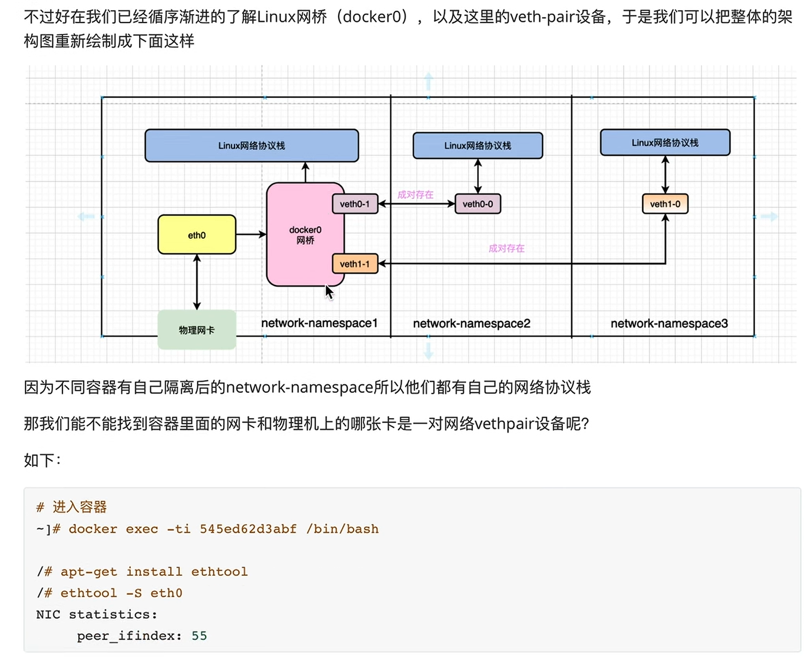

## 基础知识

### 什么是网桥:

网桥:待总结

宿主机安装docker后通过ip addr查看网络接口, 会看到已经自动增加一个网络接口:docker0,
这个docker0其实是一个网桥. 

可以通过下面的命令, 列出本机的网桥:
ip link show type bridge

理解docker0:

因此,容器中的ip和docker0的ip就是在一个网段的. 可以启动几个容器测试一下. (但是使用docker swarm的话好像不太一样.)

这里面的命名空间什么意思(docker0和宿主机是在一个命名空间), 什么事veth-pair技术,为什么是成对出现的,出现的目的是什么, 

