## 命令使用说明
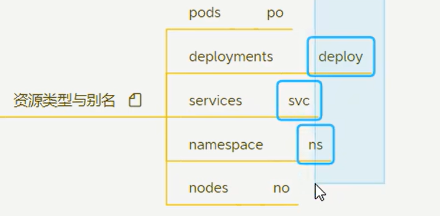
看上面的图片, 在使用命令操作资源(k8s中,一切皆资源)的时候, 资源的名称可以缩写:

kubectl get nodes 等同于 kubectl get node 等同于 kubectl get no
kubectl get pods 等同于 kubectl get pod 等同于 kubectl get po

其他的参考上图.

======================================================================================

命令的大致脑图:
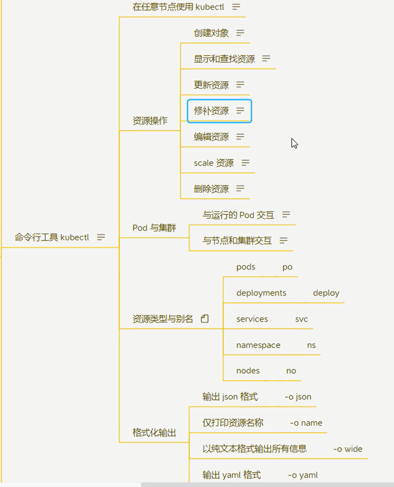

下面注意讲解

===========================================================================================
## 检查集群状态

### 列出所有资源类型
kubectl api-resources
~~~shell
[root@k8s-master ~]# kubectl api-resources
NAME                              SHORTNAMES   APIVERSION                             NAMESPACED   KIND
bindings                                       v1                                     true         Binding
componentstatuses                 cs           v1                                     false        ComponentStatus
configmaps                        cm           v1                                     true         ConfigMap
endpoints                         ep           v1                                     true         Endpoints
events                            ev           v1                                     true         Event
limitranges                       limits       v1                                     true         LimitRange
namespaces                        ns           v1                                     false        Namespace
nodes                             no           v1                                     false        Node
persistentvolumeclaims            pvc          v1                                     true         PersistentVolumeClaim
persistentvolumes                 pv           v1                                     false        PersistentVolume
pods                              po           v1                                     true         Pod
podtemplates                                   v1                                     true         PodTemplate
replicationcontrollers            rc           v1                                     true         ReplicationController
resourcequotas                    quota        v1                                     true         ResourceQuota
secrets                                        v1                                     true         Secret
serviceaccounts                   sa           v1                                     true         ServiceAccount
services                          svc          v1                                     true         Service
mutatingwebhookconfigurations                  admissionregistration.k8s.io/v1        false        MutatingWebhookConfiguration
validatingwebhookconfigurations                admissionregistration.k8s.io/v1        false        ValidatingWebhookConfiguration
customresourcedefinitions         crd,crds     apiextensions.k8s.io/v1                false        CustomResourceDefinition
apiservices                                    apiregistration.k8s.io/v1              false        APIService
controllerrevisions                            apps/v1                                true         ControllerRevision
daemonsets                        ds           apps/v1                                true         DaemonSet
deployments                       deploy       apps/v1                                true         Deployment
replicasets                       rs           apps/v1                                true         ReplicaSet
statefulsets                      sts          apps/v1                                true         StatefulSet
tokenreviews                                   authentication.k8s.io/v1               false        TokenReview
localsubjectaccessreviews                      authorization.k8s.io/v1                true         LocalSubjectAccessReview
selfsubjectaccessreviews                       authorization.k8s.io/v1                false        SelfSubjectAccessReview
selfsubjectrulesreviews                        authorization.k8s.io/v1                false        SelfSubjectRulesReview
subjectaccessreviews                           authorization.k8s.io/v1                false        SubjectAccessReview
horizontalpodautoscalers          hpa          autoscaling/v2                         true         HorizontalPodAutoscaler
cronjobs                          cj           batch/v1                               true         CronJob
jobs                                           batch/v1                               true         Job
certificatesigningrequests        csr          certificates.k8s.io/v1                 false        CertificateSigningRequest
leases                                         coordination.k8s.io/v1                 true         Lease
bgpconfigurations                              crd.projectcalico.org/v1               false        BGPConfiguration
bgppeers                                       crd.projectcalico.org/v1               false        BGPPeer
blockaffinities                                crd.projectcalico.org/v1               false        BlockAffinity
caliconodestatuses                             crd.projectcalico.org/v1               false        CalicoNodeStatus
clusterinformations                            crd.projectcalico.org/v1               false        ClusterInformation
felixconfigurations                            crd.projectcalico.org/v1               false        FelixConfiguration
globalnetworkpolicies                          crd.projectcalico.org/v1               false        GlobalNetworkPolicy
globalnetworksets                              crd.projectcalico.org/v1               false        GlobalNetworkSet
hostendpoints                                  crd.projectcalico.org/v1               false        HostEndpoint
ipamblocks                                     crd.projectcalico.org/v1               false        IPAMBlock
ipamconfigs                                    crd.projectcalico.org/v1               false        IPAMConfig
ipamhandles                                    crd.projectcalico.org/v1               false        IPAMHandle
ippools                                        crd.projectcalico.org/v1               false        IPPool
ipreservations                                 crd.projectcalico.org/v1               false        IPReservation
kubecontrollersconfigurations                  crd.projectcalico.org/v1               false        KubeControllersConfiguration
networkpolicies                                crd.projectcalico.org/v1               true         NetworkPolicy
networksets                                    crd.projectcalico.org/v1               true         NetworkSet
endpointslices                                 discovery.k8s.io/v1                    true         EndpointSlice
events                            ev           events.k8s.io/v1                       true         Event
flowschemas                                    flowcontrol.apiserver.k8s.io/v1beta2   false        FlowSchema
prioritylevelconfigurations                    flowcontrol.apiserver.k8s.io/v1beta2   false        PriorityLevelConfiguration
ingressclasses                                 networking.k8s.io/v1                   false        IngressClass
ingresses                         ing          networking.k8s.io/v1                   true         Ingress
networkpolicies                   netpol       networking.k8s.io/v1                   true         NetworkPolicy
runtimeclasses                                 node.k8s.io/v1                         false        RuntimeClass
poddisruptionbudgets              pdb          policy/v1                              true         PodDisruptionBudget
podsecuritypolicies               psp          policy/v1beta1                         false        PodSecurityPolicy
clusterrolebindings                            rbac.authorization.k8s.io/v1           false        ClusterRoleBinding
clusterroles                                   rbac.authorization.k8s.io/v1           false        ClusterRole
rolebindings                                   rbac.authorization.k8s.io/v1           true         RoleBinding
roles                                          rbac.authorization.k8s.io/v1           true         Role
priorityclasses                   pc           scheduling.k8s.io/v1                   false        PriorityClass
csidrivers                                     storage.k8s.io/v1                      false        CSIDriver
csinodes                                       storage.k8s.io/v1                      false        CSINode
csistoragecapacities                           storage.k8s.io/v1beta1                 true         CSIStorageCapacity
storageclasses                    sc           storage.k8s.io/v1                      false        StorageClass
volumeattachments                              storage.k8s.io/v1                      false        VolumeAttachment
[root@k8s-master ~]# 
~~~

经常使用的资源有下面这些：
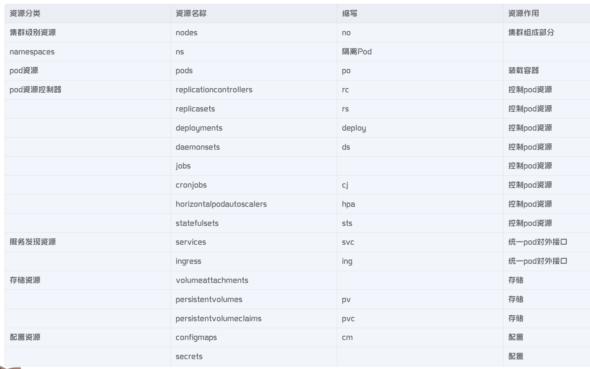

经常使用的操作有下面这些：
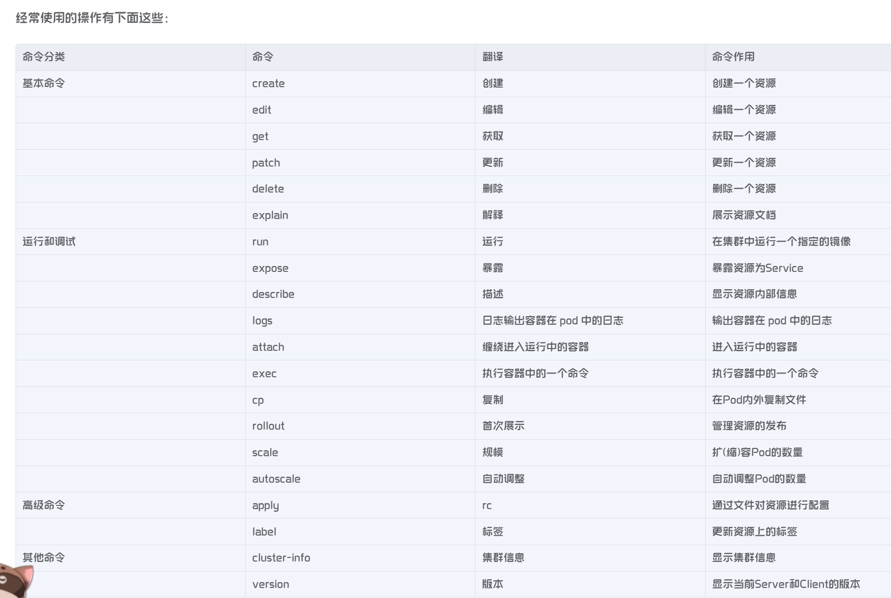

上面是查看资源类型,下面可以操作和查看制定类型的资源:

### kubectl get no 
这会列出所有节点资源以及它们的状态，应为 Ready。如果有任何节点处于 NotReady，你需要检查原因。

#### 加参数:
-o wide:  
例如:kubectl get nodes -o wide  会显示更多详细的信息,包括节点的ip地址等

-w 或 --watch :  
会监视节点的实时状态变化。当某个节点状态改变时，命令行会实时更新显示。非常适合在排查问题时监控节点状态。
kubectl get nodes -w

-l 或 --selector :  
使用标签选择器（label selector）可以根据节点的标签筛选出特定的节点。
就是比如你在yaml文件中给当前要部署的资源(比如Deployment)的labels标签里设置了一些标签,比如name: myNginx或 appName:myNginx, 
在查询Deployment的时候,就可以通过这个参数查询指定的标签的资源.
kubectl get deploy -l appName=myNginx
 
标签选择器非常适用于大型集群管理，可以快速筛选出特定的节点进行操作。下面要学习的Deployment的yaml管理里有通过这个机制去匹配和管理相关的资源.

-o json 或 -o yaml (--output=json 或 --output=yaml) :   
kubectl get nodes -o json  
使用 -o json 或 -o yaml 可以将输出以 JSON 或 YAML 格式显示，这对于调试或者编写自动化脚本非常有用。比如查看某个节点的详细信息，可以这样执行：
kubectl get nodes node-1 -o json

--field-selector <field>
允许你基于节点的字段来筛选输出。例如，选择状态为 Ready 的节点：kubectl get nodes --field-selector status.conditions[0].status=True

等其他参数

### kubectl get po  检查各个组件(pod资源)状态

-n 或 --namespace 查询指定命名空间的pod

--all-namespaces 或 -A  查询所有命名空间的pod

-o wide  使用 -o wide 参数可以显示更多的信息

--selector 或 -l  使用标签选择器筛选出特定标签的 Pod。例如，列出所有标签为 app=nginx 的 Pod

-w 或 --watch  实时监控查询

等其他参数

============================================================================
## 创建部署一个服务

kubectl create -f ./my-manifest.yaml        #使用yaml配置文件创建资源,具体创建什么子啊配置文件中有定义
kubectl create -f ./my1.yaml -f ./my2.yaml  #可以指定多个配置文件
kubectl create f ./dirs    #可以指定一个文件夹,使用文件夹下的配置文件创建资源                 
kubectl create -f https://git.io/vPieos  #使用远程url的配置文件创建
kubectl run nginx--image=nginx   #还可以用直接run的方式创建并运行

kubectl explain pods,svc   #explain是对资源做一个解析,获取pods,svc的文档信息

因此, 一般创建资源都需要yaml,编写yaml是必知必会的,下面是yaml编写的语法和关键字:
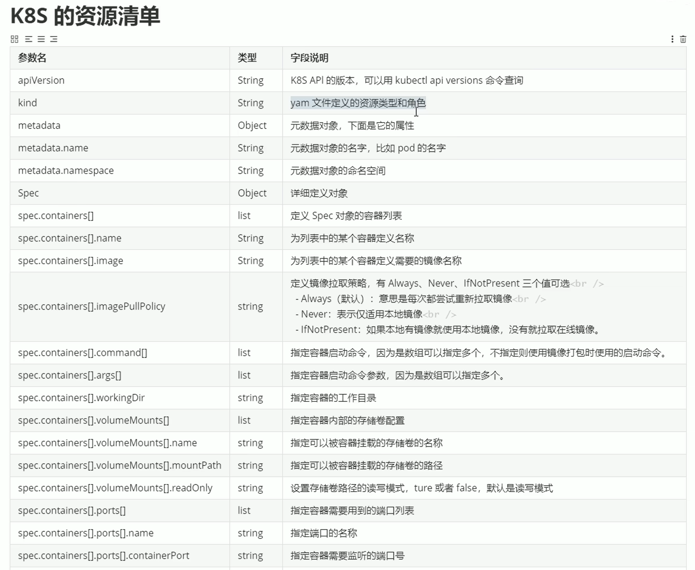
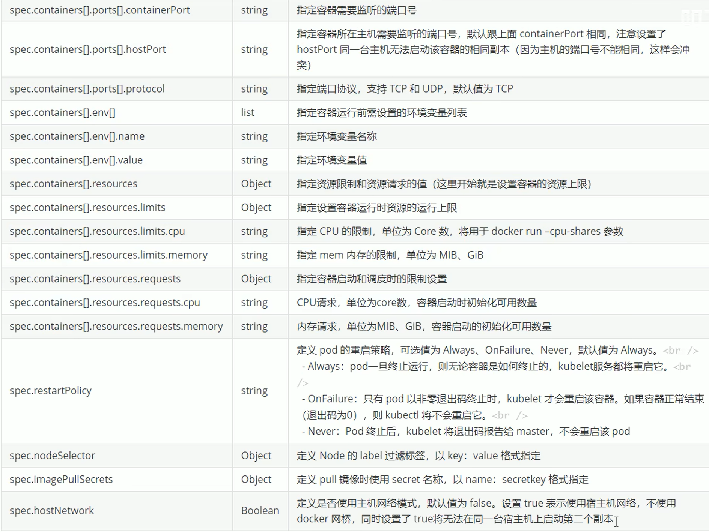

那我们写yaml文件的时候一般kind指令里写什么呢? 写pod还是Deployment,或Service?

其实yaml直接的kind里直接写pod是可以的,代表这里yaml管理和部署的直接就是pod, 但是一般直接部署pod类型的资源会有很多问题,
比如这样部署的pod无法随意的扩容等,无法动态的修改里面的一些参数已达到动态管理容器的目的.

所以,一般我们写yaml管理和部署pod是通过Deployment资源类型去统一调度管理pod.
可以把Deployment认为是docker swarm集群里面的service服务,用来统一管理一类容器,这一类容器通常应该就是一个项目下的多个实例.
比如部署nginx的话,就创建一个nginx的Deployment,Deployment下面自动创建并管理者多个nginx的pod,每个pod积极看做是一个nginx的服务实例,
这些实例分布在不同的节点上. pod就可以先看做是docker swarm里面的task任务,是最小的执行单元,一般可以看做是一个容器(当然不完成等于一个容器,pod本身包含容器和一些其他机制)

k8s里面还有一种常用的资源就是service,这个service和docker swarm里的service就不一样了,这个service可以看做是给Deployment定义的一个
与外界访问通信的一套固定元素和机制,比如定义了一个固定的ip,通过这个ip与外界通信,等.

(老师说开发过程中,如果你是无状态的应用就使用Deployment类型编写yaml,如果是有状态的就使用statefulSet类型写yaml,待研究什么意思)

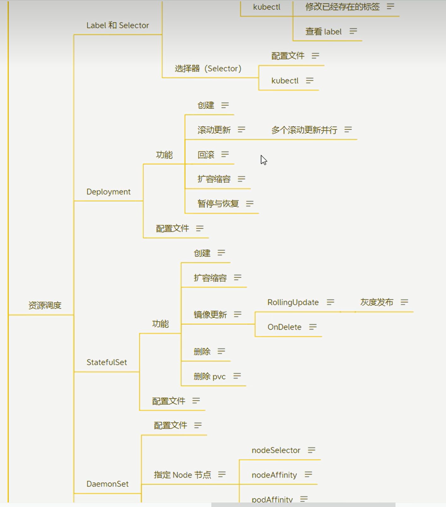

--------------------------------------------------------------------------------------------------------
### Deployment
下面讲解Deployment(部署), 我们可以通过yaml编写一个部署, 这个部署yaml文件里面可以定义要部署的所有信息,比如名称,镜像(当然镜像就决定了你部署的到底是什么),副本数,重启策略,
端口,命名空间,工作目录 等等.

如果不想直接写yaml, 可以直接通过命令行的方式创建一个部署:
kubectl create deploy my-nginx-deploy --image=nginx:1.7.9  

这个命令会自动拉取nginx:1.7.9镜像创建一个deploy并运行.
~~~shell
[root@k8s-worker ~]# kubectl get deploy -A
NAMESPACE     NAME                      READY   UP-TO-DATE   AVAILABLE   AGE
default       my-nginx-deploy           0/1     1            0           14s
kube-system   calico-kube-controllers   1/1     1            1           5d3h
kube-system   coredns                   2/2     2            2           6d2h
[root@k8s-worker ~]# 
~~~
可以看到有个刚才创建的my-nginx-deploy.

~~~shell
[root@k8s-worker ~]# kubectl get pod -A
NAMESPACE     NAME                                     READY   STATUS    RESTARTS   AGE
default       my-nginx-deploy-5bb9b5c65b-jp7xn         1/1     Running   0          92s
kube-system   calico-kube-controllers-664f4f4d-5mlb7   1/1     Running   0          5d3h
kube-system   calico-node-mp6tg                        0/1     Running   0          5d3h
kube-system   calico-node-qd58x                        0/1     Running   0          5d
kube-system   coredns-6d8c4cb4d-6np82                  1/1     Running   0          6d2h
kube-system   coredns-6d8c4cb4d-qng8t                  1/1     Running   0          6d2h
kube-system   etcd-k8s-master                          1/1     Running   0          6d2h
kube-system   kube-apiserver-k8s-master                1/1     Running   0          6d2h
kube-system   kube-controller-manager-k8s-master       1/1     Running   6          6d2h
kube-system   kube-proxy-pkrnj                         1/1     Running   0          6d2h
kube-system   kube-proxy-rgp5c                         1/1     Running   0          5d
kube-system   kube-scheduler-k8s-master                1/1     Running   6          6d2h
[root@k8s-worker ~]# 
~~~
并且可以看到默认给创建了一个pod副本,并且已经运行起来了.  但是这个pod的名字(my-nginx-deploy-5bb9b5c65b-jp7xn)为什么是这样的呢?  

那是因为中间还有一层概念:副本集(ReplicaSet,简称RS), 副本集就是多个副本的一个集中控制器, 看下面系统的总结:

总的来说, k8s管理集群管理pod不是一个pod一个pod的管理的,是抽象了几个层级去统一管理和调配pod,
这些层级统一可以叫做控制器,控制器是分多个种类的, 比如deployment(简写deploy), 比如ReplicaSet简称RS, 比如:ReplicationController简称RC,
比如:statefulSet  比如:DaemonSet, 比如JOb和CronJob等.
这些控制器也都资源的一种,因为k8s一切皆资源.

根据一般的用途分类,又可以分类为下面:   

适用于无状态的pod服务的控制器有: deployment,RS,RC   
适用于有状态的pod服务的控制器有: statefulSet     
适用于守护进程的pod服务的控制器有: DaemonSet    
适用于定时任务的pod服务的控制器有: JOb和CronJob   

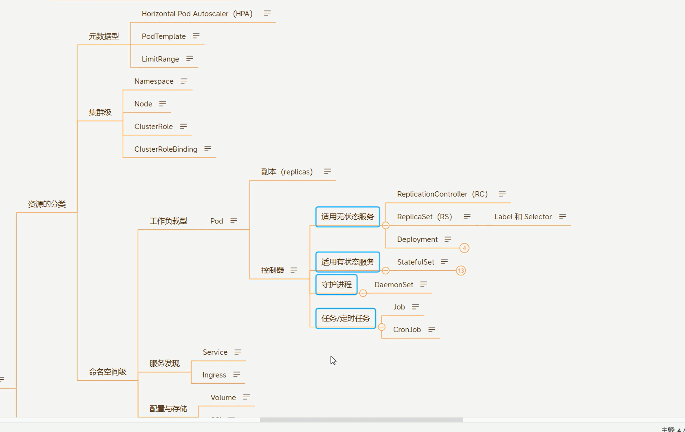

详解:   
RC在1.1版本的时候就已经废弃了, 因为已经被RS替代掉了. 
以为RC的功能就是给固定的pod动态的调整副本数,扩容缩容,但是只能固定给绑定好的pod调整.
而RS是可以灵活指定标签(label selector)去调整符合指定标签的pod分副本数.比较灵活. RS就是RC的升级.
RC在k8s集群中已经没有了,RS还在. 虽然RS还在, 但deployment又对RS做了再次的封装升级, 兼容了RS又加了其他功能,
因此我们工作中使用的就是deployment而不是RS去部署无状态的应用, deployment在创建的时候会自动帮我们创建一层RS,看下图:
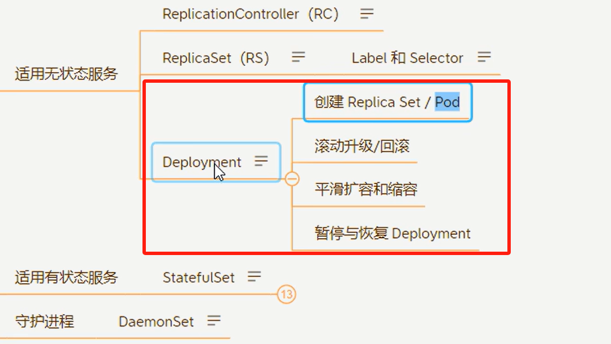

使用  kubectl get rs -A 查看自动创建的RS, 即my-nginx-deploy-5bb9b5c65b
~~~shell
[root@k8s-worker ~]# kubectl get rs -A
NAMESPACE     NAME                               DESIRED   CURRENT   READY   AGE
default       my-nginx-deploy-5bb9b5c65b         1         1         1       37m
kube-system   calico-kube-controllers-664f4f4d   1         1         1       5d3h
kube-system   coredns-6d8c4cb4d                  2         2         2       6d2h
[root@k8s-worker ~]# 
~~~

层级关系是: deployment下面有RS, RS下面有pod

因此,上面pod的名字(my-nginx-deploy-5bb9b5c65b-jp7xn)就是对应的deploy名字(my-nginx-deploy)
拼接上自动创建的RS的名字(my-nginx-deploy-5bb9b5c65b)
再拼接一层pod自己的随机编码成为pod自己的名字.

看下图:
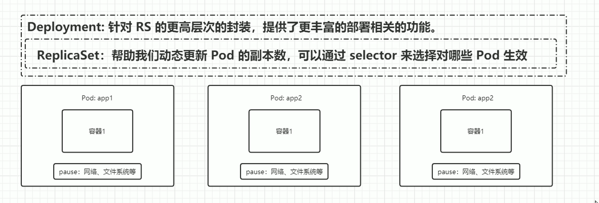

到此,我们就已经通过命令直接创建一个nginx的deploy,我们再使用:
kubectl get deploy my-nginx-deploy -o yaml 命令,
就可以得到它自动创建的nginx deploy的yaml描述:
~~~shell
[root@k8s-worker ~]# kubectl get deploy my-nginx-deploy -o yaml
apiVersion: apps/v1
kind: Deployment
metadata:
  annotations:
    deployment.kubernetes.io/revision: "1"
  creationTimestamp: "2024-09-22T09:36:02Z"
  generation: 1
  labels:
    app: my-nginx-deploy
  name: my-nginx-deploy
  namespace: default
  resourceVersion: "689999"
  uid: 0227c9dd-b39e-4cc2-acde-e5eac14398d8
spec:
  progressDeadlineSeconds: 600
  replicas: 1
  revisionHistoryLimit: 10
  selector:
    matchLabels:
      app: my-nginx-deploy
  strategy:
    rollingUpdate:
      maxSurge: 25%
      maxUnavailable: 25%
    type: RollingUpdate
  template:
    metadata:
      creationTimestamp: null
      labels:
        app: my-nginx-deploy
    spec:
      containers:
      - image: nginx:1.7.9
        imagePullPolicy: IfNotPresent
        name: nginx
        resources: {}
        terminationMessagePath: /dev/termination-log
        terminationMessagePolicy: File
      dnsPolicy: ClusterFirst
      restartPolicy: Always
      schedulerName: default-scheduler
      securityContext: {}
      terminationGracePeriodSeconds: 30
status:
  availableReplicas: 1
  conditions:
  - lastTransitionTime: "2024-09-22T09:36:29Z"
    lastUpdateTime: "2024-09-22T09:36:29Z"
    message: Deployment has minimum availability.
    reason: MinimumReplicasAvailable
    status: "True"
    type: Available
  - lastTransitionTime: "2024-09-22T09:36:02Z"
    lastUpdateTime: "2024-09-22T09:36:29Z"
    message: ReplicaSet "my-nginx-deploy-5bb9b5c65b" has successfully progressed.
    reason: NewReplicaSetAvailable
    status: "True"
    type: Progressing
  observedGeneration: 1
  readyReplicas: 1
  replicas: 1
  updatedReplicas: 1
[root@k8s-worker ~]# 
~~~
我们把除status状态以外的yaml描述复制出来成一份yaml文件,删除一些不需要的指令, 就是我们要写的nginx的部署yaml了,
然后可以随意改变里面的配置参数,达到我们想要的结果.

比如下面:
~~~yaml 
apiVersion: apps/v1
kind: Deployment
metadata:
  labels:
    app: my-nginx-deploy
  name: my-nginx-deploy
  namespace: default
spec:
  replicas: 1
  revisionHistoryLimit: 10
  selector:
    matchLabels:
      app: my-nginx-deploy
  strategy:
    rollingUpdate:
      maxSurge: 25%
      maxUnavailable: 25%
    type: RollingUpdate
  template:
    metadata:
      labels:
        app: my-nginx-deploy
    spec:
      containers:
      - image: nginx:1.7.9
        imagePullPolicy: IfNotPresent
        name: nginx
      restartPolicy: Always
      terminationGracePeriodSeconds: 30
~~~
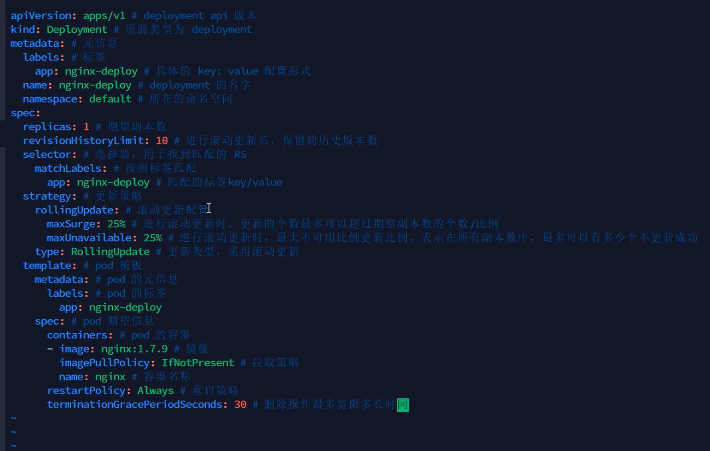

可以使用综合查询命令:  
kubectl get deploy,rs,po --show-labels  
一次查看多钟资源,带标签的展示.

#### 滚动更新deployment 
上面已经创建好一个deploy了, 这个deploy会自动有一个对应的yaml文件, 如果要滚动更新deploy就可以通过修改其yaml文件(kubectl edit deployment my-nginx-deploy), 修改template.spec.containers.image的镜像版本,
保存后会自动进行滚动更新(为了好观察是否滚动跟新,可以先把副本数(spec.replicas)改成多个,观察多个副本是否有部分在停止并自动重启).

修改deploy的yaml文件:
kubectl edit deployment my-nginx-deploy

会进入yaml的编辑界面,进行编辑(修改spec.replicas副本数为7),保存.

使用kubectl po -o wide 查看是否有7个pod,并且查看是否都已经是running状态.

然后再修改nginx的镜像为template.spec.containers.image为nginx:1.8,保存,然后kubectl po -o wide查看pod的启停状态.
~~~shell
[root@k8s-master ~]# kubectl get pod -o wide
NAME                               READY   STATUS              RESTARTS   AGE   IP           NODE         NOMINATED NODE   READINESS GATES
my-nginx-deploy-5bb9b5c65b-5p46v   1/1     Running             0          20m   172.17.0.8   k8s-worker   <none>           <none>
my-nginx-deploy-5bb9b5c65b-hjqkb   1/1     Running             0          24m   172.17.0.3   k8s-worker   <none>           <none>
my-nginx-deploy-5bb9b5c65b-jp7xn   1/1     Running             0          24h   172.17.0.2   k8s-worker   <none>           <none>
my-nginx-deploy-5bb9b5c65b-llftf   1/1     Running             0          20m   172.17.0.5   k8s-worker   <none>           <none>
my-nginx-deploy-5bb9b5c65b-svwvp   1/1     Terminating         0          20m   172.17.0.6   k8s-worker   <none>           <none>
my-nginx-deploy-68cfbf9984-2l6xw   0/1     ContainerCreating   0          30s   <none>       k8s-worker   <none>           <none>
my-nginx-deploy-68cfbf9984-49chk   0/1     ContainerCreating   0          30s   <none>       k8s-worker   <none>           <none>
my-nginx-deploy-68cfbf9984-6xm5h   0/1     ContainerCreating   0          1s    <none>       k8s-worker   <none>           <none>
my-nginx-deploy-68cfbf9984-cc8lj   1/1     Running             0          30s   172.17.0.9   k8s-worker   <none>           <none>
my-nginx-deploy-68cfbf9984-j4n8g   1/1     Running             0          3s    172.17.0.4   k8s-worker   <none>           <none>
[root@k8s-master ~]# 
~~~
会发现,修改镜像后滚动更新后,rs的名字都变了(由my-nginx-deploy-5bb9b5c65b逐个变成my-nginx-deploy-68cfbf9984), 说明rs都换了一个,里面的pod当然也逐个在换成nginx:1.8的.

然后使用:  
kubectl describe pod <pod-name>   
查看pod的镜像是不是已经被改成nginx:1.8了.

#### 回滚到历史版本
查看历史版本:  
kubectl rollout history deployment my-nginx-deploy  
会显示历史版本:
~~~shell
deployment.apps/my-nginx-deploy
REVISION  CHANGE-CAUSE
1         xxxxx #(这里应该是修改版本的时候填写的备注)
2         xxxxxxxx
~~~

回滚到上一个版本:  
kubectl rollout undo deployment my-nginx-deploy

回滚到指定编号的版本:
kubectl rollout undo deployment my-nginx-deploy  --to-revision=1

查看回滚状态:
kubectl rollout status deployment my-nginx-deploy

再次查看历史版本,会发现版本编号增加了.

#### Deploy滚动更新的暂停与恢复
Deployment 控制器允许你在应用更新时暂停和恢复更新操作。暂停更新可以帮助你在做出一系列变更之前，先验证环境、观察问题，或者进行其他需要中断滚动更新的任务。在准备好之后，你可以恢复更新操作。

暂停更新:  
kubectl rollout pause deployment <deployment-name>  
在这个命令之后，Deployment 的更新将会被暂停。暂停状态下，即使你修改了 Deployment 的配置，Kubernetes 也不会立即开始滚动更新。
暂停后，你可以安全地进行一系列的配置变更、调试或更新其他关联的资源（如 ConfigMap、Secrets 等），然后再恢复 Deployment 的滚动更新。

恢复更新:  
kubectl rollout resume deployment <deployment-name>  
这会恢复之前被暂停的 Deployment，Kubernetes 将会开始应用你已经配置的变更，并继续滚动更新。

检查 Deployment 状态:  
kubectl rollout status deployment <deployment-name>  
在暂停或恢复操作后，可以使用 kubectl rollout status 来检查 Deployment 的状态，确保操作成功执行。  
你将会看到 Deployment 的当前状态，例如是否正在进行更新，或者 Deployment 处于暂停状态

暂停与恢复 的操作非常适合在以下场景中使用：  
1.多步骤更新：在进行复杂的多步骤更新时，可以先暂停更新，确保每个步骤都正确实施，再恢复更新。
2.避免意外更新：如果你正在修改与应用相关的多个资源（如 Deployment、ConfigMap、Secrets 等），暂停更新可以避免 Kubernetes 在每次变更时自动开始滚动更新，直到你准备好恢复。
3.验证变更：在应用较大或风险较高的变更时，暂停更新可以给你时间验证新的配置或镜像版本是否按预期工作。

-----------------------------------------------------------------------------------------------
### statefulSet

--------------------------------------------------------------------------------------------
### DaemonSet

------------------------------------------------------------------------------------------
### JOb和CronJob

----------------------------------------------------------------------------------------
### Service

---------------------------------------------------------------------------------------------------
### Pod

============================================================================
## 配置 kubectl 自动补全
为了提高效率，可以启用 kubectl 自动补全功能：
source <(kubectl completion bash)

如果你希望自动补全永久生效，可以将其添加到 ~/.bashrc 文件中：
echo "source <(kubectl completion bash)" >> ~/.bashrc

==================================================================================

pod生命周期(待总结):
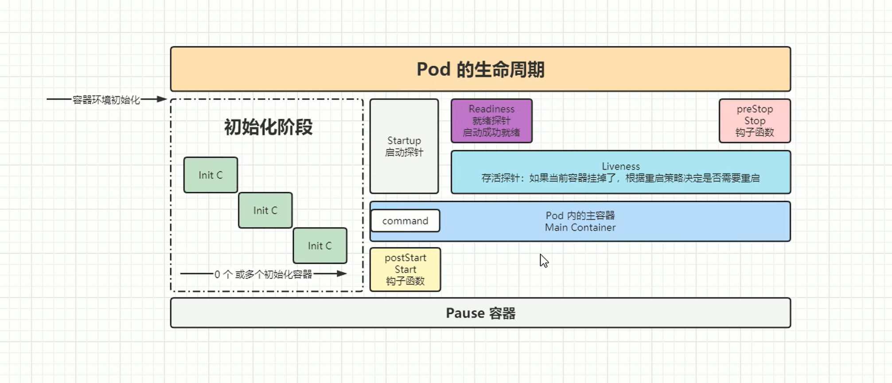

pause容器的作用是:pod内的容器做网络和文件系统共享:
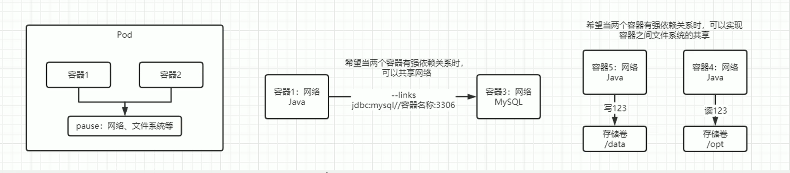

