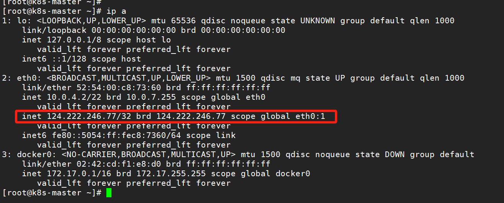
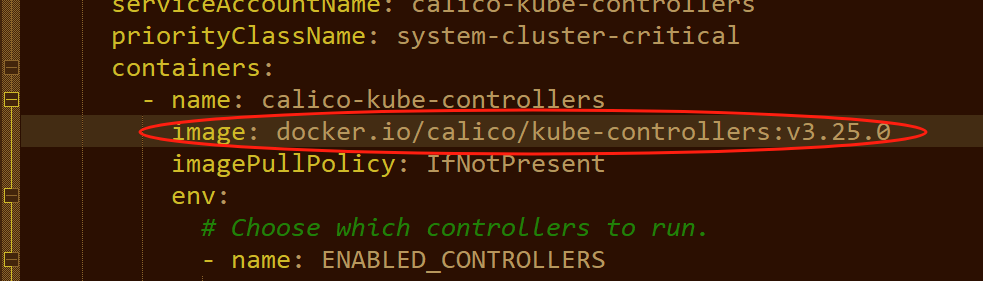
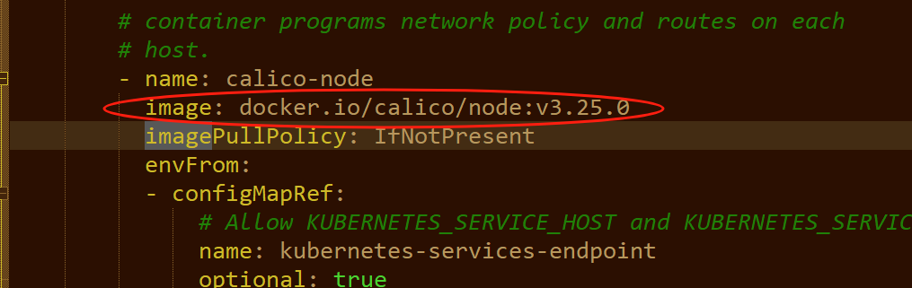
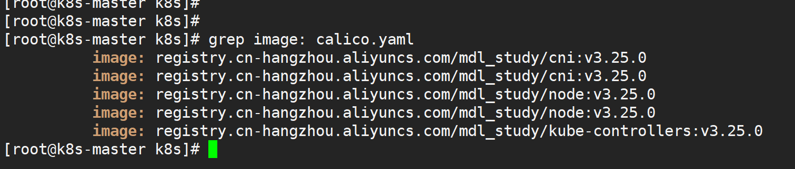

## 一般就是用 kubeadm 去安装k8s
kubeadm用于安装和管理生产级别的 Kubernetes 集群, 是一个工具软件, 用于安装k8s集群和管理集群, 他本身不是集群, 是官方推荐的用于生产环境的工具.
它能够自动化地初始化控制平面（master 节点）并将工作节点（worker 节点）加入集群中。
它能够创建多节点集群. 而Minikube只能创建一主一从的简单学习集群.

==============================================================================
## 安装前期说明
k8s在1.24.0版本之后就不支持docker了,因为他们在推的那个什么CRI规范来着, docker目前还不支持,后面docker可能会支持. 
但是我们为了使用docker作为容器技术, 就使用1.23.6版本的k8s就行. 所以安装k8s工具软件(kubeadm,kubelet,kubectl)的时候一定要指定安装的版本,
否则安装了最新版本的kubeadm,kubelet,kubectl就初始化不起来集群了,因为最新的版本默认使用containerd容器技术,而我们安装的只有docker,
启动的时候就报错找不到containerd.

docker版本最好是20.10.xx的版本. 因为官方验证的对应版本列表中就是有这个版本, 高于这个版本的好像兼容性不确定.

===========================================================================
## 卸载k8s
卸载 Kubernetes 组件的方式取决于你最初如何安装 Kubernetes。

#### 如果已经安装了k8s相关的组件(kubeadm,kubelet,kubectl等),需要卸载的话,可以这样卸载:

先检查是否安装了k8s:
可以通过一些相关命令:
kubectl version --client  
kubectl config view  
kubectl version
kubeadm version
等,查看一下是否有安装过k8s相关的工具软件.

如果有安装,卸载:

比如是安装的是kubeadm,kubectl,kubelet. 可以使用kubeadm reset 卸载:

先执行: 
kubeadm reset 命令来重置集群.
这会清理掉所有的 Kubernetes 组件和配置文件，但不会移除任何安装的软件包。

要彻底删除 Kubernetes 相关软件包，可以执行以下操作：
yum remove kubeadm kubectl kubelet kubernetes-cni

清理文件和集群数据（如容器网络、CNI 配置等）：
sudo rm -rf /etc/cni/net.d
sudo rm -rf /var/lib/etcd
sudo rm -rf /var/lib/kubelet
sudo rm -rf /etc/kubernetes/
sudo rm -rf /var/lib/dockershim

#### 如果你最初安装的是 minikube, 卸载:
minikube stop 停止集群
minikube delete 删除集群

================================================================================
## 安装环境准备(每台机器都要执行下面的操作)

#### 关闭防火墙:  
systemctl stop firewalld
systemctl disable firewalld

#### 关闭selinux  
临时关闭:使用以下命令立即将 SELinux 设置为 permissive 模式（相当于关闭了 SELinux 的强制执行，但依然会记录日志）：
setenforce 0

建议永久关闭:
编辑 /etc/selinux/config 文件：
找到以下行并将 SELINUX=enforcing 修改为 SELINUX=disabled：
#ELINUX=enforcing
SELINUX=disabled

重启系统,检查 SELinux 状态：sestatus  
你应该看到 SELinux status: disabled，表示 SELinux 已经永久关闭。

#### 关闭swap
临时关闭: swapoff -a  

永久关闭 Swap: 
编辑 /etc/fstab 文件：
找到包含 swap 的行并将其注释掉:
#/dev/mapper/centos-swap swap      swap    defaults    0 0

保存并退出文件重启机器.

然后检查是否已成功关闭：free -m 
输出中的 Swap 一行的 total 应为 0，表示 Swap 已经成功关闭。

#### 设置主机名和hosts
在Master节点机器上设置主机名: hostnamectl set-hostname k8s-master
在Worker节点机器上设置主机名: hostnamectl set-hostname k8s-worker

使用 hostnamectl 或 hostnamectl 来查看主机名

在所有机器上都给hosts文件添加IP主机名的映射,执行:
echo "121.40.xxx.xxx  k8s-master" >> /etc/hosts
echo "124.222.xxx.xxx  k8s-worker" >> /etc/hosts

#### ipv4和ipv6的网络桥接的设置, 执行:
cat <<EOF | tee /etc/sysctl.d/k8s.conf
net.bridge.bridge-nf-call-ip6tables = 1
net.bridge.bridge-nf-call-iptables = 1
net.ipv4.ip_forward = 1
EOF

sysctl --system #生效

#### 时间同步
yum install ntpdate -y  
ntpdate time.windows.com

注意: 上面设置完之后重启机器.

=========================================================================
## 安装docker
看之前的笔记安装,安装20.10.xx版本的docker,  因为官方验证的对应版本列表中就是有这个版本, 高于这个版本的好像兼容性不确定.

安装步骤看总结的docker笔记.

==========================================================================
## 添加k8s的yum仓库源,所有机器都执行:
cat <<EOF | tee /etc/yum.repos.d/kubernetes.repo
[kubernetes]
name=Kubernetes
baseurl=https://mirrors.aliyun.com/kubernetes/yum/repos/kubernetes-el7-\$basearch
enabled=1
gpgcheck=1
repo_gpgcheck=1
gpgkey=https://mirrors.aliyun.com/kubernetes/yum/doc/yum-key.gpg https://mirrors.aliyun.com/kubernetes/yum/doc/rpm-package-key.gpg
EOF

============================================================================
## 安装k8s组件(不要安装1.24.0之后的版本,因为不支持docker)
安装:  
yum install -y kubelet-1.23.6 kubeadm-1.23.6 kubectl-1.23.6

注意:上面三个命令需要在worker节点安装吗:
kubelet：必须在 worker 节点上安装，用于运行容器和与 Kubernetes API 通信。
kubeadm：需要安装，主要用于将 worker 节点加入 Kubernetes 集群（执行 kubeadm join 命令）。
kubectl：可选安装，通常只在 master 节点或管理员的本地环境中使用，worker 节点上可以不安装。
如果你需要在 worker 节点上调试问题或者临时查看某些资源，可以安装 kubectl.

启动kubelet:
systemctl enable kubelet

查看版本:  
kubectl version
kubeadm version
kubelet --version

=========================================================================
## 修改docker的cgroups为systemd

cgroups（control groups）是 Linux 内核提供的一项功能，用于限制、控制和隔离进程对系统资源（如 CPU、内存、磁盘 I/O 和网络）的使用。
它是容器化技术（如 Docker 和 Kubernetes）实现资源管理的核心机制之一。
cgroups 驱动决定了容器运行时（如 Docker 或 Kubernetes）如何与 cgroups 交互。在现代容器管理系统中，有两个常见的 cgroups 驱动：
cgroupfs驱动 和 systemd驱动;

cgroupfs 驱动：
这是直接通过 cgroups 文件系统管理资源的方式。cgroupfs 是早期 Docker 容器的默认驱动，容器通过访问和操作 /sys/fs/cgroup 来控制资源使用。
虽然简单直接，但与现代系统管理工具（如 systemd）集成不够好，因为 systemd 自身也使用 cgroups，这可能导致不一致的问题。

systemd 驱动：
systemd 是现代 Linux 发行版中的默认系统管理工具，它也使用 cgroups 来管理系统服务。在这种情况下，cgroups 驱动被集成到 systemd 中，
Kubernetes 或 Docker 使用 systemd 来管理 cgroups，这与大多数 Linux 系统的管理方式保持一致。
systemd 驱动更现代化，更适合与系统其他部分集成，并且在资源管理上更加一致，因此在最新的 Kubernetes 和 Docker 中，
推荐使用 systemd 作为 cgroups 驱动。

查看docker的cgroups驱动:
docker info | grep Driver
会显示是cgroupfs.

docker默认的cgroups驱动是cgroupfs,修改为systemd和Kubernetes的kubelet保持一致:
修改 /etc/docker/daemon.json 文件, 在大括号里添加一行配置("exec-opts": ["native.cgroupdriver=systemd"]):
{
    "exec-opts": ["native.cgroupdriver=systemd"]
}

保存,然后:
systemctl daemon-reload
systemctl restart docker

再查看docker的cgroups驱动就变成systemd了.

注意每台机器都要改.

如果初始化集群的时候已经因为这个问题报错了,修改docker的cgroups驱动之后, 
可以使用kubeadm reset 命令来重置集群.

kubeadm reset 是 Kubernetes 中用于重置通过 kubeadm 安装和初始化的 Kubernetes 集群的命令。
这个命令会清理掉在主节点上通过 kubeadm init 或 kubeadm join 所创建的集群配置和状态，使节点恢复到初始化之前的状态。
这个命令有很多用途, 比如重新初始化集群, 移除节点, 重置节点角色, 清理 iptables 规则和容器等, 但是应该谨慎使用.
命令执行后默认会提示你是否确认进行操作。执行该命令会对系统进行不可逆的更改，因此在生产环境中使用时要小心。

========================================================================
## 绑定公网ip
cat >/etc/sysconfig/network-scripts/ifcfg-eth0:1 <<EOF
BOOTPROTO=static
DEVICE=eth0:1
IPADDR=124.222.246.77
PREFIX=32
TYPE=Ethernet
USERCTL=no
ONBOOT=yes
EOF

(上面这段代码的意思待研究, 大概的意思就是给云服务器配置网络接口(虚拟网卡) eth0:1（即 eth0 的别名接口）为静态IP,
IP地址指定为和我们的公网ip一样, 这样我们内网中就有一个ip了并且和公网ip一样, 
因为kubeadm初始化集群只有使用内网ip初始化才不会出问题, 因此我们就把公网的ip也指定成为一个内网ip,
使用这个内网ip(同样也是公网ip)初始化集群之后, 阿里云服务器就可以通过公网ip间接访问到内网里的集群了.
应该是这样的原理.
)

视频老师的解答:
为什么要给master节点创建一个和master节点公网IP一样的虚拟网卡?
答:首先所有节点都需要ping通master节点上的IP，但是在目前的国内的云服务器上公网IP不是实实在在绑定在
机器上的(当然有的服务器内公网用的确实是一个IP)，这个时候需要进行虚拟网卡的创建, 否则在kubeadm init的时候会出问题
(具体什么问题老师没说,好像是初始化的过程中要有好几个组件之间的通信,有的组件默认使用的内网,有的组件又给指定使用的公网ip,就乱套了,通信有问题吧)。
如果直接使用内网ip初始化集群,相当于所有的组件都使用了内网,那也能初始化集群成功,但是阿里云的服务器ping不通master节点就没法加入这个集群了(集群是在腾讯云服务器上初始化的).
上面这个配置解决的就是怎么把不一个内网(并且公网ip和内网ip不一致)的机器构建在同一个集群的问题.

然后重置网络:
systemctl restart network

然后使用ip a查看IP地址:

会发现eth0多了一个ip,就是我们的公网ip.

然后执行一下这个命令(这个命令作用可以gpt一下): 
echo 1 > /proc/sys/net/ipv4/ip_forward  
否则执行初始化集群的时候会报错:
~~~shell
[init] Using Kubernetes version: v1.23.6
[preflight] Running pre-flight checks
error execution phase preflight: [preflight] Some fatal errors occurred:
	[ERROR FileContent--proc-sys-net-ipv4-ip_forward]: /proc/sys/net/ipv4/ip_forward contents are not set to 1
[preflight] If you know what you are doing, you can make a check non-fatal with `--ignore-preflight-errors=...`
To see the stack trace of this error execute with --v=5 or higher
~~~

然后下面使用这个既是公网ip又是内网ip的的ip地址初始化集群.

如果你的机器都在一个网络里,就不存在这个问题,不需要这些配置.

=========================================================================
## 在master节点 初始化集群
kubeadm init 命令用于在自己预定的master机器上,初始化一个集群,当前机器就被初始化为一个master节点

参数:  
--apiserver-advertise-address=192.168.0.10  
指定 Kubernetes API Server 向外部服务的 IP 地址（通常是 Master 节点的内网 IP）

--apiserver-bind-port=6443
指定 Kubernetes API Server 使用的端口，默认是 6443。

--pod-network-cidr=10.244.0.0/16 \
定义集群中 Pod 的网络范围。不同的网络插件可能需要不同的 CIDR，例如 Flannel 使用 192.168.0.0/16，`而 Calico 使用 192.168.0.0/16 或 10.244.0.0/16。

--service-cidr=10.96.0.0/12 \
指定 Kubernetes 服务（Service）使用的网络范围，默认是 10.96.0.0/12。

--service-dns-domain=cluster.local \
设置集群内的服务 DNS 域名，默认为 cluster.local。

--image-repository=registry.aliyuncs.com/google_containers \
指定拉取镜像的仓库。默认情况下，Kubernetes 使用 k8s.gcr.io，但如果你在中国，可能需要更换为阿里云镜像仓库等。

--kubernetes-version=v1.23.6 \
指定要安装的 Kubernetes 版本。默认会安装最新稳定版本。

--control-plane-endpoint=lb.example.com:6443 \
指定控制平面的外部访问地址或负载均衡器地址（多 Master 节点高可用集群时使用）。

--token=abcdef.0123456789abcdef \
指定用于加入集群的 token。如果未指定，kubeadm 会自动生成一个 token。

--token-ttl=0 \
定义生成 token 的有效期，默认值为 24h，可以设置为 0 表示永久有效。

--certificate-key
用于在多主节点模式下共享证书，确保所有主节点的证书一致。该参数常用于高可用性集群的初始化过程中。

--apiserver-cert-extra-sans="master.example.com,192.168.0.10" \
为 Kubernetes API Server 证书添加额外的 Subject Alternative Names (SANs)。这对于让 API Server 使用多个 IP 或域名访问时非常有用。

--upload-certs
指定是否将控制平面的证书上传到集群，以支持多主节点。

--skip-phases=control-plane
跳过某些初始化阶段（phases），可以自定义不需要的步骤。(上面是跳过所有的控制平面部署阶段)

--ignore-preflight-errors
忽略初始化过程中可能出现的预检错误。例如，如果机器的某些环境配置不符合默认标准，可以使用该参数忽略这些错误。

--node-name=k8s-master
指定当前节点在 Kubernetes 集群中的名称。如果不设置，Kubernetes 会使用主机名作为节点名称。

一般使用下面的参数就行了(这里因为要和阿里云节点通信, 这里ip使用腾讯云的外网ip):

kubeadm init \
--apiserver-advertise-address=10.0.4.2  \  #奇怪:这里使用腾讯云公网ip就报错,内网ip就初始化成功
--image-repository registry.aliyuncs.com/google_containers \
--kubernetes-version v1.23.6 \
--service-cidr=10.96.0.0/12 \
--pod-network-cidr=10.244.0.0/16 

因为上面说了要能是阿里云的机器加入集群,因此配置了公网ip为内网ip, 所以这里我们使用下面的命令初始化集群(正常生产环境不需要这样):
kubeadm init \
--apiserver-advertise-address=124.222.246.77  \
--control-plane-endpoint=124.222.246.77  \
--image-repository registry.aliyuncs.com/google_containers \
--kubernetes-version v1.23.6 \
--service-cidr=10.96.0.0/12 \
--pod-network-cidr=10.244.0.0/16    

执行成功后的结果:
~~~shell
[root@k8s-master ~]# echo 1 > /proc/sys/net/ipv4/ip_forward
[root@k8s-master ~]# kubeadm init --apiserver-advertise-address=124.222.246.77  --control-plane-endpoint=124.222.246.77  --image-repository registry.aliyuncs.com/google_containers --kubernetes-version v1.23.6 --service-cidr=10.96.0.0/12 --pod
-network-cidr=10.244.0.0/16[init] Using Kubernetes version: v1.23.6
[preflight] Running pre-flight checks
[preflight] Pulling images required for setting up a Kubernetes cluster
[preflight] This might take a minute or two, depending on the speed of your internet connection
[preflight] You can also perform this action in beforehand using 'kubeadm config images pull'
[certs] Using certificateDir folder "/etc/kubernetes/pki"
[certs] Generating "ca" certificate and key
[certs] Generating "apiserver" certificate and key
[certs] apiserver serving cert is signed for DNS names [k8s-master kubernetes kubernetes.default kubernetes.default.svc kubernetes.default.svc.cluster.local] and IPs [10.96.0.1 124.222.246.77]
[certs] Generating "apiserver-kubelet-client" certificate and key
[certs] Generating "front-proxy-ca" certificate and key
[certs] Generating "front-proxy-client" certificate and key
[certs] Generating "etcd/ca" certificate and key
[certs] Generating "etcd/server" certificate and key
[certs] etcd/server serving cert is signed for DNS names [k8s-master localhost] and IPs [124.222.246.77 127.0.0.1 ::1]
[certs] Generating "etcd/peer" certificate and key
[certs] etcd/peer serving cert is signed for DNS names [k8s-master localhost] and IPs [124.222.246.77 127.0.0.1 ::1]
[certs] Generating "etcd/healthcheck-client" certificate and key
[certs] Generating "apiserver-etcd-client" certificate and key
[certs] Generating "sa" key and public key
[kubeconfig] Using kubeconfig folder "/etc/kubernetes"
[kubeconfig] Writing "admin.conf" kubeconfig file
[kubeconfig] Writing "kubelet.conf" kubeconfig file
[kubeconfig] Writing "controller-manager.conf" kubeconfig file
[kubeconfig] Writing "scheduler.conf" kubeconfig file
[kubelet-start] Writing kubelet environment file with flags to file "/var/lib/kubelet/kubeadm-flags.env"
[kubelet-start] Writing kubelet configuration to file "/var/lib/kubelet/config.yaml"
[kubelet-start] Starting the kubelet
[control-plane] Using manifest folder "/etc/kubernetes/manifests"
[control-plane] Creating static Pod manifest for "kube-apiserver"
[control-plane] Creating static Pod manifest for "kube-controller-manager"
[control-plane] Creating static Pod manifest for "kube-scheduler"
[etcd] Creating static Pod manifest for local etcd in "/etc/kubernetes/manifests"
[wait-control-plane] Waiting for the kubelet to boot up the control plane as static Pods from directory "/etc/kubernetes/manifests". This can take up to 4m0s
[apiclient] All control plane components are healthy after 6.503741 seconds
[upload-config] Storing the configuration used in ConfigMap "kubeadm-config" in the "kube-system" Namespace
[kubelet] Creating a ConfigMap "kubelet-config-1.23" in namespace kube-system with the configuration for the kubelets in the cluster
NOTE: The "kubelet-config-1.23" naming of the kubelet ConfigMap is deprecated. Once the UnversionedKubeletConfigMap feature gate graduates to Beta the default name will become just "kubelet-config". Kubeadm upgrade will handle this transition
 transparently.[upload-certs] Skipping phase. Please see --upload-certs
[mark-control-plane] Marking the node k8s-master as control-plane by adding the labels: [node-role.kubernetes.io/master(deprecated) node-role.kubernetes.io/control-plane node.kubernetes.io/exclude-from-external-load-balancers]
[mark-control-plane] Marking the node k8s-master as control-plane by adding the taints [node-role.kubernetes.io/master:NoSchedule]
[bootstrap-token] Using token: pkbxmr.klisrbofil7khth7
[bootstrap-token] Configuring bootstrap tokens, cluster-info ConfigMap, RBAC Roles
[bootstrap-token] configured RBAC rules to allow Node Bootstrap tokens to get nodes
[bootstrap-token] configured RBAC rules to allow Node Bootstrap tokens to post CSRs in order for nodes to get long term certificate credentials
[bootstrap-token] configured RBAC rules to allow the csrapprover controller automatically approve CSRs from a Node Bootstrap Token
[bootstrap-token] configured RBAC rules to allow certificate rotation for all node client certificates in the cluster
[bootstrap-token] Creating the "cluster-info" ConfigMap in the "kube-public" namespace
[kubelet-finalize] Updating "/etc/kubernetes/kubelet.conf" to point to a rotatable kubelet client certificate and key
[addons] Applied essential addon: CoreDNS
[addons] Applied essential addon: kube-proxy

Your Kubernetes control-plane has initialized successfully!

To start using your cluster, you need to run the following as a regular user:

  mkdir -p $HOME/.kube
  sudo cp -i /etc/kubernetes/admin.conf $HOME/.kube/config
  sudo chown $(id -u):$(id -g) $HOME/.kube/config

Alternatively, if you are the root user, you can run:

  export KUBECONFIG=/etc/kubernetes/admin.conf

You should now deploy a pod network to the cluster.
Run "kubectl apply -f [podnetwork].yaml" with one of the options listed at:
  https://kubernetes.io/docs/concepts/cluster-administration/addons/

You can now join any number of control-plane nodes by copying certificate authorities
and service account keys on each node and then running the following as root:

  kubeadm join 124.222.246.77:6443 --token pkbxmr.klisrbofil7khth7 \
	--discovery-token-ca-cert-hash sha256:b06afc3bd50d4e6b8477be7d570db3ea39b4a0e1e1354d2f8fc0adfd9c67d350 \
	--control-plane 

Then you can join any number of worker nodes by running the following on each as root:

kubeadm join 124.222.246.77:6443 --token pkbxmr.klisrbofil7khth7 \
	--discovery-token-ca-cert-hash sha256:b06afc3bd50d4e6b8477be7d570db3ea39b4a0e1e1354d2f8fc0adfd9c67d350 
[root@k8s-master ~]# 

~~~

看到上面的信息,代表执行成功了,然后按上面提示的要求,执行:
mkdir -p $HOME/.kube
sudo cp -i /etc/kubernetes/admin.conf $HOME/.kube/config
sudo chown $(id -u):$(id -g) $HOME/.kube/config

这三个命令的作用是配置 Kubernetes 管理工具 kubectl 使用的 kubeconfig 文件，
以便能够通过 kubectl 与 Kubernetes 集群进行交互。具体作用如下：
第一个命令创建了存放 Kubernetes 配置的目录。
第二个命令将管理员的 Kubernetes 配置文件复制到该目录下，供 kubectl 使用。
第三个命令确保该配置文件的所有者是当前用户，从而允许用户正常访问和管理 Kubernetes 集群。

测试使用kubectl:
~~~shell
[root@k8s-master ~]# kubectl get po
No resources found in default namespace.
[root@k8s-master ~]# 
[root@k8s-master ~]# 
[root@k8s-master ~]# kubectl get nodes
NAME         STATUS     ROLES                  AGE   VERSION
k8s-master   NotReady   control-plane,master   46m   v1.23.6
~~~

============================================================================================
## 加入阿里云服务器作为 worker 节点

然后可以使用上面给的命令在阿里云机器上执行加入集群:
kubeadm join 124.222.246.77:6443 --token pkbxmr.klisrbofil7khth7 --discovery-token-ca-cert-hash sha256:b06afc3bd50d4e6b8477be7d570db3ea39b4a0e1e1354d2f8fc0adfd9c67d350

显示下面的信息就是加入集群成功:
~~~shell
[root@k8s-worker ~]# 
[root@k8s-worker ~]# kubeadm join 124.222.246.77:6443 --token pkbxmr.klisrbofil7khth7 --discovery-token-ca-cert-hash sha256:b06afc3bd50d4e6b8477be7d570db3ea39b4a0e1e1354d2f8fc0adfd9c67d350
[preflight] Running pre-flight checks
[preflight] Reading configuration from the cluster...
[preflight] FYI: You can look at this config file with 'kubectl -n kube-system get cm kubeadm-config -o yaml'
[kubelet-start] Writing kubelet configuration to file "/var/lib/kubelet/config.yaml"
[kubelet-start] Writing kubelet environment file with flags to file "/var/lib/kubelet/kubeadm-flags.env"
[kubelet-start] Starting the kubelet
[kubelet-start] Waiting for the kubelet to perform the TLS Bootstrap...

This node has joined the cluster:
* Certificate signing request was sent to apiserver and a response was received.
* The Kubelet was informed of the new secure connection details.

Run 'kubectl get nodes' on the control-plane to see this node join the cluster.

[root@k8s-worker ~]# 
~~~

可以查看kubelet的状态:  
systemctl status kubelet

注意, 执行上面的加入节点命令之后,在控制平面节点查看节点pod信息, 会发现阿里云的这个节点的ip使用的是内网ip, 因此, 这里要添加一个配置文件:  
/etc/systemd/system/kubelet.service.d/10-kubeadm.conf   

这个配置文件的作用是: 因为直接执行上面的join命令的话,把当前阿里云的服务器加入集群使用的是阿里云服务器的内网ip, 因此在控制平面节点上看到的该节点的ip是其内网ip, 
这样控制平面节点或其他节点与阿里云服务器这个节点通信就会使用这个内网ip,这样是调不通该节点的. (当然如果所有集群节点本身都在一个内网中,
或节点不区分公网ip和内网ip的话,就不存在这个问题了)
因此,这个配置文件是指定一些kubelet启动时的参数, 配置文件的内容:
~~~
[Service]

# 指定依然要使用默认的配置文件的配置,这里的配置只是多加的配置
Environment="KUBELET_CONFIG_ARGS=--config=/var/lib/kubelet/config.yaml"

# 指定本节点的kubelet对外使用的ip,这里指定使用公网ip(命令行中不能指定ip,只能使用配置文件指定), 
# 好像加了这个配置文件后cgroup-driver就变了,不知道为什么,这里也直接指定cgroup-driver为systemd,
# 防止启动的时候kubelet报错与docker的cgroup-driver不一致,docker的已经通过配置修改成systemd了
Environment="KUBELET_EXTRA_ARGS=--node-ip=121.40.156.98 --cgroup-driver=systemd"

# 这一行时清空一下原本的参数,防止下面的不生效
ExecStart=

# 指定启动kubelet的配置文件和参数(就是上面设置的参数)
ExecStart=/usr/bin/kubelet --kubeconfig=/etc/kubernetes/kubelet.conf $KUBELET_EXTRA_ARGS
~~~

注意,上面配置文件中,因为我们指定使用121.40.156.98这个公网ip,但是这个ip在Linux系统的网卡中是没这个ip的(通过 ip a 命令查看),因此启动的时候会报错, 
所以要和上面初始化控制平面节点的时候一样, 给当前Linux系统添加一个虚拟网卡,网卡的地址是本机的公网ip, 也就是把公网ip也添加成为一个内网ip. 重置一下网络.

添加完配置文件后,加载一下配置文件,重启kubelet:
systemctl daemon-reload
systemctl restart kubelet

查看启动有没有报错:
systemctl status kubelet
如果有报错,查看详细启动日志:
journalctl -u kubelet -f -n 1000

重启kubelet后没问题的话, 在控制平面节点查看阿里云节点(k8s-worker)的pod的ip是不是改成121.40.156.98了, 如果已经改了就可以通过ip通信了, 
控制平面节点的指令就会自动同步到阿里云节点执行了,比如下载镜像启动pod等.

在控制平面节点查看阿里云节点(k8s-worker)的pod的ip是不是改成121.40.156.98了:
~~~shell
[root@k8s-master k8s]# kubectl get pods --all-namespaces  -o wide
NAMESPACE     NAME                                     READY   STATUS              RESTARTS   AGE    IP               NODE         NOMINATED NODE   READINESS GATES
kube-system   etcd-k8s-master                          1/1     Running             0          27h    124.222.246.77   k8s-master   <none>           <none>
kube-system   kube-apiserver-k8s-master                1/1     Running             0          27h    124.222.246.77   k8s-master   <none>           <none>
kube-system   kube-controller-manager-k8s-master       1/1     Running             6          27h    124.222.246.77   k8s-master   <none>           <none>
kube-system   kube-proxy-pkrnj                         1/1     Running             0          27h    124.222.246.77   k8s-master   <none>           <none>
kube-system   kube-proxy-rgp5c                         1/1     Running             0          75m    121.40.156.98    k8s-worker   <none>           <none>
kube-system   kube-scheduler-k8s-master                1/1     Running             6          27h    124.222.246.77   k8s-master   <none>           <none>
[root@k8s-master k8s]# 
~~~

===================================================================================
## 最终验证状态

在master执行:

kubectl get no 或 kubectl get nodes 查看节点:
~~~shell
[root@k8s-master ~]# 
[root@k8s-master ~]# kubectl get no
NAME         STATUS     ROLES                  AGE     VERSION
k8s-master   NotReady   control-plane,master   6h26m   v1.23.6
k8s-worker   NotReady   <none>                 6h19m   v1.23.6
[root@k8s-master ~]#
~~~
不过看到节点都是NotReady没有准备好的状态.为什么没有准备好呢,继续往下看.跟下面的pod和网路有关系.

kubectl get cs 或 kubectl get componentstatus 查看组件的状态,
上面初始化和加入从节点没问题的话, 这里返回应该都是ok的:
~~~shell
[root@k8s-master ~]#  kubectl get cs
Warning: v1 ComponentStatus is deprecated in v1.19+
NAME                 STATUS    MESSAGE                         ERROR
controller-manager   Healthy   ok                              
scheduler            Healthy   ok                              
etcd-0               Healthy   {"health":"true","reason":""}   
[root@k8s-master ~]# 
~~~

kubectl get pods 查看pod:
~~~shell
[root@k8s-master ~]# kubectl get pods
No resources found in default namespace.
~~~
但是这里却看不到有任何pod,其实安装集群成功之后是有一些k8s组件自己的pod的,只不过pod是放在命名空间里的,
这样查看没有指定命名空间,查看的就是默认的命名空间("default"命名空间),一些k8s组件自己的pod是没有放在默认命名空间的,放在了kube-system命名空间.

可以使用:
kubectl get pods -n kube-system 
查看指定的命名空间来查看自带的pod:
~~~shell
[root@k8s-master ~]# 
[root@k8s-master ~]# kubectl get pods -n kube-system
NAME                                 READY   STATUS    RESTARTS   AGE
coredns-6d8c4cb4d-6np82              0/1     Pending   0          98m
coredns-6d8c4cb4d-qng8t              0/1     Pending   0          98m
etcd-k8s-master                      1/1     Running   0          98m
kube-apiserver-k8s-master            1/1     Running   0          98m
kube-controller-manager-k8s-master   1/1     Running   6          98m
kube-proxy-ndv2c                     1/1     Running   0          92m
kube-proxy-pkrnj                     1/1     Running   0          98m
kube-scheduler-k8s-master            1/1     Running   6          98m
[root@k8s-master ~]# 
~~~
不过从上面的pod状态可以看到,其他pod都是Running状态,但是两个coredns的pod是Pending的状态,没有下载下来并运行.
看是dns相关的pod, 就知道这就涉及到网络的问题了. 需要安装网络插件,一般安装calico插件,这个插件比较常用且强大, 下面会讲解.

kubectl get pods --all-namespaces -w
该命令是查看所有命名空间的pod,并且是-w实时监控刷新pod动态,类似于tail -f查看一个日志文件.

kubectl get pods -A -o wide
该命令是查看所有命名空间的pod,并且显示出pod的节点和ip信息等

curl -k https://localhost:6443/healthz  返回ok

kubectl get pods -A -o wide -w
该命令是查看所有命名空间的pod,并且显示出pod的节点和ip信息等, 并且实时监控刷新pod动态

===========================================================================
## 部署calico网络插件
在k8s中安装calico（这条命令很快的）
kubectl create -f https://docs.projectcalico.org/manifests/calico.yaml
这条命令就是以执行yaml配置文件的方式去安装一些pod,就类似于docker compose 可以执行一个yaml文件去统一执行或编排一些容器一样,应该是一个道理.
上面这个命令就是以这种方式从网路文件的yaml文件直接下载并安装calico插件相关的pod,该插件在存在方式就是在k8s集群中安装并启动一些calico的pod.

但是直接执行上面的命令的话,里面的镜像下载默认是固定从Docker Hub源下载, 几乎没办法下载下来, 因此应该先下载下来这个yaml文件,
再修改该yaml里面下载镜像的源:  
curl https://docs.projectcalico.org/manifests/calico.yaml -O 这个地址好像不能用了,并重定向到下面的地址了,使用下面的地址就行了:  
curl https://calico-v3-25.netlify.app/archive/v3.25/manifests/calico.yaml -O  
下载下来这个calico.yaml文件之后,修改里面的配置"CALICO_IPV4POOL_CIDR",修改成我们初始化的时候  
指定的--pod-network-cidr=10.244.0.0/16的ip:
~~~shell
- name: CALICO_IPV4POOL_CIDR
  value: "10.244.0.0/16"
~~~
不过默认这个配置项默认是被注释了的,不修改应该就会默认使用我们初始化的时候指定的ip,保险起见这里还是修改一下吧.

然后修改一下这个文件里的镜像的下载源,在这个文件里搜索"image:",看一发现里面的镜像都是固定加了前缀地址"docker.io/":

这样就会导致自动下载镜像的时候使用Docker Hub源去下载, 我们应该把文件里面所有镜像的改成自己已经备份在阿里云私有仓库的镜像,
让他默认使用我们阿里镜像,比如把"docker.io/calico/node:v3.25.0"改成"registry.cn-hangzhou.aliyuncs.com/mdl_study/node:v3.25.0",
全部改了之后保存.
统一检查一下:

可以看到已经改了.

然后执行这个文件,安装所有calico插件的镜像和配置等: 
kubectl apply -f calico.yaml 

安装结果:
~~~shell
[root@k8s-master k8s]# kubectl apply -f calico.yaml
poddisruptionbudget.policy/calico-kube-controllers created
serviceaccount/calico-kube-controllers created
serviceaccount/calico-node created
configmap/calico-config created
customresourcedefinition.apiextensions.k8s.io/bgpconfigurations.crd.projectcalico.org created
customresourcedefinition.apiextensions.k8s.io/bgppeers.crd.projectcalico.org created
customresourcedefinition.apiextensions.k8s.io/blockaffinities.crd.projectcalico.org created
customresourcedefinition.apiextensions.k8s.io/caliconodestatuses.crd.projectcalico.org created
customresourcedefinition.apiextensions.k8s.io/clusterinformations.crd.projectcalico.org created
customresourcedefinition.apiextensions.k8s.io/felixconfigurations.crd.projectcalico.org created
customresourcedefinition.apiextensions.k8s.io/globalnetworkpolicies.crd.projectcalico.org created
customresourcedefinition.apiextensions.k8s.io/globalnetworksets.crd.projectcalico.org created
customresourcedefinition.apiextensions.k8s.io/hostendpoints.crd.projectcalico.org created
customresourcedefinition.apiextensions.k8s.io/ipamblocks.crd.projectcalico.org created
customresourcedefinition.apiextensions.k8s.io/ipamconfigs.crd.projectcalico.org created
customresourcedefinition.apiextensions.k8s.io/ipamhandles.crd.projectcalico.org created
customresourcedefinition.apiextensions.k8s.io/ippools.crd.projectcalico.org created
customresourcedefinition.apiextensions.k8s.io/ipreservations.crd.projectcalico.org created
customresourcedefinition.apiextensions.k8s.io/kubecontrollersconfigurations.crd.projectcalico.org created
customresourcedefinition.apiextensions.k8s.io/networkpolicies.crd.projectcalico.org created
customresourcedefinition.apiextensions.k8s.io/networksets.crd.projectcalico.org created
clusterrole.rbac.authorization.k8s.io/calico-kube-controllers created
clusterrole.rbac.authorization.k8s.io/calico-node created
clusterrolebinding.rbac.authorization.k8s.io/calico-kube-controllers created
clusterrolebinding.rbac.authorization.k8s.io/calico-node created
daemonset.apps/calico-node created
deployment.apps/calico-kube-controllers created
[root@k8s-master k8s]# 
~~~

#确认一下calico是否安装成功,查看calico相关的pod的安装进度,  -w可以看实时变化（看到calico相关的pod的状态都是running表示网络插件安装并运行好了）
kubectl get pods --all-namespaces -w

比如下面看到calico相关的pod还在初始化安装,好像是拉取镜像出问题了:
~~~shell
[root@k8s-master ~]# 
[root@k8s-master ~]# kubectl get pods --all-namespaces
NAMESPACE     NAME                                       READY   STATUS                  RESTARTS   AGE
kube-system   calico-kube-controllers-64cc74d646-m95wg   0/1     Pending                 0          9m10s
kube-system   calico-node-h45dd                          0/1     Init:ImagePullBackOff   0          9m10s
kube-system   calico-node-nd669                          0/1     Init:ImagePullBackOff   0          9m10s
kube-system   coredns-6d8c4cb4d-6np82                    0/1     Pending                 0          7h4m
kube-system   coredns-6d8c4cb4d-qng8t                    0/1     Pending                 0          7h4m
kube-system   etcd-k8s-master                            1/1     Running                 0          7h4m
kube-system   kube-apiserver-k8s-master                  1/1     Running                 0          7h4m
kube-system   kube-controller-manager-k8s-master         1/1     Running                 6          7h4m
kube-system   kube-proxy-ndv2c                           1/1     Running                 0          6h57m
kube-system   kube-proxy-pkrnj                           1/1     Running                 0          7h4m
kube-system   kube-scheduler-k8s-master                  1/1     Running                 6          7h4m
[root@k8s-master ~]# 
~~~

这个过程中要一直查看主节点的pod状态, 并且要查看是哪个节点上的哪个pod启动有问题:
~~~shell
[root@k8s-master k8s]# kubectl get pods --all-namespaces  -o wide
NAMESPACE     NAME                                     READY   STATUS              RESTARTS   AGE    IP               NODE         NOMINATED NODE   READINESS GATES
kube-system   calico-kube-controllers-664f4f4d-5mlb7   1/1     Running             0          4h2m   10.244.235.195   k8s-master   <none>           <none>
kube-system   calico-node-mp6tg                        1/1     Running             0          4h2m   124.222.246.77   k8s-master   <none>           <none>
kube-system   calico-node-qd58x                        0/1     Init:ErrImagePull   0          75m    121.40.156.98    k8s-worker   <none>           <none>
kube-system   coredns-6d8c4cb4d-6np82                  1/1     Running             0          27h    10.244.235.193   k8s-master   <none>           <none>
kube-system   coredns-6d8c4cb4d-qng8t                  1/1     Running             0          27h    10.244.235.194   k8s-master   <none>           <none>
kube-system   etcd-k8s-master                          1/1     Running             0          27h    124.222.246.77   k8s-master   <none>           <none>
kube-system   kube-apiserver-k8s-master                1/1     Running             0          27h    124.222.246.77   k8s-master   <none>           <none>
kube-system   kube-controller-manager-k8s-master       1/1     Running             6          27h    124.222.246.77   k8s-master   <none>           <none>
kube-system   kube-proxy-pkrnj                         1/1     Running             0          27h    124.222.246.77   k8s-master   <none>           <none>
kube-system   kube-proxy-rgp5c                         1/1     Running             0          75m    121.40.156.98    k8s-worker   <none>           <none>
kube-system   kube-scheduler-k8s-master                1/1     Running             6          27h    124.222.246.77   k8s-master   <none>           <none>
[root@k8s-master k8s]# 
~~~
查看到上面的""k8s-worker"从节点的状态必须都是Running,如果不是Running, 就查看该节点的pod的执行日志,看看是正在正常执行中,还是执行在一直报错,
往往""calico-node-qd58x   0/1     Init:ErrImagePull" 报这种拉取镜像失败的, 就要在这个pod对应的节点上,手动帮助拉取镜像.

比如上面已经备份好的calico的镜像,如果在阿里云仓库还是不能自动拉取镜像,就手动帮助拉取.
其中还有一个镜像,可以通过手动下载下来,打一个和calico需要的镜像一样的tag(k8s.gcr.io/pause:3.6), 这样calico的pod启动就直接使用这个镜像了:
docker pull registry.cn-hangzhou.aliyuncs.com/mdl_study/pause:3.6  
docker tag  registry.cn-hangzhou.aliyuncs.com/mdl_study/pause:3.6  k8s.gcr.io/pause:3.6

还要先确认这个节点的ip能不能与控制平面节点相互通信,这里如果上面配置的阿里云的节点ip没问题的话,阿里云节点那边应该就在执行calico的pod的启动流程.

ImagePullBackOff 是 Kubernetes 中 Pod 状态的一种错误信息，表示 Kubernetes 尝试从镜像仓库拉取容器镜像失败，
并且系统会在一段时间后重试拉取操作。这个状态是对 ErrImagePull 错误的延续，表明 Kubernetes 
正在等待一段时间（BackOff 机制）后重试拉取镜像。

最后如果上面的pod都是Running的状态了,说明就安装集群搭建完成了. 可以使用了.