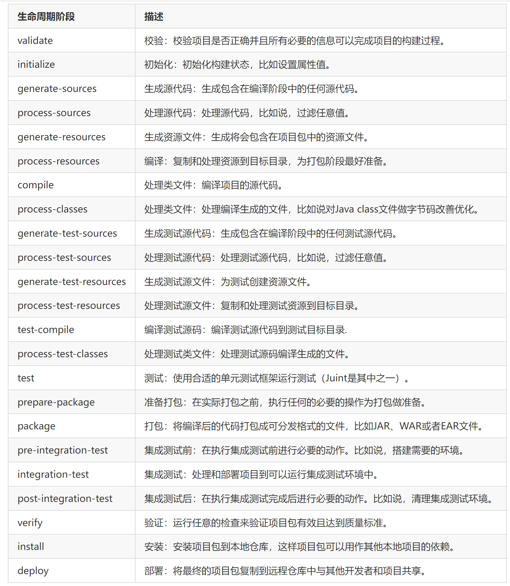
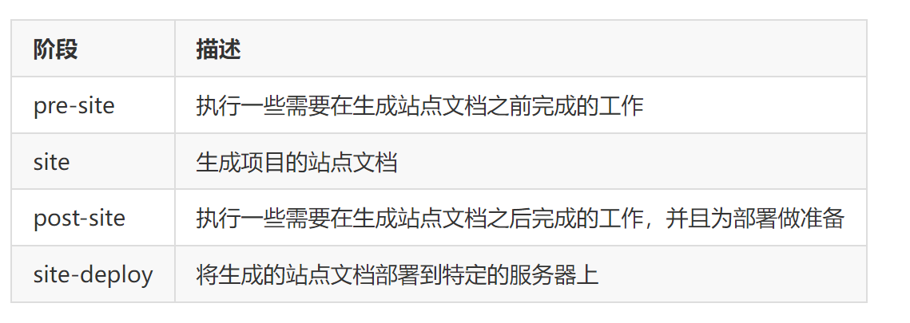

## 生命周期
生命周期就是执行mvn命令的后需要执行的多个阶段，比如有clean，test，package，install等。

不过之前理解有偏差的地方是，上面的几个阶段不是一套下来的。
而是maven把生命周期分成了三种或者说三套，每套生命周期有自己的多个阶段。

## maven 三套生命周期 详解
maven将项目的生命周期抽象成了3套生命周期，每套生命周期又包含多个阶段，
每套中具体包含哪些阶段是maven已经约定好的，但是每个阶段具体需要做什么，是用户可以自己指定的。

maven中定义的3套生命周期：

- clean生命周期  
- default生命周期  
- site生命周期  

上面这3套生命周期是相互独立的，没有依赖关系的，而每套生命周期中有多个阶段，每套中的多个阶段是有先后顺序的，
并且后面的阶段依赖于前面的阶段，而用户可以直接使用mvn命令来调用这些阶段去完成项目生命周期中具体的操作，命令是：  
mvn 生命周期阶段

~~~
通俗点解释：
maven中的3套生命周期相当于maven定义了3个java类来解决项目生命周期中需要的各种操作，每个类中有多个方法，
这些方法就是指具体的阶段，方法名称就是阶段的名称，每个类的方法是有顺序的，当执行某个方法的时候，这个方法前面的方法也会执行。
具体每个方法中需要执行什么，这个是通过插件的方式让用户去配置的，所以非常灵活。
 
用户执行 "mvn 阶段名称" 就相当于调用了具体的某个方法。
~~~

下面我们来看看每个生命周期中有哪些阶段（也就是我们说的每个类中有哪些方法，顺序是什么样的）

### clean生命周期
clean生命周期的目的是清理项目，它包含三个阶段：

pre-clean	执行一些需要在clean之前完成的工作  
clean	移除所有上一次构建生成的文件  
post-clean	执行一些需要在clean之后立刻完成的工作

用户可以通过mvn pre-clean来调用clean生命周期中的pre-clean阶段需要执行的操作。
调用mvn post-clean会执行上面3个阶段所有的操作，上文中有说过，每个生命周期中的后面的阶段会依赖于前面的阶段，
当执行某个阶段的时候，会先执行其前面的阶段。

### default生命周期
这个是maven主要的生命周期，主要被用于构建应用，包含了23个阶段。

### site生命周期
site生命周期的目的是建立和发布项目站点，Maven能够基于pom.xml所包含的信息，自动生成一个友好的站点，方便团队交流和发布项目信息。主要包含以下4个阶段：

## mvn命令 和其对应的 生命周期
从命令行执行maven任务的最主要方式就是调用maven生命周期的阶段，需要注意的是，每套生命周期是相互独立的，
但是每套生命周期中阶段是有前后依赖关系的，执行某个的时候，会按序先执行其前面所有的。

mvn执行阶段的命令格式是：mvn 阶段1 [阶段2] [阶段n]

###  举例
mvn clean  
该命令是调用clean生命周期的clean阶段，实际执行的阶段为clean生命周期中的pre-clean和clean阶段。

mvn test  
该命令调用default生命周期的test阶段，实际上会从default生命周期的第一个阶段（validate）开始执行一直到test阶段结束。这里面包含了代码的编译，运行测试用例。

mvn clean install  
这个命令中执行了两个阶段：clean和install，从上面3个生命周期的阶段列表中找一下，可以看出clean位于clean生命周期的表格中，install位于default生命周期的表格中，所以这个命令会先从clean生命周期中的pre-clean阶段开始执行一直到clean生命周期的clean阶段；然后会继续从default生命周期的validate阶段开始执行一直到default生命周期的install阶段。

这里面包含了清理上次构建的结果，编译代码，测试，打包，将打好的包安装到本地仓库。

mvn clean deploy  
这个命令也比较常用，会先按顺序执行clean生命周期的[pre-clean,clean]这个闭区间内所有的阶段，然后按序执行default生命周期的[validate,deploy]这个闭区间内的所有阶段（也就是default生命周期中的所有阶段）。这个命令内部包含了清理上次构建的结果、编译代码、运行单元测试、打包、将打好的包安装到本地仓库、将打好的包发布到私服仓库。

`注意以下所有命令都在cmd窗口执行，执行位置位于上面这个项目的pom.xml所在目录。`

## Maven插件
上面几个mvn命令的案例，都是通过mvn命令去执行了mvn中定义的生命周期中的阶段，然后完成了很多看似内部很复杂的操作。
比如打包，内部包含很多复杂的操作，maven都帮我们屏蔽了，通过一个简单的mvn package就完成了。
上面也有说过，每个阶段具体做的事情是由maven插件来完成的（包括clean，package等都是由对应的插件去执行的）。

看一下上面几个命令的输出中，有很多类似于maven-xxxx-plugin:版本:xxx这样的内容，这个就是表示当前在运行这个插件来完成对应阶段的操作，
mvn 阶段明明执行的是阶段，但是实际输出中确实插件在干活，那么阶段是如何和插件关联起来的呢？插件又是什么呢？

maven插件主要是为maven中生命周期中的阶段服务的，maven中只是定义了3套生命周期，以及每套生命周期中有哪些阶段，
具体每个阶段中执行什么操作，完全是交给插件去干的。

maven中的插件就相当于一些工具，比如编译代码的工具，运行测试用例的工具，打包代码的工具，将代码上传到本地仓库的工具，
将代码部署到远程仓库的工具等等，这些都是maven中的插件。

插件可以通过mvn命令的方式调用直接运行，或者将插件和maven生命周期的阶段进行绑定，
然后通过mvn 阶段的方式执行阶段的时候， 会自动执行和这些阶段绑定的插件。

### 插件的目标
maven中的插件以jar的方式存在于仓库中，和其他构件是一样的，也是通过坐标进行访问，
每个插件中可能为了代码可以重用，一个插件可能包含了多个功能，比如编译代码的插件，可以编译源代码、也可以编译测试代码；
插件中的每个功能就叫做插件的目标（Plugin Goal），每个插件中可能包含一个或者多个插件目标（Plugin Goal）。

### 目标参数
插件目标是用来执行任务的，那么执行任务肯定是有参数配的，这些就是目标的参数，
每个插件目标对应于java中的一个类，参数就对应于这个类中的属性。

### 列出插件所有目标
语法：
* mvn 插件goupId:插件artifactId[:插件version]:help
* mvn 插件前缀:help

上面插件前缀的先略过，我们先看第一种效果

在项目pom文件所在目录执行：mvn org.apache.maven.plugins:maven-clean-plugin:help  
会列出了maven-clean-plugin这个插件所有的目标，有2个，分别是clean:clean、clean:help，分号后面的部分是目标名称，
分号前面的部分是插件的前缀，每个目标的后面包含对这个目标的详细解释说明，关于前缀的后面会有详细介绍。

### 查看插件目标参数列表
* mvn 插件goupId:插件artifactId[:插件version]:help -Dgoal=目标名称 -Ddetail
* mvn 插件前缀:help -Dgoal=目标名称 -Ddetail

上面命令中的-Ddetail用户输出目标详细的参数列表信息，如果没有这个，目标的参数列表不会输出出来，执行  
mvn org.apache.maven.plugins:maven-clean-plugin:help -Dgoal=help -Ddetail   
然后看效果。

上面列出了clean插件的help目标的详细参数信息。

注意上面参数详细参数说明中有Expression: ${xxx}这样的部分，这种表示给这个运行的目标传参，可以通过mvn -Dxxx这种方式传参，xxx为${xxx}中的xxx部分，这个xxx有时候和目标参数的名称不一致，所以这点需要注意，运行带参数的目标，看一下效果：

mvn org.apache.maven.plugins:maven-clean-plugin:help -Dgoal=help -Ddetail=false

