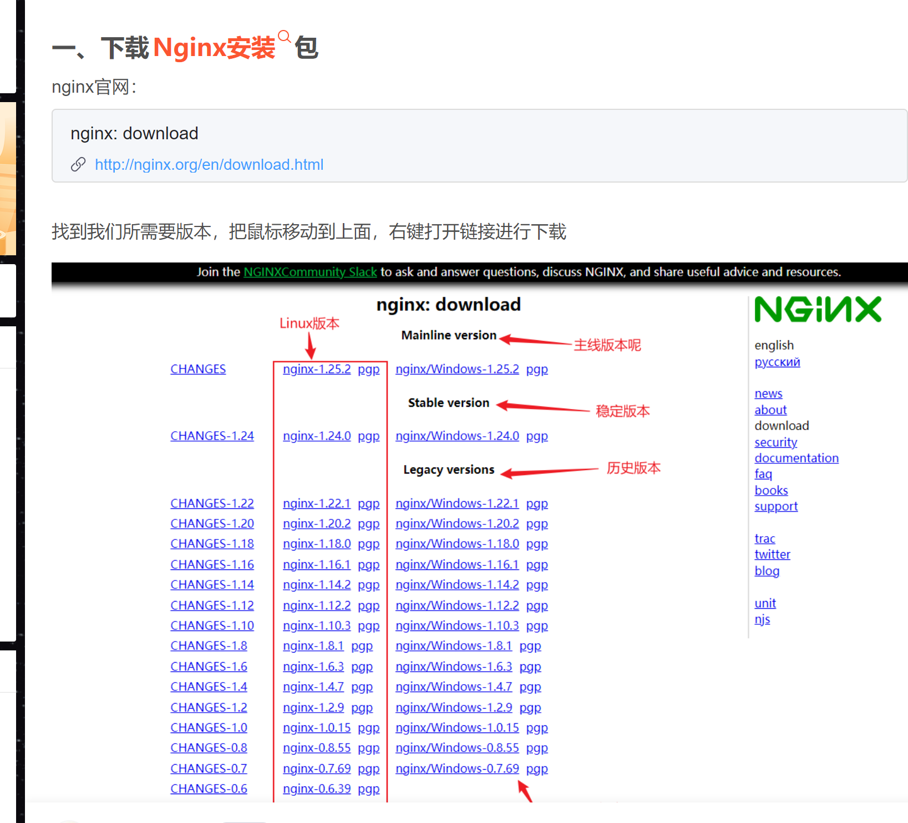
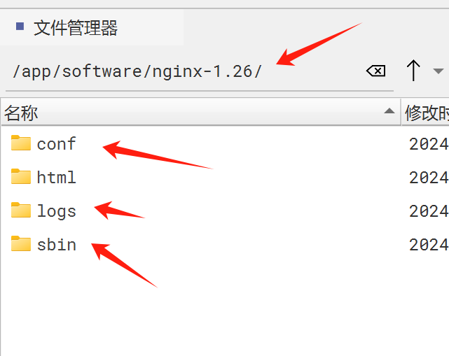

## 下载
下载压缩包：nginx-1.26.0.tar.gz， 已经在阿里云盘了。

## 安装nginx

### 先安装依赖
安装nginx之前，需要先安装一些 安装或编译nginx时 需要的依赖软件：
~~~shell
#安装nginx所需要的一些列依赖包（如果已经安装请忽略）
yum install -y gcc-c++	zlib zlib-devel	openssl openssl-devel pcre pcre-devel
~~~

### 上传解压nginx
把 nginx-1.26.0.tar.gz 上传到服务器的某个目录下，解压缩到当前文件夹：
tar -xzvf nginx-1.26.0.tar.gz

进入解压后的nginx文件夹，执行配置：
./configure --prefix=打算安装nginx的目录

比如：./configure --prefix=/app/software/nginx-1.26

执行了上面的配置代码，接下来的安装nginx，就会安装到上面指定的目录内（该目录如果不存在会自动创建）。  
注意：这里指定的目录不要和上面解压nginx的目录相同，不然安装的时候会报 文件已存在 之类的错误。
如果不指定--prefix=xxx安装目录，安装的时候默认会把nginx的文件分散安装，比如nginx的执行文件放到了/usr/local/nginx里，nginx的配置文件安装到了其他目录。日志文件又在另一个地方。

当然，默认安装的位置时linux安装服务的默认位置时在Path相关的目录下，可以通过 systemctl 或 whereis nginx去操作或查看，这样有这样的有好处，
不过，我们安装在我们自己指定的特定目录下，自己统一管理也很好。就像公司的软件都在/app/software下，通过脚本统一管理。

### 编译和安装nginx
执行完配置命令后，就可以编译并安装了： make & make install
注意：不要重复执行编译安装，否则可能安装出多份文件。

安装后的结果：

nginx的启动脚本程序就在其下的sbin里。

## 启动，停止，重载，优雅退出nginx服务
~~~shell
#启动
/app/software/nginx-1.26/sbin/nginx -c /app/software/nginx-1.26/conf/nginx.conf
#立即停止nginx服务，会中断正在进行的请求
/app/software/nginx-1.26/sbin/nginx -s stop
#优雅关闭nginx服务，不再接收新请求，会继续执行完已经接收的请求再关闭服务
/app/software/nginx-1.26/sbin/nginx -s quit
#重新加载配置文件，原理大概就是先停止接收新请求，执行完已经接收的请求，
# 然后停止worker进程，同时使用新配置启动一个新的worker进程接收请求，
# 从PID的变化上可以看出worker进程换了。master进程没换。
/app/software/nginx-1.26/sbin/nginx -s reload
~~~

## 开机自启动
~~~shell
vim /etc/rc.local
文本底部追加
/usr/local/nginx/sbin/nginx
~~~
上面这种方法不知道是不是标准的方法，待百度一下

## nginx讲解

### 配置文件详解
~~~text
#user nobody nobody;#运行nginx的默认账号，这里意思就是所有linux用户和用户组都可以启动nginx
# worker进程数,不包括master主进程，建议设置为等于CPU总核心数。
worker_processes  1;
error_log logs/error.log;	# nginx服务器运行的错误日志存放路径
pid	logs/nginx.pid;	# nginx服务器运行时的pid文件存放路径
 
#事件区块,这里配置的是nginx和用户之间（用户指的是比如浏览器或者LVS服务器）的网络连接的一些东西，看下图
events {
    user epoll;	# 配置网络通信的事件驱动模型，这里用epoll
    #单个进程最大链接数（最大连接数=连接数*进程数）
    #根据硬件调整，与前面工作进程配合起来用，尽量大，但别把CPU跑到100%就行，每个进程允许的最多连接数，理论上为每台nginx服务器的最大连接数
    worker_connections  1024;
}
 
#这里配置的是七层网络协议http的。设定http服务器，利用它的反向代理功能提供负载均衡支持
http {
    #include:导入外部文件mime.types,将所有types提取为文件，然后导入到nginx配置文件中。
    include       mime.types;
    #默认文件类型
    default_type  application/octet-stream;
    
    #开启高效文件传输模式，sendfile指令指定nginx是否调用sendfile函数来输出文件，对于普通应用设置为on，如果用来进行下载等应用磁盘IO重负载应用，可设置为off，以平衡磁盘与网络I/O处理速度，降低系统的负载，注意：如果图片显示不正常把这个改成off
    #sendfile指令指定，nginx是否调用sendfile函数（zero copy方式）来输出文件，对于普通应用，必须设为on,如果用来进行下载等应用磁盘IO重负载应用，可设置为off，以平衡磁盘与网络IO处理速度，降低系统uptime
    sendfile        on;
    #长连接超时事件，单位是秒
    keepalive_timeout  65;
 
    # 配置请求日志的格式
	# Nginx采集一些请求日志，用在大数据领域
	# 采集的是用户的一些行为日志，浏览器上前端代码在用户做了一些操作的时候
	# 就会把行为日志写入到后台的Nginx上去，Nginx就可以把请求日志写在自己本地
	# 大数据系统，就可以通过flume去Nginx服务器上去捞他的请求日志
	log_format	access.log	‘$remote_addr-[$time_local]-“$request”-“$http_user_agent”’;

  
    #第一个server区块开始，表示一个独立的虚拟主机站点
    server {
        #这个虚拟机主键监听的端口号和主机名
        #提供服务的端口，默认80
        listen       80;
        #提供服务的域名主机名
        server_name  localhost;
        
        #下面是配置针对这个虚拟主机的请求日志的存放地址
		#access_log	/app/xxxxx/logs/access.log
		#error_page	404 /404.html		# 这个目录会找到nginx安装目录/html/404.html
 
        
        #对 “/” 启动反向代理，第一个location区块开始
        location / {
            root   html;    #服务默认启动目录,可以改成指定的目录位置
            index  index.html index.htm; #默认的首页文件，多个用空格分开
        }
        
        #每一个location就代表一种请求如何处理
		location /server1 {	#收到/server1/user.html请求
			#会到/server-html目录下，找你请求的/server1目录下的user.html页面
			root	/server-html;
			# 站点默认页面
			index	index.html;
        }
 
        #错误页面路由
        error_page   500 502 503 504  /50x.html; # 出现对应的http状态码是，使用50x.html回应客户
        location = /50x.html { # location区块开始，访问50x.html
            root   html; # 指定对应的站点目录为html
        }
 
    }
 
 
}
~~~