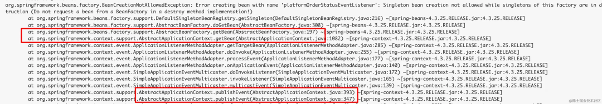
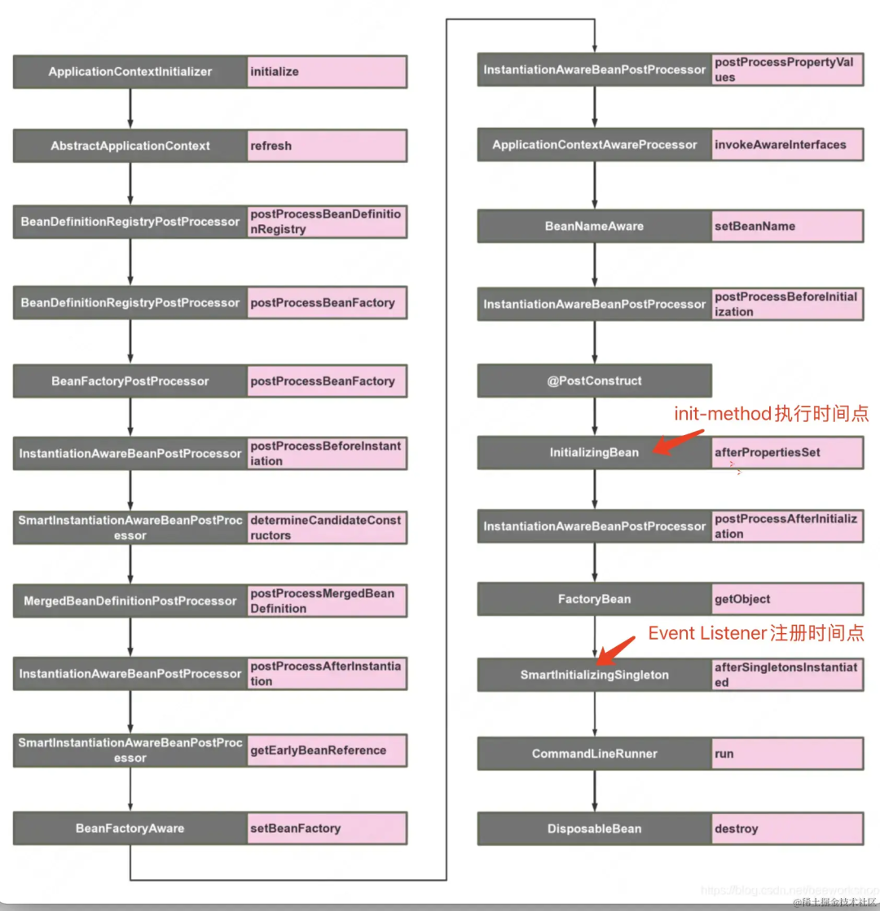
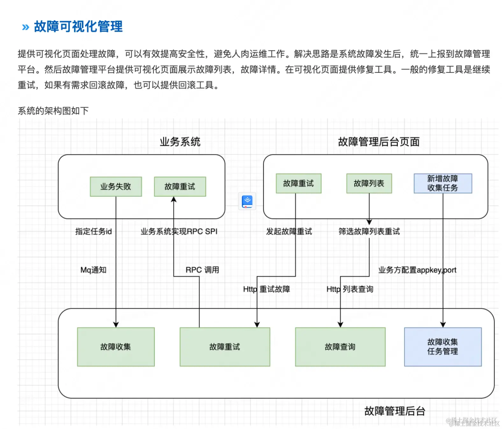

## Spring Event 别瞎用！从我司的悲剧中，我总结了6 条最佳实践
本文复制于网文, 文章地址:https://mp.weixin.qq.com/s/5UVNit9JULknYTJMHgymug

文章正文:  

今天我们重点聊聊使用 Spring Event 最为关键的几个问题。这是我司线上生产环境实际踩坑后，总结的极为宝贵的经验！  
Spring Event框架实现了基于事件的发布订阅机制。开发者可以自定义事件，在某些业务场景发布事件，Spring 会将该事件广播给监听该事件的监听者。监听者可以实现Spring 的监听者接口 
ApplicationListener注册自己，也可以使用 EventListener注解注册自己。  
这是Spring Event 的简短介绍，网上有大量的入门级教程，我在此不过多赘述，进入正文！

### 1. 为什么说：业务系统一定要先实现优雅关闭服务，才能使用 Spring Event?
Spring  广播消息时，Spring会在 ApplicationContext 中查找所有的监听者，即需要 getBean 获取 bean 实例。然而 Spring 有个限制————ApplicationContext 
关闭期间，不得GetBean 否则会报错。  
这个知识点得来不易。它是我们公司在线上环境发生故障后，最终定位的原因，大家一定要重视！  
前几天，线上系统出现两条异常日志Get Bean时找不到对应的bean，调用堆栈让我非常迷惑，为什么Get Bean找不到对应的Bean呢? 如下图所示

堆栈中的信息 解释了原因: Do not request a bean from a BeanFactory in a destroy method implementation  
在应用上下文关闭时，不得从上下文中Get Bean。 恰好，这个问题出现在服务关闭期间.....  
由于系统流量较高，日订单几百万，即便在低峰期单机的并发度也是比较高的，所以服务在关闭期间有少量流量进来或未处理完。这个场景下，使用 Spring Event 发布事件，Spring 无法正常广播事件，一定会出现异常，导致处理失败！  
大家一定要切记！使用 SpringEvent 之前，一定要先治理服务，确保服务关闭时，先切断入口流量（Http、MQ、RPC），然后再关闭服务，关闭 Spring 上下文！

详细的分析请参考：
https://juejin.cn/post/7281159113882468371

### 2. 为什么服务启动阶段，Spring Event 事件丢失了？
   我们公司遇到的情况是， Kafka conumser 在 init-method 阶段开始消费，然而 Spring EventListener 被注册进 Spring 的时间点滞后于 init-method 时间点，所以 Kafka Consumer 中使用 Spring Event 发布事件时，没有找到监听者，出现消息处理丢失的情况。
从下图中可以看到 init-method 时间点 滞后于 EventListener 被注册的时间点。

简单来说：SpringBoot 会在Spring完全启动完成后，才开启Http流量。这给了我们启示：应该在Spring启动完成后开启入口流量。Rpc和 MQ流量 也应该如此，所以建议大家 在 SmartLifecype 或者 ContextRefreshedEvent 等位置 注册服务，开启流量。

>最佳实践是：改造系统开启入口流量（Http、MQ、RPC）的时机，确保在Spring 启动完成后开启入口流量。

### 什么业务特点适合发布——订阅模式
每一个优秀的程序员都应该有自己的工具箱，他能在不同的业务场景选择最合适的工具。

>SpringEvent 适合哪些业务场景呢？这由订阅发布模式的特性决定
>- 事件发布者并不关心事件如何被处理
>- 事件发布者不关心事件处理的结果
>- 事件订阅者有多个，可异步订阅，也可以同步订阅。
>- 事件订阅者之间各自独立，互不依赖。
>- 发布订阅模式实现了发布和订阅两个模块的解耦。但是对于强一致性的场景，并不适合使用发布订阅模式。

### 3. 强一致性场景不适合 订阅发布模式
   强一致性的业务例如提单场景。提单阶段，库存扣减成功和订单提单成功务必完全一致。库存扣减失败但提单成功；提单失败，库存未回滚等场景都是要避免发生的异常场景！

提单场景，使用 Spring Event会有很多问题。假设提单前，发布提单前置事件，事件订阅者的业务逻辑可能有扣减库存，锁定优惠券资源等操作。库存扣减失败或者锁定资源失败需要回滚整个提单流程，然而 Spring  事件订阅模式无法提供这种 订阅异常——>回滚 的能力。

事件发布者无法获知哪些订阅消费失败，哪些订阅者成功？无法准确的触发回滚流程。（如果基于 Spring Event 强行搞回滚，也可以做到，但方案会很复杂！）

### 4. 最终一致性的业务特性适合——发布订阅模式
   最终一致性场景非常适合使用 Spring Event。

例如提单成功后，发布 MQ ，释放锁等资源，可使用 SpringEvent 解耦。为什么呢？因为业务上确保提单成功后，提单实际上已经成功，后续的收尾工作不应该触发订单提单失败。

在提单成功事件的订阅者中，只有一种执行结果——————成功。即使出现失败，也应该重试直至成功。例如 发布 提单成功MQ 消息，释放提单锁等资源都是务必成功的业务逻辑。

再来举一个例子，我们公司在处理订单消息时使用了Spring Event框架。在这个场景中，我们需要处理履约完成、退款完成、订单过期等事件，并且每个事件都有一些独立的业务逻辑，每一个业务场景都属于最终一致性的场景。举个例子，履约完成后需要将履约数据和订单金额等数据通知结算系统。这个业务场景是最终一致性场景，而不是强一致性，这是因为通知结算即便失败，重试即可，无需回滚履约过程。

如果我们不使用Spring Event，那么我就需要手动编写观察者模式，并将订单消息根据状态通知到相应的观察者中。又或者每当新增一个业务逻辑时，我需要新增一个Kafka消费组，并且在代码中解析订单消息，然后根据状态将事件发送给相应的订阅者。总之我需要把事件按照状态分发给对应的监听者。

在这个场景中，使用Spring Event非常适合。可以将每个事件封装为Spring Event，并且每个业务逻辑都可以通过@EventListener注解来注册对应状态的事件监听器（不过需要注意的是，如果订阅者过多，那么Kafka消息的消费时间可能会增加。那么该如何解决呢？）。使用 Spring Event 框架比自己手写监听者模式强多了。

### 5. 使用SpringEvent 要有额外的可靠性保证！
   Spring Event适用于需要保证最终一致性的业务场景，但为了确保可靠性，必须提供重试能力。通过使用 applicationContext.publishEvent(event) 方法发布事件，Spring会按顺序执行相关的订阅者。如果出现异常，publishEvent 方法会抛出异常，发布者能够感知订阅逻辑处理失败了。

在发布事件时，需要考虑事件订阅逻辑出现异常的情况，我提出三种解决办法

订阅者自行重试
订阅逻辑可自行重试保证成功。例如使用 Spring  retry注解可以保证出现异常时，重新执行该方法。

以下代码示例 performSuccess 方法抛出异常时，Spring 会重新执行该方法直至成功，最多重试 3 次，可设置间隔时间，重试间隔递增时间。

~~~java
@Retryable(value = Exception.class, maxAttempts = 3, backoff = @Backoff(delay = 100L, multiplier = 2))
public void performSuccess(PerformEvent event) {

}
~~~
使用 @Retryable 注解前，记得引入 spring-retry pom 依赖
~~~xml
<dependency>
    <groupId>org.springframework.retry</groupId>
    <artifactId>spring-retry</artifactId>
    <version>1.2.4.RELEASE</version>
</dependency>
~~~
订阅者依赖 Kafka 消费组重试
如果在 Kafka 消费者中使用Spring Event，处理重试非常容易。只需要在消费异常时，向 Kafka 返回消费失败即可，Kafka 会自动进行重试。

此外，还可以将消息发送到专门的死信队列，在死信队列中重新消费消息！不同公司的 Kafka 重试能力实现方案可能不同，大家自行选择。

主动上报故障异常到故障管理平台
故障处理流程

当请求一直重试失败超过最大重试次数时，业务系统会上报到故障 MQ，故障管理平台消费 MQ，收集故障并落库。研发同学收到故障通知，介入排查问题。同时研发同学在故障管理后台可以看到故障列表、故障详情。

排查问题原因、敦促相关同事修复问题后，点击重试按钮。故障管理后台收到重试请求，会通过 Rpc SPI 调用到业务系统 重试故障，并告知管理后台成功和失败结果。

### 6. Spring 订阅者务必保证幂等
   为了提高可靠性，要有额外的重试机制保证 Spring 订阅发布的可靠性。

有重试就要有幂等！要保证 订阅者逻辑具备幂等性。Spring 不知道哪些订阅者成功，哪些订阅者失败，下一次重试时，会全部执行所有的订阅者。所以订阅逻辑要做好幂等，防止数据不一致情况发生。

### 为什么有消息队列 MQ ，还需要 Spring Event
曾经有掘友给我评论，说我司对 Spring Event 的应用场景应该替换为 MQ。在此我解释一下

>Spring Event和 MQ 都属于订阅发布模式的应用，然而 MQ 比 SpringEvent 强大且复杂。MQ 
> 更适合应用之间的解耦、隔离、事件通知。例如订单支付、订单完成、订单履约完成等等事件需要广播出去，通知下游其他微服务， 这种场景更适合使用 MQ 。  
> 
>然而对于应用内需要订阅发布的场景更适合使用 SpringEvent。两者并不矛盾，MQ 能力更强大，技术方案也更”重“一些。Spring Event 更加小巧适合应用内订阅发布，实现业务逻辑解耦。

