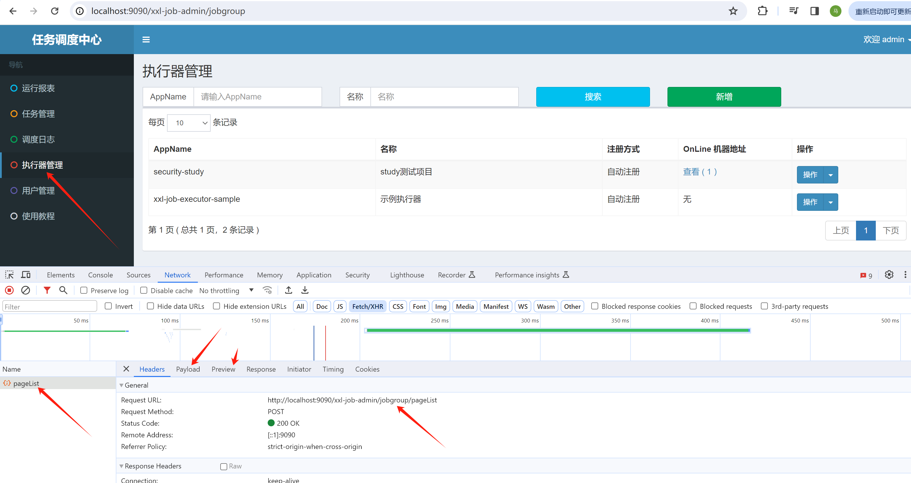

## 资料来源
学习内容和文档来源于：https://www.bilibili.com/video/BV1824y1G7vT

## xxl-job 的扩展
我们根据xxl-job的自带管理页面，通过F12里面可以看到xxljob的很多功能实现都是可以通过调用接口请求实现的。

比如：查询已有的执行器：

就是发送一个查询请求。

包括新增一个执行器，新增一个任务，开启一个任务等，都是可以通过发请求控制的，
因此，我们可以在项目中通过代码请求的方式，动态的根据业务逻辑创建xxljob定时任务。
创建任务的时候，可以给任务添加特定的参数，作为业务识别，根据业务动态设置cron表达式，
做到灵活使用xxljob的目的，也可以灵活的暂停，删除已经不需要的任务等。